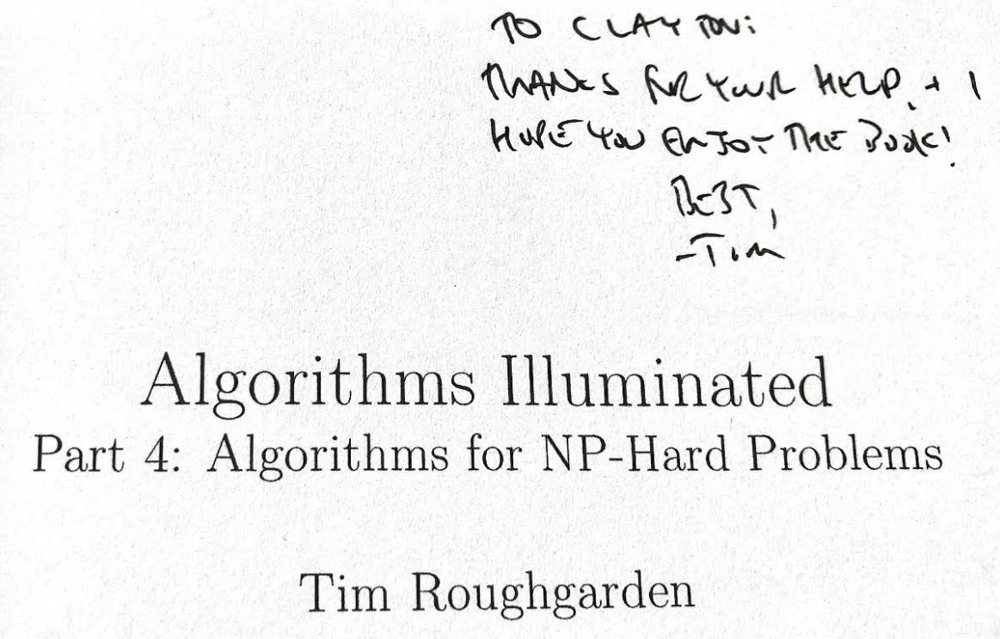
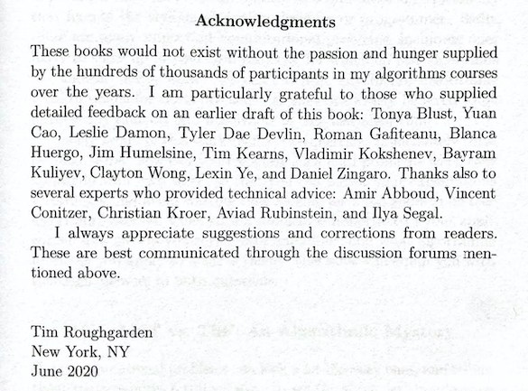
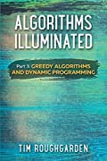

# Algorithms Illuminated

* [algorithmsilluminated.org](https://www.algorithmsilluminated.org/)

Coincidentally, my [algorithm learning journey](https://github.com/claytonjwong/Algorithms) which began in 2017 has occurred in parallel with the publication of Tim Roughgarden's (TR) 4-book series about algorithms and data structures. Over these years, I've purchased, studied, and provided feedback on TR's books. I was totally stoked when TR sent me a free copy of his 4th book for review before publication in 2020! I'm amazed by what can be done in near-linear time, and it's awesome we can leverage these "for-free primitives" based upon computationally tractable problems as "building blocks" towards more complex solutions to computationally intractable (NP-Hard) problems via selective compromise on generality, correctness, and speed (ie. pick 2 of 3). Can we do better?




---

<details><summary><b>Part 1: The Basics</b></summary>

<br/>
<a href="https://www.amazon.com/dp/0999282905" target="_blank">
    
</a>

## Merge Sort

<details><summary>Videos</summary>
<br/>

* [MergeSort: Motivation and Example](https://www.youtube.com/watch?v=kiyRJ7GVWro&list=PLEGCF-WLh2RLHqXx6-GZr_w7LgqKDXxN_&index=4) (Section 1.4, part 1)
* [MergeSort: Pseudocode](https://www.youtube.com/watch?v=rBd5w0rQaFo&list=PLEGCF-WLh2RLHqXx6-GZr_w7LgqKDXxN_&index=5) (Section 1.4, part 2)
* [MergeSort: Analysis](https://www.youtube.com/watch?v=8ArtRiTkYEw&list=PLEGCF-WLh2RLHqXx6-GZr_w7LgqKDXxN_&index=6) (Section 1.5)

</details>

<details><summary>Implementations</summary>
<br/>

*Kotlin*
```java
fun sort(A: IntArray): IntArray {
    fun merge(A: IntArray, B: IntArray): IntArray {
        var C = mutableListOf<Int>()
        var i = 0
        var j = 0
        while (i < A.size && j < B.size)
            if (A[i] < B[j])
                C.add(A[i++])
            else
                C.add(B[j++])
        A.slice(i..A.lastIndex).forEach { C.add(it) }
        B.slice(j..B.lastIndex).forEach { C.add(it) }
        return C.toIntArray()
    }
    fun go(A: IntArray): IntArray {
        var N = A.size
        if (N < 2)
            return A
        var half = Math.floor(N / 2.0).toInt()
        var first  = go(A.slice(0 until half).toIntArray())
        var second = go(A.slice(half until N).toIntArray())
        return merge(first, second)
    }
    return go(A)
}

fun main(args: Array<String>) {
    sort(intArrayOf(5,3,8,9,1,7,0,2,6,4)).forEach { print("$it ") }  // 0 1 2 3 4 5 6 7 8 9
    println()
}
```

*Javascript*
```javascript
let sort = A => {
    let go = A => {
        let N = A.length;
        if (N < 2)
            return A;
        let half = Math.floor(N / 2);
        let first  = go([...A.slice(0, half)]),
            second = go([...A.slice(half, N)]);
        return merge(first, second);
    };
    let merge = (A, B, C = []) => {
        let M = A.length,
            N = B.length;
        let i = 0,
            j = 0;
        while (i < M && j < N)
            C.push(A[i] < B[j] ? A[i++] : B[j++]);
        C.push(...A.slice(i, M));
        C.push(...B.slice(j, N));
        return C;
    };
    return go(A);
};

console.log(sort([5,3,8,9,1,7,0,2,6,4]));  // (10) [0, 1, 2, 3, 4, 5, 6, 7, 8, 9]
```

*Python3*
```python
from math import floor

def sort(A):
    def go(A):
        N = len(A)
        if N < 2:
            return A
        half = floor(N / 2)
        first =  go(A[:half])
        second = go(A[half:])
        return merge(first, second)
    def merge(A, B):
        C = []
        i = 0
        j = 0
        while i < len(A) and j < len(B):
            if A[i] < B[j]:
                C.append(A[i]); i += 1
            else:
                C.append(B[j]); j += 1
        C.extend(A[i:])
        C.extend(B[j:])
        return C
    return go(A)

print(sort([5,3,8,9,1,7,0,2,6,4]))  # [0, 1, 2, 3, 4, 5, 6, 7, 8, 9]
```

*C++*
```cpp
#include <iostream>
#include <vector>

using namespace std;

class Solution {
public:
    using VI = vector<int>;
    VI mergesort(VI& A) {
        return go(move(A));
    }
private:
    VI go(VI&& A) {
        auto N = A.size();
        if( N < 2 )
            return A;
        auto half = A.begin() + (N / 2);
        auto first = go({ A.begin(), half }),
             second = go({ half, A.end() });
        return merge(first, second);
    }
    VI merge(VI& A, VI& B, VI C = {}) {
        auto i{ 0 },
             j{ 0 };
        while (i < A.size() && j < B.size())
            C.push_back(A[i] < B[j] ? A[i++] : B[j++]);
        C.insert(C.end(), A.begin() + i, A.end());
        C.insert(C.end(), B.begin() + j, B.end());
        return C;
    }
};

int main() {
    Solution::VI A{ 3,5,7,1,3,9,2,0 };
    auto ans = Solution().mergesort(A);
    copy(ans.begin(), ans.end(), ostream_iterator<int>(cout, " ")), cout << endl;  // 0 1 2 3 4 5 6 7 8 9
    return 0;
}
```

</details>


## Counting Inversions

<details><summary>Videos</summary>
<br/>

* [The Divide-and-Conquer Paradigm](https://www.youtube.com/watch?v=7_AJfusC6UQ&list=PLEGCF-WLh2RLHqXx6-GZr_w7LgqKDXxN_&index=13) (Section 3.1; part 1 of Section 3.2)
* [Counting Inversions in O(n log n)](https://www.youtube.com/watch?v=I6ygiW8xN7Y&list=PLEGCF-WLh2RLHqXx6-GZr_w7LgqKDXxN_&index=14) Time (Section 3.2, part 2)

</details>

<details><summary>Implementations</summary>
<br/>

*Kotlin*
```java
import java.io.File

fun sort(A: IntArray): Pair<IntArray, Long> {
    fun merge(A: IntArray, B: IntArray): Pair<IntArray, Long> {
        var C = mutableListOf<Int>()
        var inv: Long = 0
        var i = 0
        var j = 0
        while (i < A.size && j < B.size)
            if (A[i] < B[j]) {
                C.add(A[i++])
            } else {
                inv += A.size - i  // ⭐️ B[j] comes before all remaining A[i...], thus all remaining A[i...] are inversions
                C.add(B[j++])
            }
        A.slice(i..A.lastIndex).forEach { C.add(it) }
        B.slice(j..B.lastIndex).forEach { C.add(it) }
        return Pair(C.toIntArray(), inv)
    }
    fun go(A: IntArray): Pair<IntArray, Long> {
        var N = A.size
        if (N < 2)
            return Pair(A, 0)
        var half = Math.floor(N / 2.0).toInt()
        var (first,  inv1) = go(A.slice(0 until half).toIntArray())
        var (second, inv2) = go(A.slice(half until N).toIntArray())
        var (third,  inv3) = merge(first, second)
        return Pair(third, inv1 + inv2 + inv3)
    }
    return go(A)
}

fun run(filename: String): Long {
    var A = mutableListOf<Int>()
    File(filename).forEachLine { A.add(it.toInt()) }
    var (_, inv) = sort(A.toIntArray())
    return inv
}

fun main() {
    println("problem3.5test.txt: " + run("problem3.5test.txt"))  // problem3.5test.txt: 28
    println("problem3.5.txt: "     + run("problem3.5.txt"))      // problem3.5.txt: 2407905288
}
```

*Javascript*
```javascript
let sort = A => {
    let go = A => {
        let N = A.length;
        if (N < 2)
            return [A, 0];
        let half = Math.floor(N / 2);
        let [first,  inv1] = go([...A.slice(0, half)]),
            [second, inv2] = go([...A.slice(half, N)]),
            [third,  inv3] = merge(first, second);
        return [third, inv1 + inv2 + inv3];
    };
    let merge = (A, B, C = [], inv = 0) => {
        let M = A.length,
            N = B.length;
        let i = 0,
            j = 0;
        while (i < M && j < N)
            if (A[i] < B[j])
                C.push(A[i++]);
            else
                inv += M - i,      // ⭐️ B[j] comes before all remaining A[i...], thus all remaining A[i...] are inversions
                C.push(B[j++]);
        C.push(...A.slice(i, M));
        C.push(...B.slice(j, N));
        return [C, inv];
    };
    return go(A);
};

let run = filename => {
    let A = [];
    require('fs').readFileSync(filename, 'utf-8').split(/\r?\n/).forEach(line => A.push(Number(line)));
    let [_, inv] = sort(A);
    return inv;
}

console.log(`problem3.5test.txt: ${run('problem3.5test.txt')}`);  // problem3.5test.txt: 28
console.log(`problem3.5.txt: ${run('problem3.5.txt')}`);          // problem3.5.txt: 2407905288
```

*Python3*
```python
from math import floor

def sort(A):
    def go(A):
        N = len(A)
        if N < 2:
            return [A, 0]
        half = floor(N / 2)
        first,  inv1 = go(A[:half])
        second, inv2 = go(A[half:])
        third,  inv3 = merge(first, second)
        return [third, inv1 + inv2 + inv3]
    def merge(A, B, inv = 0):
        C = []
        i = 0
        j = 0
        while i < len(A) and j < len(B):
            if A[i] < B[j]:
                C.append(A[i]); i += 1
            else:
                inv += len(A) - i        # ⭐️ B[j] comes before all remaining A[i...], thus all remaining A[i...] are inversions
                C.append(B[j]); j += 1
        C.extend(A[i:])
        C.extend(B[j:])
        return [C, inv]
    return go(A)

def run(filename):
    A = []
    with open(filename) as fin:
        while True:
            line = fin.readline()
            if not line:
                break
            A.append(int(line))
    _, inv = sort(A)
    return inv

print(f"problem3.5test.txt: {run('problem3.5test.txt')}")  # problem3.5test.txt: 28
print(f"problem3.5.txt: {run('problem3.5.txt')}")          # problem3.5.txt: 2407905288
```

*C++*
```cpp
#include <iostream>
#include <vector>
#include <fstream>

using namespace std;

class Solution {
public:
    using VL = vector<long>;
    using Pair = pair<VL, long>;
    using fun = function<Pair(VL&&)>;
    Pair merge(VL& A, VL& B, VL C = {}, long inv = 0) {
        auto i = 0,
             j = 0;
        while (i < A.size() && j < B.size()) {
            if (A[i] < B[j]) {
                C.push_back(A[i++]);
            } else {
                inv += A.size() - i; // ⭐️ B[j] comes before all remaining A[i...], thus all remaining A[i...] are inversions
                C.push_back(B[j++]);
            }
        }
        C.insert(C.end(), A.begin() + i, A.end());
        C.insert(C.end(), B.begin() + j, B.end());
        return { C, inv };
    }
    Pair inversions(VL& A) {
        fun go = [&](VL&& A) -> Pair {
            int N = A.size();
            if (N < 2)
                return { A, 0 };
            int half = N / 2;
            auto [first,  inv1] = go({ A.begin(), A.begin() + half });
            auto [second, inv2] = go({ A.begin() + half, A.end() });
            auto [third,  inv3] = merge(first, second);
            return { third, inv1 + inv2 + inv3 };
        };
        return go(move(A));
    }
};

long run(string filename) {
    Solution solution;
    Solution::VL A;
    fstream fin{ filename };
    for (string line; fin >> line; A.push_back(stol(line)));
    auto [_, inv] = solution.inversions(A);
    return inv;
}

int main() {
    cout << "problem3.5test.txt: " << run("problem3.5test.txt") << endl   // problem3.5test.txt: 28
         << "problem3.5.txt: "     << run("problem3.5.txt")     << endl;  // problem3.5.txt: 2407905288
    return 0;
}
```

</details>

## Quick Sort

<details><summary>Videos</summary>
<br/>

* [QuickSort: Overview](https://www.youtube.com/watch?v=ETo1cpLN7kk&list=PLEGCF-WLh2RLHqXx6-GZr_w7LgqKDXxN_&index=24) (Section 5.1)
* [Partitioning Around a Pivot Element](https://www.youtube.com/watch?v=LYzdRN5iFdA&list=PLEGCF-WLh2RLHqXx6-GZr_w7LgqKDXxN_&index=25) (Section 5.2)
* [Choosing a Good Pivot](https://www.youtube.com/watch?v=kqO46FOUTbI&list=PLEGCF-WLh2RLHqXx6-GZr_w7LgqKDXxN_&index=26) (Sections 5.3 and 5.4)
* [QuickSort Analysis (Part 1)](https://www.youtube.com/watch?v=sToWtKSYlMw&list=PLEGCF-WLh2RLHqXx6-GZr_w7LgqKDXxN_&index=27) (Section 5.5, part 1)
* [QuickSort Analysis (Part 2)](https://www.youtube.com/watch?v=4t_Y-aGLkok&list=PLEGCF-WLh2RLHqXx6-GZr_w7LgqKDXxN_&index=28) (Section 5.5, part 2)
* [QuickSort Analysis (Part 3)](https://www.youtube.com/watch?v=IBTvneWhFsA&list=PLEGCF-WLh2RLHqXx6-GZr_w7LgqKDXxN_&index=29) (Section 5.5, part 3)
* [Sorting Requires Omega(n log n) Comparisons](https://www.youtube.com/watch?v=aFveIyII5D4&list=PLEGCF-WLh2RLHqXx6-GZr_w7LgqKDXxN_&index=30) (Section 5.6)
* [Proofs by Induction and the Correctness of QuickSort](https://www.youtube.com/watch?v=Colb_4jAy8A&list=PLEGCF-WLh2RLHqXx6-GZr_w7LgqKDXxN_&index=36) (Appendix A)
* [Quick Review of Discrete Probability](https://www.youtube.com/watch?v=uLeIMwMHX5U&list=PLEGCF-WLh2RLHqXx6-GZr_w7LgqKDXxN_&index=37) (Appendix B)

</details>

<details><summary>Implementations</summary>
<br/>

*Kotlin*
```java
import java.io.File

typealias PivotFunc = (A: MutableList<Int>, L: Int, R: Int) -> (Int)
var pivotLeft: PivotFunc = { _: MutableList<Int>, L: Int, _: Int -> L }
var pivotRight: PivotFunc = { _: MutableList<Int>, _: Int, R: Int -> R }
fun _pivotMedian(A: MutableList<Int>, L: Int, R: Int): Int {
    var M = L + (R - L) / 2
    var cand = intArrayOf(A[L], A[M], A[R])
    cand.sort()
    var target = cand[1]
    if (target == A[L]) return L
    if (target == A[M]) return M
    if (target == A[R]) return R
    return -1
}
var pivotMedian: PivotFunc = { A: MutableList<Int>, L: Int, R: Int -> _pivotMedian(A, L, R) }

fun partition(A: MutableList<Int>, L: Int, R: Int, choosePivot: (A: MutableList<Int>, L: Int, R: Int) -> (Int)): Int {
    var i = L + 1
    var j = L + 1
    var k = choosePivot(A, L, R)
    A[k] = A[L].also { A[L] = A[k] }          // swap pivot A[k] with first element of subarray A[L]
    while (j <= R) {
        if (A[j] < A[L]) {                    // maintain loop invariant A[i] < pivot < A[j]
            A[i] = A[j].also { A[j] = A[i] }
            ++i
        }
        ++j
    }
    A[L] = A[i - 1].also { A[i - 1] = A[L] }  // swap pivot A[L] with last value less-than pivot A[i - 1]
    return i - 1
}

fun quicksort(A: MutableList<Int>, L: Int, R: Int, choosePivot: (A: MutableList<Int>, L: Int, R: Int) -> (Int)): Int {
    if (R <= L)
        return 0
    var k = partition(A, L, R, choosePivot)
    return (R - L) + quicksort(A, L, k - 1, choosePivot) + quicksort(A, k + 1, R, choosePivot)
}

fun run(filename: String, choosePivot: (A: MutableList<Int>, L: Int, R: Int) -> (Int)): Int {
    var A = mutableListOf<Int>()
    File(filename).forEachLine { A.add(it.toInt()) }
    return quicksort(A, 0, A.size - 1, choosePivot)
}

fun main() {
    var filename = "problem5.6.txt"
    println("  left: ${run(filename, pivotLeft)}")    //   left: 162085
    println(" right: ${run(filename, pivotRight)}")   //  right: 164123
    println("median: ${run(filename, pivotMedian)}")  // median: 138382
}
```

*Javascript*
```javascript
let pivotLeft = (A, L, R) => L;
let pivotRight = (A, L, R) => R;
let pivotMedian = (A, L, R) => {
    let M = L + Math.floor((R - L) / 2);
    let cand = [A[L], A[M], A[R]].sort((a, b) => a - b),
        target = cand[1];
    if (target == A[L]) return L;
    if (target == A[M]) return M;
    if (target == A[R]) return R;
};

let partition = (A, L, R, choosePivot) => {
    let i = L + 1,
        j = L + 1,
        k = choosePivot(A, L, R);
    [A[L], A[k]] = [A[k], A[L]];          // swap pivot A[k] with first element of subarray A[L]
    while (j <= R) {
        if (A[j] < A[L]) {                // maintain loop invariant A[i] < pivot < A[j]
            [A[i], A[j]] = [A[j], A[i]];
            ++i;
        }
        ++j;
    }
    [A[L], A[i - 1]] = [A[i - 1], A[L]];  // swap pivot A[L] with last value less-than pivot A[i - 1]
    return i - 1;
};

let quicksort = (A, L, R, choosePivot) => {
    if (R <= L)
        return 0;
    let k = partition(A, L, R, choosePivot);
    return (R - L) + quicksort(A, L, k - 1, choosePivot)
                   + quicksort(A, k + 1, R, choosePivot);
};

let run = (filename, choosePivot) => {
    let A = [];
    let LineByLine = require("n-readlines");
    let input = new LineByLine(filename);
    for (let line; line = input.next(); A.push(Number(line)));
    return quicksort(A, 0, A.length - 1, choosePivot);
}

let filename = 'problem5.6.txt';
console.log(`  left: ${run(filename, pivotLeft)}`);    //   left: 162085
console.log(` right: ${run(filename, pivotRight)}`);   //  right: 164123
console.log(`median: ${run(filename, pivotMedian)}`);  // median: 138382
```

*Python3*
```python
def pivotLeft(A, L, R): return L
def pivotRight(A, L, R): return R
def pivotMedian(A, L, R):
    M = L + (R - L) // 2
    cand = sorted([A[L], A[M], A[R]])
    target = cand[1]
    if target == A[L]: return L
    if target == A[M]: return M
    if target == A[R]: return R

def partition(A, L, R, choosePivot):
    i = L + 1
    j = L + 1
    k = choosePivot(A, L, R)
    A[L], A[k] = A[k], A[L]          # swap pivot A[k] with first element of subarray A[L]
    while j <= R:
        if A[j] < A[L]:              # maintain loop invariant A[i] < pivot < A[j]
            A[i], A[j] = A[j], A[i]
            i += 1
        j += 1
    A[L], A[i - 1] = A[i - 1], A[L]  # swap pivot A[L] with last value less-than pivot A[i - 1]
    return i - 1

def quicksort(A, L, R, choosePivot):
    if R <= L:
        return 0
    k = partition(A, L, R, choosePivot)
    return (R - L) + quicksort(A, L, k - 1, choosePivot) + quicksort(A, k + 1, R, choosePivot)

def run(filename, choosePivot):
    A = []
    with open(filename) as fin:
        while True:
            line = fin.readline()
            if not line:
                break
            A.append(int(line))

    return quicksort(A, 0, len(A) - 1, choosePivot)

filename = 'problem5.6.txt'
print(f'  left: {run(filename, pivotLeft)}')    #   left: 162085
print(f' right: {run(filename, pivotRight)}')   #  right: 164123
print(f'median: {run(filename, pivotMedian)}')  # median: 138382
```

*C++*
```cpp
#include <iostream>
#include <fstream>
#include <vector>

using namespace std;
using VI = vector<int>;
using fun = function<int(VI&, int, int)>;

fun pivotLeft = [](VI& A, int L, int R) { return L; };
fun pivotRight = [](VI& A, int L, int R) { return R; };
fun pivotMedian = [](VI& A, int L, int R) {
    auto M = L + (R - L) / 2;
    VI cand{ A[L], A[M], A[R] };
    sort(cand.begin(), cand.end());
    auto target = cand[1];
    if (target == A[L]) return L;
    if (target == A[M]) return M;
    if (target == A[R]) return R;
};

int partition(VI& A, int L, int R, fun choosePivot) {
    auto i = L + 1,
         j = L + 1,
         k = choosePivot(A, L, R);
    swap(A[L], A[k]);          // swap pivot A[k] with first element of the subarray A[L]
    while (j <= R) {
        if (A[j] < A[L]) {     // maintain loop invariant A[i] < pivot < A[j]
            swap(A[i], A[j]);
            ++i;
        }
        ++j;
    }
    swap(A[L], A[i - 1]);      // swap pivot A[L] with last value less-than pivot A[i - 1]
    return i - 1;
}

int quicksort(VI& A, int L, int R, fun choosePivot) {
    if (R <= L)
        return 0;
    auto k = partition(A, L, R, choosePivot);
    return (R - L) + quicksort(A, L, k - 1, choosePivot)
                   + quicksort(A, k + 1, R, choosePivot);
}

int run(string& filename, fun choosePivot) {
    VI A;
    fstream fin{ filename };
    for (string line; fin >> line; A.push_back(stoi(line)));
    int N = A.size();
    return quicksort(A, 0, N - 1, choosePivot);
}

int main() {
    string filename{ "problem5.6.txt" };
    cout << "  left: " << run(filename, pivotLeft)   << endl   //   left: 162085
         << " right: " << run(filename, pivotRight)  << endl   //  right: 164123
         << "median: " << run(filename, pivotMedian) << endl;  // median: 138382
    return 0;
}
```
</details>

## Randomized Linear-Time Selection

<details><summary>Videos</summary>
<br/>

* [Randomized Linear-Time Selection](https://www.youtube.com/watch?v=nFw6x7DoYbs&list=PLEGCF-WLh2RLHqXx6-GZr_w7LgqKDXxN_&index=31) (Section 6.1)
* [Randomized Linear-Time Selection (Analysis)](https://www.youtube.com/watch?v=rX2u2CnpveQ&list=PLEGCF-WLh2RLHqXx6-GZr_w7LgqKDXxN_&index=32) (Section 6.2)

</details>

<details><summary>Implementations</summary>
<br/>

*Kotlin*
```java
import java.io.File
import kotlin.random.Random

fun partition(A: MutableList<Int>, L: Int, R: Int): Int {
    var i = L + 1
    var j = L + 1
    var k = Random.nextInt(L, R + 1)          // +1 for L..R inclusive
    A[L] = A[k].also { A[k] = A[L] }          // swap pivot A[k] with first element of subarray A[L]
    while (j <= R) {
        if (A[j] < A[L]) {                    // maintain loop invariant A[i] < pivot < A[j]
            A[i] = A[j].also { A[j] = A[i] }
            ++i
        }
        ++j
    }
    A[L] = A[i - 1].also { A[i - 1] = A[L] }  // swap pivot A[L] with last value less-than pivot A[i - 1]
    return i - 1
}

fun rselect(A: MutableList<Int>, i: Int, L_: Int, R_: Int): Int {
    var L = L_
    var R = R_
    var k = partition(A, L, R)
    if (i == k)
        return A[k]  // 🎯 lucky guess
    if (i < k)
        R = k - 1
    else
        L = k + 1
    return rselect(A, i, L, R)
}

fun run(filename: String, i: Int): Int {
    var A = mutableListOf<Int>()
    File(filename).forEachLine { A.add(it.toInt()) }
    var N = A.size
    return rselect(A, i - 1, 0 , N - 1)  // -1 for 0-based indexing
}

fun main() {
    println("problem6.5test1.txt: " + run("problem6.5test1.txt", 5))   // problem6.5test1.txt: 5469
    println("problem6.5test2.txt: " + run("problem6.5test2.txt", 50))  // problem6.5test2.txt: 4715
}
```

*Javascript*
```javascript
let random = (L, R) => Math.floor(Math.random() * (R + 1 - L) + L);  // +1 for L..R inclusive

let partition = (A, L, R) => {
    let i = L + 1,
        j = L + 1,
        k = random(L, R);
    [A[L], A[k]] = [A[k], A[L]];          // swap pivot A[k] with first element of subarray A[L]
    while (j <= R) {
        if (A[j] < A[L]) {                // maintain loop invariant A[i] < pivot < A[j]
            [A[i], A[j]] = [A[j], A[i]];
            ++i;
        }
        ++j;
    }
    [A[L], A[i - 1]] = [A[i - 1], A[L]];  // swap pivot A[L] with last value less-than pivot A[i - 1]
    return i - 1;
};

let rselect = (A, i, L, R) => {
    let k = partition(A, L, R);
    if (i == k)
        return A[k];  // 🎯 lucky guess
    if (i < k)
        R = k - 1;
    else
        L = k + 1;
    return rselect(A, i, L, R);
}

let run = (filename, i) => {
    let A = [];
    let LineByLine = require("n-readlines");
    let input = new LineByLine(filename);
    for (let line; line = input.next(); A.push(Number(line)));
    let N = A.length;
    return rselect(A, i - 1, 0, N - 1);  // -1 for 0-based indexing
};

console.log(`problem6.5test1.txt: ${run('problem6.5test1.txt', 5)}`);   // problem6.5test1.txt: 5469
console.log(`problem6.5test2.txt: ${run('problem6.5test2.txt', 50)}`);  // problem6.5test2.txt: 4715
```

*Python3*
```python
from random import uniform
from math import floor

def partition(A, L, R):
    i = L + 1
    j = L + 1
    k = floor(uniform(L, R))
    A[L], A[k] = A[k], A[L]          # swap pivot A[k] with first element of subarray A[L]
    while j <= R:
        if A[j] < A[L]:              # maintain loop invariant A[i] < pivot < A[j]
            A[i], A[j] = A[j], A[i]
            i += 1
        j += 1
    A[L], A[i - 1] = A[i - 1], A[L]  # swap pivot A[L] with last value less-than pivot A[i - 1]
    return i - 1

def rselect(A, i, L, R):
    k = partition(A, L, R)
    if i == k:
        return A[k]  # 🎯 lucky guess
    if i < k:
        R = k - 1
    else:
        L = k + 1
    return rselect(A, i, L, R)

def run(filename, i):
    A = []
    with open(filename) as fin:
        while True:
            line = fin.readline()
            if not line:
                break
            A.append(int(line))
    N = len(A)
    return rselect(A, i - 1, 0, N - 1)  # -1 for 0-based indexing

print('problem6.5test1.txt:', run('problem6.5test1.txt', 5))   # problem6.5test1.txt: 5469
print('problem6.5test2.txt:', run('problem6.5test2.txt', 50))  # problem6.5test2.txt: 4715
```

*C++*
```cpp
#include <iostream>
#include <fstream>
#include <vector>
#include <random>

using namespace std;
using VI = vector<int>;

int random(int L, int R) {
    random_device rd;
    mt19937 gen{ rd() };
    uniform_int_distribution dist(L, R);
    return dist(gen);
}

int partition(VI& A, int L, int R) {
    auto i = L + 1,
         j = L + 1,
         k = random(L, R);
    swap(A[L], A[k]);            // swap pivot A[k] with first element of the subarray A[L]
    while (j <= R) {
        if (A[j] < A[L])         // maintain loop invariant A[i] < pivot < A[j]
            swap(A[i++], A[j]);
        ++j;
    }
    swap(A[L], A[i - 1]);       // swap pivot A[L] with last value less-than pivot A[i - 1]
    return i - 1;
}

int rselect(VI& A, int i, int L, int R) {
    auto k = partition(A, L, R);
    if (i == k)
        return A[k];  // 🎯 lucky guess
    if (i < k)
        R = k - 1;
    else
        L = k + 1;
    return rselect(A, i, L, R);
}

int run(string filename, int i, VI A = {}) {
    fstream fin{ filename };
    for (string line; fin >> line; A.push_back(stoi(line)));
    int N = A.size();
    return rselect(A, i - 1, 0, N - 1);  // -1 for 0-based indexing
}

int main() {
    cout << "problem6.5test1.txt: " << run("problem6.5test1.txt", 5)  << endl;  // problem6.5test1.txt: 5469
    cout << "problem6.5test2.txt: " << run("problem6.5test2.txt", 50) << endl;  // problem6.5test2.txt: 4715
    return 0;
}
```

</details>

</details>

---

<details><summary><b>Part 2: Graph Algorithms and Data Structures</b></summary>

<br/>
<a href="https://www.amazon.com/dp/0999282921" target="_blank">
    
</a>

## Topological Sort

<details><summary>Videos</summary>
<br/>

* [Graphs: The Basics (from 2:06 to 6:39)](https://www.youtube.com/watch?v=4Ih3UhVuEtw&list=PLEGCF-WLh2RJ5W-pt-KE9GUArTDzVwL1P&index=1) (Sections 7.1 and 7.2)
* [Graph Representations](https://www.youtube.com/watch?v=b-Mfu8dPv9U&list=PLEGCF-WLh2RJ5W-pt-KE9GUArTDzVwL1P&index=2) (Sections 7.3 and 7.4)
* [Graph Search Overview](https://www.youtube.com/watch?v=SW6jwg7WS48&list=PLEGCF-WLh2RJ5W-pt-KE9GUArTDzVwL1P&index=3) (Section 8.1)
* [Breadth-First Search](https://www.youtube.com/watch?v=73qCvXsYkfk&list=PLEGCF-WLh2RJ5W-pt-KE9GUArTDzVwL1P&index=4) (Section 8.2, Part 1)
* [Depth-First Search](https://www.youtube.com/watch?v=73qCvXsYkfk&list=PLEGCF-WLh2RJ5W-pt-KE9GUArTDzVwL1P&index=4) (Section 8.4)
* [Topological Sort](https://www.youtube.com/watch?v=ozso3xxkVGU&list=PLEGCF-WLh2RJ5W-pt-KE9GUArTDzVwL1P&index=8) (Section 8.5)

</details>

<details><summary>Implementations</summary>
<br/>

*Kotlin*
```java
import java.util.Queue
import java.util.LinkedList

class Solution(val adj: MutableMap<Char, List<Char>>) {

    var N: Int
    var color: Int
    var m = mutableMapOf<Char, Int>()
    var seen = mutableSetOf<Char>()

    init {
        N = adj.size
        color = 0
    }

    fun init(start: Int) {
        color = start
        m.clear()
        seen.clear()
    }

    fun topoSortBFS(): String {
        init(1)  // 👉 color forward from 1..N
        bfs()
        return toString()
    }

    fun topoSortDFS(): String {
        init(N)  // 👈 color reverse from N..1 (as the recursive stack unwinds)
        adj.forEach{ (u, _) -> dfs(u) }
        return toString()
    }

    fun bfs() {
        var degree = mutableMapOf<Char, Int>()
        adj.forEach{ (_, neighbors) ->
            neighbors.forEach{ v ->
                degree[v] = 1 + degree.getOrDefault(v, 0)
            }
        }
        var q: Queue<Char> = LinkedList(adj.map{ (u, _) -> u }.filter{ !degree.contains(it) })
        while (0 < q.size) {
            var u = q.poll()
            m[u] = color++
            adj[u]!!.forEach{ v ->
                degree[v] = degree[v]!!.minus(1)
                if (degree[v] == 0 && !seen.contains(v)) {
                    q.add(v); seen.add(v)
                }
            }
        }
    }

    fun dfs(u: Char) {
        if (seen.contains(u))
            return
        seen.add(u)
        adj[u]!!.forEach{ v ->
            dfs(v)
        }
        m[u] = color--
    }

    override fun toString(): String {
        var s = mutableListOf<String>()
        adj.forEach{ (u, _) ->
            s.add("$u: ${m[u]}")
        }
        return s.joinToString("\n")
    }
}

fun main() {
    var adj = mutableMapOf<Char, List<Char>>(
        's' to listOf<Char>('v', 'w'),
        'v' to listOf<Char>('t'),
        'w' to listOf<Char>('t'),
        't' to listOf<Char>()
    )
    var solution = Solution(adj)
    println("BFS:\n${solution.topoSortBFS()}\n\nDFS:\n${solution.topoSortDFS()}")

//    BFS:
//    s: 1
//    v: 2
//    w: 3
//    t: 4

//    DFS:
//    s: 1
//    v: 3
//    w: 2
//    t: 4

}
```

*Javascript*
```javascript
class Solution {
    constructor(adj) {
        this.adj = adj;
        this.N = this.adj.size;
    }
    init(start) {
        this.color = start;
        this.seen = new Set();
        this.m = new Map();
    }
    topo_sort_bfs() {
        this.init(1);       // 👉 color forward from 1..N
        this.bfs();
        return this.to_string();
    }
    topo_sort_dfs() {
        this.init(this.N);  // 👈 color reverse from N..1 (as the recursive stack unwinds)
        for (let [u, _] of [...this.adj])
            this.dfs(u);
        return this.to_string();
    }
    bfs() {
        let degree = new Map();
        for (let [u, _] of [...this.adj])
            for (let v of this.adj.get(u))
                degree.set(v, 1 + (degree.get(v) || 0));
        let q = [...this.adj].map(([u, _]) => u).filter(u => !degree.has(u));
        let seen = new Set(q);
        while (q.length) {
            let u = q.shift();
            this.m.set(u, this.color++);
            for (let v of this.adj.get(u))
                if (!seen.has(v))
                    q.push(v), seen.add(v);
        }
    }
    dfs(u) {
        if (this.seen.has(u))
            return;
        this.seen.add(u);
        for (let v of this.adj.get(u))
            if (!this.seen.has(v))
                this.dfs(v);
        this.m.set(u, this.color--);
    }
    to_string() {
        let s = [];
        for (let [u, color] of [...this.m])
            s.push(`${u}: ${color}`);
        return s.join('\n');
    }
}

let adj = new Map();
adj.set('s', ['v', 'w']);
adj.set('v', ['t']);
adj.set('w', ['t']);
adj.set('t', []);
let solution = new Solution(adj);
console.log(`BFS:\n${solution.topo_sort_bfs()}\n\nDFS:\n${solution.topo_sort_dfs()}`);

//    BFS:
//    s: 1
//    v: 2
//    w: 3
//    t: 4

//    DFS:
//    t: 4
//    v: 3
//    w: 2
//    s: 1
```

*Python3*
```python
from collections import deque

class Solution:
    def __init__(self, adj):
        self.adj = adj
        self.N = len(adj)
        self.seen = set()
        self.m = {}

    def init(self, start):
        self.color = start
        self.seen.clear()
        self.m.clear()

    def topo_sort_bfs(self):
        self.init(1)         # 👉 color forward from 1..N
        self.bfs()
        return self.to_string()

    def topo_sort_dfs(self):
        self.init(self.N)  # 👈 color reverse from N..1 (as the recursive stack unwinds)
        for u, _ in self.adj.items():
            self.dfs(u)
        return self.to_string()

    def bfs(self):
        degree = {}
        for _, neighbors in self.adj.items():
            for v in neighbors:
                degree[v] = 1 + (degree[v] if v in degree else 0)
        q = deque(u for u, _ in self.adj.items() if u not in degree)
        self.seen.update(*q)
        while q:
            u = q.popleft()
            self.m[u] = self.color; self.color += 1
            for v in adj[u]:
                degree[v] -= 1
                if not degree[v] and v not in self.seen:
                    q.append(v); self.seen.add(v)

    def dfs(self, u):
        if u in self.seen:
            return
        self.seen.add(u)
        for v in adj[u]:
            self.dfs(v)
        self.m[u] = self.color; self.color -= 1

    def to_string(self):
        s = []
        for u, color in self.m.items():
            s.append(f'{u}: {color}')
        return '\n'.join(s)

#
# graph from Quiz 8.3 on page 45 of Algorithms Illuminated: Part 2
#
adj = {
    's': ['v', 'w'],
    'v': ['t'],
    'w': ['t'],
    't': []
}
solution = Solution(adj)

print(f'BFS:\n{solution.topo_sort_bfs()}\n\nDFS:\n{solution.topo_sort_dfs()}')

#    BFS:
#    s: 1
#    v: 2
#    w: 3
#    t: 4

#    DFS:
#    t: 4
#    v: 3
#    w: 2
#    s: 1
```

*C++*
```cpp
#include <iostream>
#include <sstream>
#include <vector>
#include <unordered_map>
#include <unordered_set>
#include <queue>

using namespace std;

using VI = vector<int>;
using AdjList = unordered_map<char, VI>;
using Set = unordered_set<char>;
using Map = unordered_map<char, int>;
using Queue = queue<char>;
using fun = function<void(char)>;

class Solution {
private:
    AdjList adj;
    const int N;
    Map m;
    Set seen;
    int color;
public:
    Solution(AdjList& adj) : adj{ adj }, N{ int(adj.size()) } {
    }
    void init(int start) {
        m.clear();
        seen.clear();
        color = start;
    }
    string topo_sort_bfs() {
        init(1);  // 👉 color forward from 1..N
        bfs();
        return to_string();
    }
    string topo_sort_dfs() {
        init(N);  // 👈 color reverse from N..1 (as the recursive stack unwinds)
        for (auto [u, _]: adj)
            dfs(u);
        return to_string();
    }
    void bfs() {
        Map degree;
        for (auto [_, neighbors]: adj)
            for (auto v: neighbors)
                ++degree[v];
        Queue q;
        for (auto [u, _]: adj)
            if (!degree[u] && seen.insert(u).second)
                q.push(u);
        while (q.size()) {
            auto u = q.front(); q.pop();
            m[u] = color++;
            for (auto v: adj[u])
                if (!--degree[v] && seen.insert(v).second)
                    q.push(v);
        }
    }
    void dfs(char start) {
        fun go = [&](auto u) {
            if (!seen.insert(u).second)
                return;
            for (auto v: adj[u])
                go(v);
            m[u] = color--;
        };
        go(start);
    }
    string to_string() {
        ostringstream os;
        for (auto [u, color]: m)
            os << u << ": " << color << endl;
        return os.str();
    }
};

int main() {
    //
    // graph from Quiz 8.3 on page 45 of Algorithms Illuminated: Part 2
    //
    AdjList adj{
        { 's', { 'v', 'w' } },
        { 'v', { 't' } },
        { 'w', { 't' } },
        { 't', {} }
    };
    Solution solution{ adj };

    cout << "BFS:" << endl << solution.topo_sort_bfs() << endl
         << "DFS:" << endl << solution.topo_sort_dfs() << endl;

//    BFS:
//    t: 4
//    w: 3
//    v: 2
//    s: 1
//
//    DFS:
//    s: 1
//    w: 2
//    v: 3
//    t: 4

    return 0;
}
```

</details>

</details>

---

<details><summary><b>Part 3: Greedy Algorithms and Dynamic Programming</b></summary>

<br/>
<a href="https://www.amazon.com/dp/0999282948" target="_blank">
    
</a>

</details>

---

<details><summary><b>Part 4: Algorithms for NP-Hard Problems</b></summary>

<br/>
<a href="https://www.amazon.com/dp/0999282964" target="_blank">
    
</a>

</details>
