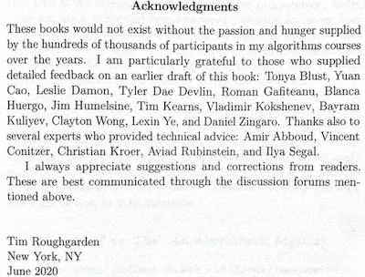
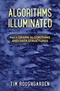
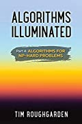

# Algorithms Illuminated

* [algorithmsilluminated.org](https://www.algorithmsilluminated.org/)

Coincidentally, my [algorithm learning journey](https://github.com/claytonjwong/Algorithms) which began in 2017 has occurred in parallel with the publication of Tim Roughgarden's (TR) 4-book series about algorithms and data structures. Over these years, I've purchased, studied, and provided feedback on TR's books. I was totally stoked when TR sent me a free copy of his 4th book for review before publication in 2020! I'm amazed by what can be done in near-linear time (ie. the amount of time to perform an algorithm is on the order of time to simply read the input), and it's awesome we can leverage these "for-free primitives" based upon computationally tractable problems as "building blocks" towards more complex solutions to computationally intractable (NP-Hard) problems via selective compromise on generality, correctness, and speed (ie. pick 2 of 3). [`💡` Can we do better?](https://en.wikipedia.org/wiki/Millennium_Prize_Problems#P_versus_NP)

<p>
    
    
</p>

---

# Part 1: The Basics

<br/>
<a href="https://www.amazon.com/dp/0999282905" target="_blank">
    
</a>

---

### Recursive Integer Multiplication

<details><summary>📚 Lectures</summary>
<br/>

* [Introduction: Why Study Algorithms?](https://www.youtube.com/watch?v=yRM3sc57q0c&list=PLEGCF-WLh2RLHqXx6-GZr_w7LgqKDXxN_&index=1)
* [Introduction: Integer Multiplication](https://www.youtube.com/watch?v=6u0Vaj4nn54&list=PLEGCF-WLh2RLHqXx6-GZr_w7LgqKDXxN_&index=2)

</details>

<details><summary>🎯 Solutions</summary>
<br/>

*Julia*
```julia
using Test, Random

function go(x, y)
  if x < 10 || y < 10
    return x * y
  end
  n = max(length(string(x)), length(string(y)))
  if isodd(n)
    n += 1
  end
  m = 10 ^ div(n, 2) # middle decimal value
  a, b = div(x, m), mod(x, m)
  c, d = div(y, m), mod(y, m)
  ac = go(a, c)
  ad = go(a, d)
  bc = go(b, c)
  bd = go(b, d)
  return 10^n * ac + 10^div(n, 2) * (ad + bc) + bd
end

Random.seed!(123456789)

@testset "Recursive Integer Multiplication tests" begin
    for _ in 1:100
        n = rand((1, 2, 4, 8, 16))

        lo = 10^(n-1)
        hi = 10^n - 1

        x = rand(lo:hi)
        y = rand(lo:hi)

        expect, actual = x * y, go(x, y)
        @test expect == actual
        println("($x x $y)\nexpect: $expect\nactual: $actual\n")
    end
end
```

</details>

---

### Merge Sort

<details><summary>📚 Lectures</summary>
<br/>

* [MergeSort: Motivation and Example](https://www.youtube.com/watch?v=kiyRJ7GVWro&list=PLEGCF-WLh2RLHqXx6-GZr_w7LgqKDXxN_&index=4) (Section 1.4, part 1)
* [MergeSort: Pseudocode](https://www.youtube.com/watch?v=rBd5w0rQaFo&list=PLEGCF-WLh2RLHqXx6-GZr_w7LgqKDXxN_&index=5) (Section 1.4, part 2)
* [MergeSort: Analysis](https://www.youtube.com/watch?v=8ArtRiTkYEw&list=PLEGCF-WLh2RLHqXx6-GZr_w7LgqKDXxN_&index=6) (Section 1.5)

</details>

<details><summary>🎯 Solutions</summary>
<br/>

*Kotlin*
```java
fun sort(A: IntArray): IntArray {
    fun merge(A: IntArray, B: IntArray): IntArray {
        var C = mutableListOf<Int>()
        var i = 0
        var j = 0
        while (i < A.size && j < B.size)
            if (A[i] < B[j])
                C.add(A[i++])
            else
                C.add(B[j++])
        A.slice(i..A.lastIndex).forEach { C.add(it) }
        B.slice(j..B.lastIndex).forEach { C.add(it) }
        return C.toIntArray()
    }
    fun go(A: IntArray): IntArray {
        var N = A.size
        if (N < 2)
            return A
        var half = Math.floor(N / 2.0).toInt()
        var first  = go(A.slice(0 until half).toIntArray())
        var second = go(A.slice(half until N).toIntArray())
        return merge(first, second)
    }
    return go(A)
}

fun main(args: Array<String>) {
    sort(intArrayOf(5,3,8,9,1,7,0,2,6,4)).forEach { print("$it ") }  // 0 1 2 3 4 5 6 7 8 9
    println()
}
```

*Javascript*
```javascript
let sort = A => {
    let go = A => {
        let N = A.length;
        if (N < 2)
            return A;
        let half = Math.floor(N / 2);
        let first  = go([...A.slice(0, half)]),
            second = go([...A.slice(half, N)]);
        return merge(first, second);
    };
    let merge = (A, B, C = []) => {
        let M = A.length,
            N = B.length;
        let i = 0,
            j = 0;
        while (i < M && j < N)
            C.push(A[i] < B[j] ? A[i++] : B[j++]);
        C.push(...A.slice(i, M));
        C.push(...B.slice(j, N));
        return C;
    };
    return go(A);
};

console.log(sort([5,3,8,9,1,7,0,2,6,4]));  // (10) [0, 1, 2, 3, 4, 5, 6, 7, 8, 9]
```

*Python3*
```python
from math import floor

def sort(A):
    def go(A):
        N = len(A)
        if N < 2:
            return A
        half = floor(N / 2)
        first =  go(A[:half])
        second = go(A[half:])
        return merge(first, second)
    def merge(A, B):
        C = []
        i = 0
        j = 0
        while i < len(A) and j < len(B):
            if A[i] < B[j]:
                C.append(A[i]); i += 1
            else:
                C.append(B[j]); j += 1
        C.extend(A[i:])
        C.extend(B[j:])
        return C
    return go(A)

print(sort([5,3,8,9,1,7,0,2,6,4]))  # [0, 1, 2, 3, 4, 5, 6, 7, 8, 9]
```

*C++*
```cpp
#include <iostream>
#include <vector>

using namespace std;

class Solution {
public:
    using VI = vector<int>;
    VI mergesort(VI& A) {
        return go(move(A));
    }
private:
    VI go(VI&& A) {
        auto N = A.size();
        if( N < 2 )
            return A;
        auto half = A.begin() + (N / 2);
        auto first = go({ A.begin(), half }),
             second = go({ half, A.end() });
        return merge(first, second);
    }
    VI merge(VI& A, VI& B, VI C = {}) {
        auto i{ 0 },
             j{ 0 };
        while (i < A.size() && j < B.size())
            C.push_back(A[i] < B[j] ? A[i++] : B[j++]);
        C.insert(C.end(), A.begin() + i, A.end());
        C.insert(C.end(), B.begin() + j, B.end());
        return C;
    }
};

int main() {
    Solution::VI A{ 3,5,7,1,3,9,2,0 };
    auto ans = Solution().mergesort(A);
    copy(ans.begin(), ans.end(), ostream_iterator<int>(cout, " ")), cout << endl;  // 0 1 2 3 4 5 6 7 8 9
    return 0;
}
```

</details>

---

### Counting Inversions

<details><summary>📚 Lectures</summary>
<br/>

* [The Divide-and-Conquer Paradigm](https://www.youtube.com/watch?v=7_AJfusC6UQ&list=PLEGCF-WLh2RLHqXx6-GZr_w7LgqKDXxN_&index=13) (Section 3.1; part 1 of Section 3.2)
* [Counting Inversions in O(n log n)](https://www.youtube.com/watch?v=I6ygiW8xN7Y&list=PLEGCF-WLh2RLHqXx6-GZr_w7LgqKDXxN_&index=14) Time (Section 3.2, part 2)

</details>

<details><summary>🎯 Solutions</summary>
<br/>

*Kotlin*
```java
import java.io.File

fun sort(A: IntArray): Pair<IntArray, Long> {
    fun merge(A: IntArray, B: IntArray): Pair<IntArray, Long> {
        var C = mutableListOf<Int>()
        var inv: Long = 0
        var i = 0
        var j = 0
        while (i < A.size && j < B.size)
            if (A[i] < B[j]) {
                C.add(A[i++])
            } else {
                inv += A.size - i  // ⭐️ B[j] comes before all remaining A[i...], thus all remaining A[i...] are inversions
                C.add(B[j++])
            }
        A.slice(i..A.lastIndex).forEach { C.add(it) }
        B.slice(j..B.lastIndex).forEach { C.add(it) }
        return Pair(C.toIntArray(), inv)
    }
    fun go(A: IntArray): Pair<IntArray, Long> {
        var N = A.size
        if (N < 2)
            return Pair(A, 0)
        var half = Math.floor(N / 2.0).toInt()
        var (first,  inv1) = go(A.slice(0 until half).toIntArray())
        var (second, inv2) = go(A.slice(half until N).toIntArray())
        var (third,  inv3) = merge(first, second)
        return Pair(third, inv1 + inv2 + inv3)
    }
    return go(A)
}

fun run(filename: String): Long {
    var A = mutableListOf<Int>()
    File(filename).forEachLine { A.add(it.toInt()) }
    var (_, inv) = sort(A.toIntArray())
    return inv
}

fun main() {
    println("problem3.5test.txt: " + run("problem3.5test.txt"))  // problem3.5test.txt: 28
    println("problem3.5.txt: "     + run("problem3.5.txt"))      // problem3.5.txt: 2407905288
}
```

*Javascript*
```javascript
let sort = A => {
    let go = A => {
        let N = A.length;
        if (N < 2)
            return [A, 0];
        let half = Math.floor(N / 2);
        let [first,  inv1] = go([...A.slice(0, half)]),
            [second, inv2] = go([...A.slice(half, N)]),
            [third,  inv3] = merge(first, second);
        return [third, inv1 + inv2 + inv3];
    };
    let merge = (A, B, C = [], inv = 0) => {
        let M = A.length,
            N = B.length;
        let i = 0,
            j = 0;
        while (i < M && j < N)
            if (A[i] < B[j])
                C.push(A[i++]);
            else
                inv += M - i,      // ⭐️ B[j] comes before all remaining A[i...], thus all remaining A[i...] are inversions
                C.push(B[j++]);
        C.push(...A.slice(i, M));
        C.push(...B.slice(j, N));
        return [C, inv];
    };
    return go(A);
};

let run = filename => {
    let A = [];
    require('fs').readFileSync(filename, 'utf-8').split(/\r?\n/).forEach(line => A.push(Number(line)));
    let [_, inv] = sort(A);
    return inv;
}

console.log(`problem3.5test.txt: ${run('problem3.5test.txt')}`);  // problem3.5test.txt: 28
console.log(`problem3.5.txt: ${run('problem3.5.txt')}`);          // problem3.5.txt: 2407905288
```

*Python3*
```python
from math import floor

def sort(A):
    def go(A):
        N = len(A)
        if N < 2:
            return [A, 0]
        half = floor(N / 2)
        first,  inv1 = go(A[:half])
        second, inv2 = go(A[half:])
        third,  inv3 = merge(first, second)
        return [third, inv1 + inv2 + inv3]
    def merge(A, B, inv = 0):
        C = []
        i = 0
        j = 0
        while i < len(A) and j < len(B):
            if A[i] < B[j]:
                C.append(A[i]); i += 1
            else:
                inv += len(A) - i        # ⭐️ B[j] comes before all remaining A[i...], thus all remaining A[i...] are inversions
                C.append(B[j]); j += 1
        C.extend(A[i:])
        C.extend(B[j:])
        return [C, inv]
    return go(A)

def run(filename):
    A = []
    with open(filename) as fin:
        while True:
            line = fin.readline()
            if not line:
                break
            A.append(int(line))
    _, inv = sort(A)
    return inv

print(f"problem3.5test.txt: {run('problem3.5test.txt')}")  # problem3.5test.txt: 28
print(f"problem3.5.txt: {run('problem3.5.txt')}")          # problem3.5.txt: 2407905288
```

*C++*
```cpp
#include <iostream>
#include <vector>
#include <fstream>

using namespace std;

class Solution {
public:
    using VL = vector<long>;
    using Pair = pair<VL, long>;
    using fun = function<Pair(VL&&)>;
    Pair merge(VL& A, VL& B, VL C = {}, long inv = 0) {
        auto i = 0,
             j = 0;
        while (i < A.size() && j < B.size()) {
            if (A[i] < B[j]) {
                C.push_back(A[i++]);
            } else {
                inv += A.size() - i; // ⭐️ B[j] comes before all remaining A[i...], thus all remaining A[i...] are inversions
                C.push_back(B[j++]);
            }
        }
        C.insert(C.end(), A.begin() + i, A.end());
        C.insert(C.end(), B.begin() + j, B.end());
        return { C, inv };
    }
    Pair inversions(VL& A) {
        fun go = [&](VL&& A) -> Pair {
            int N = A.size();
            if (N < 2)
                return { A, 0 };
            int half = N / 2;
            auto [first,  inv1] = go({ A.begin(), A.begin() + half });
            auto [second, inv2] = go({ A.begin() + half, A.end() });
            auto [third,  inv3] = merge(first, second);
            return { third, inv1 + inv2 + inv3 };
        };
        return go(move(A));
    }
};

long run(string filename) {
    Solution solution;
    Solution::VL A;
    fstream fin{ filename };
    for (string line; fin >> line; A.push_back(stol(line)));
    auto [_, inv] = solution.inversions(A);
    return inv;
}

int main() {
    cout << "problem3.5test.txt: " << run("problem3.5test.txt") << endl   // problem3.5test.txt: 28
         << "problem3.5.txt: "     << run("problem3.5.txt")     << endl;  // problem3.5.txt: 2407905288
    return 0;
}
```

</details>

---

### Quick Sort

<details><summary>📚 Lectures</summary>
<br/>

* [QuickSort: Overview](https://www.youtube.com/watch?v=ETo1cpLN7kk&list=PLEGCF-WLh2RLHqXx6-GZr_w7LgqKDXxN_&index=24) (Section 5.1)
* [Partitioning Around a Pivot Element](https://www.youtube.com/watch?v=LYzdRN5iFdA&list=PLEGCF-WLh2RLHqXx6-GZr_w7LgqKDXxN_&index=25) (Section 5.2)
* [Choosing a Good Pivot](https://www.youtube.com/watch?v=kqO46FOUTbI&list=PLEGCF-WLh2RLHqXx6-GZr_w7LgqKDXxN_&index=26) (Sections 5.3 and 5.4)
* [QuickSort Analysis (Part 1)](https://www.youtube.com/watch?v=sToWtKSYlMw&list=PLEGCF-WLh2RLHqXx6-GZr_w7LgqKDXxN_&index=27) (Section 5.5, part 1)
* [QuickSort Analysis (Part 2)](https://www.youtube.com/watch?v=4t_Y-aGLkok&list=PLEGCF-WLh2RLHqXx6-GZr_w7LgqKDXxN_&index=28) (Section 5.5, part 2)
* [QuickSort Analysis (Part 3)](https://www.youtube.com/watch?v=IBTvneWhFsA&list=PLEGCF-WLh2RLHqXx6-GZr_w7LgqKDXxN_&index=29) (Section 5.5, part 3)
* [Sorting Requires Omega(n log n) Comparisons](https://www.youtube.com/watch?v=aFveIyII5D4&list=PLEGCF-WLh2RLHqXx6-GZr_w7LgqKDXxN_&index=30) (Section 5.6)
* [Proofs by Induction and the Correctness of QuickSort](https://www.youtube.com/watch?v=Colb_4jAy8A&list=PLEGCF-WLh2RLHqXx6-GZr_w7LgqKDXxN_&index=36) (Appendix A)
* [Quick Review of Discrete Probability](https://www.youtube.com/watch?v=uLeIMwMHX5U&list=PLEGCF-WLh2RLHqXx6-GZr_w7LgqKDXxN_&index=37) (Appendix B)

</details>

<details><summary>🎯 Solutions</summary>
<br/>

*Kotlin*
```java
import java.io.File

typealias PivotFunc = (A: MutableList<Int>, L: Int, R: Int) -> (Int)
var pivotLeft: PivotFunc = { _: MutableList<Int>, L: Int, _: Int -> L }
var pivotRight: PivotFunc = { _: MutableList<Int>, _: Int, R: Int -> R }
fun _pivotMedian(A: MutableList<Int>, L: Int, R: Int): Int {
    var M = L + (R - L) / 2
    var cand = intArrayOf(A[L], A[M], A[R])
    cand.sort()
    var target = cand[1]
    if (target == A[L]) return L
    if (target == A[M]) return M
    if (target == A[R]) return R
    return -1
}
var pivotMedian: PivotFunc = { A: MutableList<Int>, L: Int, R: Int -> _pivotMedian(A, L, R) }

fun partition(A: MutableList<Int>, L: Int, R: Int, choosePivot: (A: MutableList<Int>, L: Int, R: Int) -> (Int)): Int {
    var i = L + 1
    var j = L + 1
    var k = choosePivot(A, L, R)
    A[k] = A[L].also { A[L] = A[k] }          // swap pivot A[k] with first element of subarray A[L]
    while (j <= R) {
        if (A[j] < A[L]) {                    // maintain loop invariant A[i] < pivot < A[j]
            A[i] = A[j].also { A[j] = A[i] }
            ++i
        }
        ++j
    }
    A[L] = A[i - 1].also { A[i - 1] = A[L] }  // swap pivot A[L] with last value less-than pivot A[i - 1]
    return i - 1
}

fun quicksort(A: MutableList<Int>, L: Int, R: Int, choosePivot: (A: MutableList<Int>, L: Int, R: Int) -> (Int)): Int {
    if (R <= L)
        return 0
    var k = partition(A, L, R, choosePivot)
    return (R - L) + quicksort(A, L, k - 1, choosePivot) + quicksort(A, k + 1, R, choosePivot)
}

fun run(filename: String, choosePivot: (A: MutableList<Int>, L: Int, R: Int) -> (Int)): Int {
    var A = mutableListOf<Int>()
    File(filename).forEachLine { A.add(it.toInt()) }
    return quicksort(A, 0, A.size - 1, choosePivot)
}

fun main() {
    var filename = "problem5.6.txt"
    println("  left: ${run(filename, pivotLeft)}")    //   left: 162085
    println(" right: ${run(filename, pivotRight)}")   //  right: 164123
    println("median: ${run(filename, pivotMedian)}")  // median: 138382
}
```

*Javascript*
```javascript
let pivotLeft = (A, L, R) => L;
let pivotRight = (A, L, R) => R;
let pivotMedian = (A, L, R) => {
    let M = L + Math.floor((R - L) / 2);
    let cand = [A[L], A[M], A[R]].sort((a, b) => a - b),
        target = cand[1];
    if (target == A[L]) return L;
    if (target == A[M]) return M;
    if (target == A[R]) return R;
};

let partition = (A, L, R, choosePivot) => {
    let i = L + 1,
        j = L + 1,
        k = choosePivot(A, L, R);
    [A[L], A[k]] = [A[k], A[L]];          // swap pivot A[k] with first element of subarray A[L]
    while (j <= R) {
        if (A[j] < A[L]) {                // maintain loop invariant A[i] < pivot < A[j]
            [A[i], A[j]] = [A[j], A[i]];
            ++i;
        }
        ++j;
    }
    [A[L], A[i - 1]] = [A[i - 1], A[L]];  // swap pivot A[L] with last value less-than pivot A[i - 1]
    return i - 1;
};

let quicksort = (A, L, R, choosePivot) => {
    if (R <= L)
        return 0;
    let k = partition(A, L, R, choosePivot);
    return (R - L) + quicksort(A, L, k - 1, choosePivot)
                   + quicksort(A, k + 1, R, choosePivot);
};

let run = (filename, choosePivot) => {
    let A = [];
    let LineByLine = require("n-readlines");
    let input = new LineByLine(filename);
    for (let line; line = input.next(); A.push(Number(line)));
    return quicksort(A, 0, A.length - 1, choosePivot);
}

let filename = 'problem5.6.txt';
console.log(`  left: ${run(filename, pivotLeft)}`);    //   left: 162085
console.log(` right: ${run(filename, pivotRight)}`);   //  right: 164123
console.log(`median: ${run(filename, pivotMedian)}`);  // median: 138382
```

*Python3*
```python
def pivotLeft(A, L, R): return L
def pivotRight(A, L, R): return R
def pivotMedian(A, L, R):
    M = L + (R - L) // 2
    cand = sorted([A[L], A[M], A[R]])
    target = cand[1]
    if target == A[L]: return L
    if target == A[M]: return M
    if target == A[R]: return R

def partition(A, L, R, choosePivot):
    i = L + 1
    j = L + 1
    k = choosePivot(A, L, R)
    A[L], A[k] = A[k], A[L]          # swap pivot A[k] with first element of subarray A[L]
    while j <= R:
        if A[j] < A[L]:              # maintain loop invariant A[i] < pivot < A[j]
            A[i], A[j] = A[j], A[i]
            i += 1
        j += 1
    A[L], A[i - 1] = A[i - 1], A[L]  # swap pivot A[L] with last value less-than pivot A[i - 1]
    return i - 1

def quicksort(A, L, R, choosePivot):
    if R <= L:
        return 0
    k = partition(A, L, R, choosePivot)
    return (R - L) + quicksort(A, L, k - 1, choosePivot) + quicksort(A, k + 1, R, choosePivot)

def run(filename, choosePivot):
    A = []
    with open(filename) as fin:
        while True:
            line = fin.readline()
            if not line:
                break
            A.append(int(line))

    return quicksort(A, 0, len(A) - 1, choosePivot)

filename = 'problem5.6.txt'
print(f'  left: {run(filename, pivotLeft)}')    #   left: 162085
print(f' right: {run(filename, pivotRight)}')   #  right: 164123
print(f'median: {run(filename, pivotMedian)}')  # median: 138382
```

*C++*
```cpp
#include <iostream>
#include <fstream>
#include <vector>

using namespace std;
using VI = vector<int>;
using fun = function<int(VI&, int, int)>;

fun pivotLeft = [](VI& A, int L, int R) { return L; };
fun pivotRight = [](VI& A, int L, int R) { return R; };
fun pivotMedian = [](VI& A, int L, int R) {
    auto M = L + (R - L) / 2;
    VI cand{ A[L], A[M], A[R] };
    sort(cand.begin(), cand.end());
    auto target = cand[1];
    if (target == A[L]) return L;
    if (target == A[M]) return M;
    if (target == A[R]) return R;
};

int partition(VI& A, int L, int R, fun choosePivot) {
    auto i = L + 1,
         j = L + 1,
         k = choosePivot(A, L, R);
    swap(A[L], A[k]);          // swap pivot A[k] with first element of the subarray A[L]
    while (j <= R) {
        if (A[j] < A[L]) {     // maintain loop invariant A[i] < pivot < A[j]
            swap(A[i], A[j]);
            ++i;
        }
        ++j;
    }
    swap(A[L], A[i - 1]);      // swap pivot A[L] with last value less-than pivot A[i - 1]
    return i - 1;
}

int quicksort(VI& A, int L, int R, fun choosePivot) {
    if (R <= L)
        return 0;
    auto k = partition(A, L, R, choosePivot);
    return (R - L) + quicksort(A, L, k - 1, choosePivot)
                   + quicksort(A, k + 1, R, choosePivot);
}

int run(string& filename, fun choosePivot) {
    VI A;
    fstream fin{ filename };
    for (string line; fin >> line; A.push_back(stoi(line)));
    int N = A.size();
    return quicksort(A, 0, N - 1, choosePivot);
}

int main() {
    string filename{ "problem5.6.txt" };
    cout << "  left: " << run(filename, pivotLeft)   << endl   //   left: 162085
         << " right: " << run(filename, pivotRight)  << endl   //  right: 164123
         << "median: " << run(filename, pivotMedian) << endl;  // median: 138382
    return 0;
}
```
</details>

---

### Randomized Linear-Time Selection

<details><summary>📚 Lectures</summary>
<br/>

* [Randomized Linear-Time Selection](https://www.youtube.com/watch?v=nFw6x7DoYbs&list=PLEGCF-WLh2RLHqXx6-GZr_w7LgqKDXxN_&index=31) (Section 6.1)
* [Randomized Linear-Time Selection (Analysis)](https://www.youtube.com/watch?v=rX2u2CnpveQ&list=PLEGCF-WLh2RLHqXx6-GZr_w7LgqKDXxN_&index=32) (Section 6.2)

</details>

<details><summary>🎯 Solutions</summary>
<br/>

*Kotlin*
```java
import java.io.File
import kotlin.random.Random

fun partition(A: MutableList<Int>, L: Int, R: Int): Int {
    var i = L + 1
    var j = L + 1
    var k = Random.nextInt(L, R + 1)          // +1 for L..R inclusive
    A[L] = A[k].also { A[k] = A[L] }          // swap pivot A[k] with first element of subarray A[L]
    while (j <= R) {
        if (A[j] < A[L]) {                    // maintain loop invariant A[i] < pivot < A[j]
            A[i] = A[j].also { A[j] = A[i] }
            ++i
        }
        ++j
    }
    A[L] = A[i - 1].also { A[i - 1] = A[L] }  // swap pivot A[L] with last value less-than pivot A[i - 1]
    return i - 1
}

fun rselect(A: MutableList<Int>, i: Int, L_: Int, R_: Int): Int {
    var L = L_
    var R = R_
    var k = partition(A, L, R)
    if (i == k)
        return A[k]  // 🎯 lucky guess
    if (i < k)
        R = k - 1
    else
        L = k + 1
    return rselect(A, i, L, R)
}

fun run(filename: String, i: Int): Int {
    var A = mutableListOf<Int>()
    File(filename).forEachLine { A.add(it.toInt()) }
    var N = A.size
    return rselect(A, i - 1, 0 , N - 1)  // -1 for 0-based indexing
}

fun main() {
    println("problem6.5test1.txt: " + run("problem6.5test1.txt", 5))   // problem6.5test1.txt: 5469
    println("problem6.5test2.txt: " + run("problem6.5test2.txt", 50))  // problem6.5test2.txt: 4715
}
```

*Javascript*
```javascript
let random = (L, R) => Math.floor(Math.random() * (R + 1 - L) + L);  // +1 for L..R inclusive

let partition = (A, L, R) => {
    let i = L + 1,
        j = L + 1,
        k = random(L, R);
    [A[L], A[k]] = [A[k], A[L]];          // swap pivot A[k] with first element of subarray A[L]
    while (j <= R) {
        if (A[j] < A[L]) {                // maintain loop invariant A[i] < pivot < A[j]
            [A[i], A[j]] = [A[j], A[i]];
            ++i;
        }
        ++j;
    }
    [A[L], A[i - 1]] = [A[i - 1], A[L]];  // swap pivot A[L] with last value less-than pivot A[i - 1]
    return i - 1;
};

let rselect = (A, i, L, R) => {
    let k = partition(A, L, R);
    if (i == k)
        return A[k];  // 🎯 lucky guess
    if (i < k)
        R = k - 1;
    else
        L = k + 1;
    return rselect(A, i, L, R);
}

let run = (filename, i) => {
    let A = [];
    let LineByLine = require("n-readlines");
    let input = new LineByLine(filename);
    for (let line; line = input.next(); A.push(Number(line)));
    let N = A.length;
    return rselect(A, i - 1, 0, N - 1);  // -1 for 0-based indexing
};

console.log(`problem6.5test1.txt: ${run('problem6.5test1.txt', 5)}`);   // problem6.5test1.txt: 5469
console.log(`problem6.5test2.txt: ${run('problem6.5test2.txt', 50)}`);  // problem6.5test2.txt: 4715
```

*Python3*
```python
from random import uniform
from math import floor

def partition(A, L, R):
    i = L + 1
    j = L + 1
    k = floor(uniform(L, R))
    A[L], A[k] = A[k], A[L]          # swap pivot A[k] with first element of subarray A[L]
    while j <= R:
        if A[j] < A[L]:              # maintain loop invariant A[i] < pivot < A[j]
            A[i], A[j] = A[j], A[i]
            i += 1
        j += 1
    A[L], A[i - 1] = A[i - 1], A[L]  # swap pivot A[L] with last value less-than pivot A[i - 1]
    return i - 1

def rselect(A, i, L, R):
    k = partition(A, L, R)
    if i == k:
        return A[k]  # 🎯 lucky guess
    if i < k:
        R = k - 1
    else:
        L = k + 1
    return rselect(A, i, L, R)

def run(filename, i):
    A = []
    with open(filename) as fin:
        while True:
            line = fin.readline()
            if not line:
                break
            A.append(int(line))
    N = len(A)
    return rselect(A, i - 1, 0, N - 1)  # -1 for 0-based indexing

print('problem6.5test1.txt:', run('problem6.5test1.txt', 5))   # problem6.5test1.txt: 5469
print('problem6.5test2.txt:', run('problem6.5test2.txt', 50))  # problem6.5test2.txt: 4715
```

*C++*
```cpp
#include <iostream>
#include <fstream>
#include <vector>
#include <random>

using namespace std;
using VI = vector<int>;

int random(int L, int R) {
    random_device rd;
    mt19937 gen{ rd() };
    uniform_int_distribution dist(L, R);
    return dist(gen);
}

int partition(VI& A, int L, int R) {
    auto i = L + 1,
         j = L + 1,
         k = random(L, R);
    swap(A[L], A[k]);            // swap pivot A[k] with first element of the subarray A[L]
    while (j <= R) {
        if (A[j] < A[L])         // maintain loop invariant A[i] < pivot < A[j]
            swap(A[i++], A[j]);
        ++j;
    }
    swap(A[L], A[i - 1]);       // swap pivot A[L] with last value less-than pivot A[i - 1]
    return i - 1;
}

int rselect(VI& A, int i, int L, int R) {
    auto k = partition(A, L, R);
    if (i == k)
        return A[k];  // 🎯 lucky guess
    if (i < k)
        R = k - 1;
    else
        L = k + 1;
    return rselect(A, i, L, R);
}

int run(string filename, int i, VI A = {}) {
    fstream fin{ filename };
    for (string line; fin >> line; A.push_back(stoi(line)));
    int N = A.size();
    return rselect(A, i - 1, 0, N - 1);  // -1 for 0-based indexing
}

int main() {
    cout << "problem6.5test1.txt: " << run("problem6.5test1.txt", 5)  << endl;  // problem6.5test1.txt: 5469
    cout << "problem6.5test2.txt: " << run("problem6.5test2.txt", 50) << endl;  // problem6.5test2.txt: 4715
    return 0;
}
```

</details>

---

# Part 2: Graph Algorithms and Data Structures

<br/>
<a href="https://www.amazon.com/dp/0999282921" target="_blank">
    
</a>

---

### Topological Sort

<details><summary>📚 Lectures</summary>
<br/>

* [Graphs: The Basics (from 2:06 to 6:39)](https://www.youtube.com/watch?v=4Ih3UhVuEtw&list=PLEGCF-WLh2RJ5W-pt-KE9GUArTDzVwL1P&index=1) (Sections 7.1 and 7.2)
* [Graph Representations](https://www.youtube.com/watch?v=b-Mfu8dPv9U&list=PLEGCF-WLh2RJ5W-pt-KE9GUArTDzVwL1P&index=2) (Sections 7.3 and 7.4)
* [Graph Search Overview](https://www.youtube.com/watch?v=SW6jwg7WS48&list=PLEGCF-WLh2RJ5W-pt-KE9GUArTDzVwL1P&index=3) (Section 8.1)
* [Breadth-First Search](https://www.youtube.com/watch?v=73qCvXsYkfk&list=PLEGCF-WLh2RJ5W-pt-KE9GUArTDzVwL1P&index=4) (Section 8.2, Part 1)
* [Depth-First Search](https://www.youtube.com/watch?v=73qCvXsYkfk&list=PLEGCF-WLh2RJ5W-pt-KE9GUArTDzVwL1P&index=4) (Section 8.4)
* [Topological Sort](https://www.youtube.com/watch?v=ozso3xxkVGU&list=PLEGCF-WLh2RJ5W-pt-KE9GUArTDzVwL1P&index=8) (Section 8.5)

</details>

<details><summary>🎯 Solutions</summary>
<br/>

*Kotlin*
```java
import java.util.Queue
import java.util.LinkedList

class Solution(val adj: MutableMap<Char, List<Char>>) {

    var N: Int
    var color: Int
    var m = mutableMapOf<Char, Int>()
    var seen = mutableSetOf<Char>()

    init {
        N = adj.size
        color = 0
    }

    fun init(start: Int) {
        color = start
        m.clear()
        seen.clear()
    }

    fun topoSortBFS(): String {
        init(1)  // 👉 color forward from 1..N
        bfs()
        return toString()
    }

    fun topoSortDFS(): String {
        init(N)  // 👈 color reverse from N..1 (as the recursive stack unwinds)
        adj.forEach{ (u, _) -> dfs(u) }
        return toString()
    }

    fun bfs() {
        var degree = mutableMapOf<Char, Int>()
        adj.forEach{ (_, neighbors) ->
            neighbors.forEach{ v ->
                degree[v] = 1 + degree.getOrDefault(v, 0)
            }
        }
        var q: Queue<Char> = LinkedList(adj.map{ (u, _) -> u }.filter{ !degree.contains(it) })
        while (0 < q.size) {
            var u = q.poll()
            m[u] = color++
            adj[u]!!.forEach{ v ->
                degree[v] = degree[v]!!.minus(1)
                if (degree[v] == 0 && !seen.contains(v)) {
                    q.add(v); seen.add(v)
                }
            }
        }
    }

    fun dfs(u: Char) {
        if (seen.contains(u))
            return
        seen.add(u)
        adj[u]!!.forEach{ v ->
            dfs(v)
        }
        m[u] = color--
    }

    override fun toString(): String {
        var s = mutableListOf<String>()
        adj.forEach{ (u, _) ->
            s.add("$u: ${m[u]}")
        }
        return s.joinToString("\n")
    }
}

fun main() {
    var adj = mutableMapOf<Char, List<Char>>(
        's' to listOf<Char>('v', 'w'),
        'v' to listOf<Char>('t'),
        'w' to listOf<Char>('t'),
        't' to listOf<Char>()
    )
    var solution = Solution(adj)
    println("BFS:\n${solution.topoSortBFS()}\n\nDFS:\n${solution.topoSortDFS()}")

//    BFS:
//    s: 1
//    v: 2
//    w: 3
//    t: 4

//    DFS:
//    s: 1
//    v: 3
//    w: 2
//    t: 4

}
```

*Javascript*
```javascript
class Solution {
    constructor(adj) {
        this.adj = adj;
        this.N = this.adj.size;
    }
    init(start) {
        this.color = start;
        this.seen = new Set();
        this.m = new Map();
    }
    topo_sort_bfs() {
        this.init(1);       // 👉 color forward from 1..N
        this.bfs();
        return this.to_string();
    }
    topo_sort_dfs() {
        this.init(this.N);  // 👈 color reverse from N..1 (as the recursive stack unwinds)
        for (let [u, _] of [...this.adj])
            this.dfs(u);
        return this.to_string();
    }
    bfs() {
        let degree = new Map();
        for (let [u, _] of [...this.adj]) {
            degree.set(u, (degree.get(u) || 0));
            for (let v of this.adj.get(u))
                degree.set(v, 1 + (degree.get(v) || 0));
        }
        let q = [...this.adj].map(([u, _]) => u).filter(u => !degree.get(u));
        let seen = new Set(q);
        while (q.length) {
            let u = q.shift();
            this.m.set(u, this.color++);
            for (let v of this.adj.get(u)) {
                degree.set(v, -1 + degree.get(v));
                if (!degree.get(v) && !seen.has(v))
                    q.push(v), seen.add(v);
            }
        }
    }
    dfs(u) {
        if (this.seen.has(u))
            return;
        this.seen.add(u);
        for (let v of this.adj.get(u))
            if (!this.seen.has(v))
                this.dfs(v);
        this.m.set(u, this.color--);
    }
    to_string() {
        let s = [];
        for (let [u, color] of [...this.m])
            s.push(`${u}: ${color}`);
        return s.join('\n');
    }
}

let adj = new Map();
adj.set('s', ['v', 'w']);
adj.set('v', ['t']);
adj.set('w', ['t']);
adj.set('t', []);
let solution = new Solution(adj);
console.log(`BFS:\n${solution.topo_sort_bfs()}\n\nDFS:\n${solution.topo_sort_dfs()}`);

//    BFS:
//    s: 1
//    v: 2
//    w: 3
//    t: 4

//    DFS:
//    t: 4
//    v: 3
//    w: 2
//    s: 1
```

*Python3*
```python
from collections import deque

class Solution:
    def __init__(self, adj):
        self.adj = adj
        self.N = len(adj)
        self.seen = set()
        self.m = {}

    def init(self, start):
        self.color = start
        self.seen.clear()
        self.m.clear()

    def topo_sort_bfs(self):
        self.init(1)         # 👉 color forward from 1..N
        self.bfs()
        return self.to_string()

    def topo_sort_dfs(self):
        self.init(self.N)  # 👈 color reverse from N..1 (as the recursive stack unwinds)
        for u, _ in self.adj.items():
            self.dfs(u)
        return self.to_string()

    def bfs(self):
        degree = {}
        for _, neighbors in self.adj.items():
            for v in neighbors:
                degree[v] = 1 + (degree[v] if v in degree else 0)
        q = deque(u for u, _ in self.adj.items() if u not in degree)
        self.seen.update(*q)
        while q:
            u = q.popleft()
            self.m[u] = self.color; self.color += 1
            for v in adj[u]:
                degree[v] -= 1
                if not degree[v] and v not in self.seen:
                    q.append(v); self.seen.add(v)

    def dfs(self, u):
        if u in self.seen:
            return
        self.seen.add(u)
        for v in adj[u]:
            self.dfs(v)
        self.m[u] = self.color; self.color -= 1

    def to_string(self):
        s = []
        for u, color in self.m.items():
            s.append(f'{u}: {color}')
        return '\n'.join(s)

#
# graph from Quiz 8.3 on page 45 of Algorithms Illuminated: Part 2
#
adj = {
    's': ['v', 'w'],
    'v': ['t'],
    'w': ['t'],
    't': []
}
solution = Solution(adj)

print(f'BFS:\n{solution.topo_sort_bfs()}\n\nDFS:\n{solution.topo_sort_dfs()}')

#    BFS:
#    s: 1
#    v: 2
#    w: 3
#    t: 4

#    DFS:
#    t: 4
#    v: 3
#    w: 2
#    s: 1
```

*C++*
```cpp
#include <iostream>
#include <sstream>
#include <vector>
#include <unordered_map>
#include <unordered_set>
#include <queue>

using namespace std;

using VI = vector<int>;
using AdjList = unordered_map<char, VI>;
using Set = unordered_set<char>;
using Map = unordered_map<char, int>;
using Queue = queue<char>;
using fun = function<void(char)>;

class Solution {
private:
    AdjList adj;
    const int N;
    Map m;
    Set seen;
    int color;
public:
    Solution(AdjList& adj) : adj{ adj }, N{ int(adj.size()) } {
    }
    void init(int start) {
        m.clear();
        seen.clear();
        color = start;
    }
    string topo_sort_bfs() {
        init(1);  // 👉 color forward from 1..N
        bfs();
        return to_string();
    }
    string topo_sort_dfs() {
        init(N);  // 👈 color reverse from N..1 (as the recursive stack unwinds)
        for (auto [u, _]: adj)
            dfs(u);
        return to_string();
    }
    void bfs() {
        Map degree;
        for (auto [_, neighbors]: adj)
            for (auto v: neighbors)
                ++degree[v];
        Queue q;
        for (auto [u, _]: adj)
            if (!degree[u] && seen.insert(u).second)
                q.push(u);
        while (q.size()) {
            auto u = q.front(); q.pop();
            m[u] = color++;
            for (auto v: adj[u])
                if (!--degree[v] && seen.insert(v).second)
                    q.push(v);
        }
    }
    void dfs(char start) {
        fun go = [&](auto u) {
            if (!seen.insert(u).second)
                return;
            for (auto v: adj[u])
                go(v);
            m[u] = color--;
        };
        go(start);
    }
    string to_string() {
        ostringstream os;
        for (auto [u, color]: m)
            os << u << ": " << color << endl;
        return os.str();
    }
};

int main() {
    //
    // graph from Quiz 8.3 on page 45 of Algorithms Illuminated: Part 2
    //
    AdjList adj{
        { 's', { 'v', 'w' } },
        { 'v', { 't' } },
        { 'w', { 't' } },
        { 't', {} }
    };
    Solution solution{ adj };

    cout << "BFS:" << endl << solution.topo_sort_bfs() << endl
         << "DFS:" << endl << solution.topo_sort_dfs() << endl;

//    BFS:
//    t: 4
//    w: 3
//    v: 2
//    s: 1
//
//    DFS:
//    s: 1
//    w: 2
//    v: 3
//    t: 4

    return 0;
}
```

</details>

---

### Kosaraju

<details><summary>📚 Lectures</summary>
<br/>

* [Computing Strongly Connected Components (Part 1) (Section 8.6, Part 1)](https://www.youtube.com/watch?v=O98hLTYVN3c&list=PLEGCF-WLh2RJ5W-pt-KE9GUArTDzVwL1P&index=9)
* [Computing Strongly Connected Components (Part 2) (Section 8.6, Part 2)](https://www.youtube.com/watch?v=gbs3UNRJIYk&list=PLEGCF-WLh2RJ5W-pt-KE9GUArTDzVwL1P&index=10)
* [The Structure of the Web (Section 8.7)](https://www.youtube.com/watch?v=7YodysGShlo&list=PLEGCF-WLh2RJ5W-pt-KE9GUArTDzVwL1P&index=11)

</details>

<details><summary>🎯 Solutions</summary>
<br/>

*Kotlin*
```java
import java.util.Stack
import java.io.File

class RecursiveSolution(var adj: MutableMap<Int, MutableList<Int>>, var rev: MutableMap<Int, MutableList<Int>>) {
    fun topo_sort(): MutableList<Int> {
        var list = mutableListOf<Int>()
        var seen = mutableSetOf<Int>()
        fun go(u: Int) {
            if (seen.contains(u))
                return
            seen.add(u)
            for (v in rev[u]!!)
                go(v)
            list.add(0, u)
        }
        for ((u, _) in rev)
            go(u)
        return list
    }
    fun kosaraju(): MutableList<List<Int>> {
        var lists = mutableListOf<List<Int>>()
        var seen = mutableSetOf<Int>()
        fun go(u: Int, list: MutableList<Int>) {
            if (seen.contains(u))
                return
            list.add(u); seen.add(u)
            for (v in adj[u]!!)
                go(v, list)
        }
        for (u in topo_sort()) {
            if (seen.contains(u))
                continue
            var list = mutableListOf<Int>()
            go(u, list)
            lists.add(list.toList())
        }
        return lists
    }
}

class IterativeSolution(var adj: MutableMap<Int, MutableList<Int>>, var rev: MutableMap<Int, MutableList<Int>>) {
    fun topo_sort(): MutableList<Int> {
        var list = mutableListOf<Int>()
        var seen = mutableSetOf<Int>()
        for ((u, _) in rev) {
            if (seen.contains(u))
                continue
            var stack = Stack<Int>()
            stack.push(u); seen.add(u)
            while (!stack.empty()) {
                var u = stack.last()
                for (v in rev[u]!!) {
                    if (!seen.contains(v)) {
                        stack.push(v); seen.add(v)
                    }
                }
                if (u == stack.last())
                    list.add(0, stack.pop())
            }
        }
        return list
    }
    fun kosaraju(): MutableList<List<Int>> {
        var lists = mutableListOf<List<Int>>()
        var seen = mutableSetOf<Int>()
        for (u in topo_sort()) {
            if (seen.contains(u))
                continue
            var list = mutableListOf<Int>()
            var stack = Stack<Int>()
            stack.push(u); seen.add(u)
            while (!stack.empty()) {
                var u = stack.last()
                for (v in adj[u]!!) {
                    if (!seen.contains(v)) {
                        stack.push(v); seen.add(v)
                    }
                }
                if (u == stack.last())
                    list.add(stack.pop())
            }
            lists.add(list.toList())
        }
        return lists
    }
}

fun run(filename: String) {
    var adj = mutableMapOf<Int, MutableList<Int>>()
    var rev = mutableMapOf<Int, MutableList<Int>>()
    File(filename).forEachLine {
        var (u, v) = it.trim().split(" ").map{ it.toInt() }
        if (!adj.contains(u)) adj[u] = mutableListOf(); if (!adj.contains(v)) adj[v] = mutableListOf()
        if (!rev.contains(u)) rev[u] = mutableListOf(); if (!rev.contains(v)) rev[v] = mutableListOf()
        adj[u]!!.add(v)
        rev[v]!!.add(u)
    }
    // var solution = RecursiveSolution(adj, rev)
    var solution = IterativeSolution(adj, rev)
    var A = solution.kosaraju()
    A.sortWith(Comparator{ a: List<Int>, b: List<Int> -> b.size - a.size })
    println(filename + ": " + A.map{ it.size }.slice(0 until Math.min(A.size, 5)).joinToString(" "))
}

fun main() {
    run("section8.6.5page64.txt");  // Graph from section 8.6.5 on page 64 of Algorithms Illuminated: Part 2
    run("problem8.10test1.txt");    // Test case #1: A 9-vertex 11-edge graph. Top 5 SCC sizes: 3,3,3,0,0
    run("problem8.10test2.txt");    // Test case #2: An 8-vertex 14-edge graph. Top 5 SCC sizes: 3,3,2,0,0
    run("problem8.10test3.txt");    // Test case #3: An 8-vertex 9-edge graph. Top 5 SCC sizes: 3,3,1,1,0
    run("problem8.10test4.txt");    // Test case #4: An 8-vertex 11-edge graph. Top 5 SCC sizes: 7,1,0,0,0
    run("problem8.10test5.txt");    // Test case #5: A 12-vertex 20-edge graph. Top 5 SCC sizes: 6,3,2,1,0
    run("problem8.10.txt");         // Challenge data set: Vertices are labeled as positive integers from 1 to 875714

//    section8.6.5page64.txt: 4 3 3 1
//    problem8.10test1.txt: 3 3 3
//    problem8.10test2.txt: 3 3 2
//    problem8.10test3.txt: 3 3 1 1
//    problem8.10test4.txt: 7 1
//    problem8.10test5.txt: 6 3 2 1
//    problem8.10.txt: 434821 968 459 313 211

}
```

*Javascript*
```javascript
class BaseSolution {
    constructor(adj, rev) {
        this.adj = adj;
        this.rev = rev;
    }
}

class RecursiveSolution extends BaseSolution {
    constructor(adj, rev) {
        super(adj, rev);
    }
    topo_sort() {
        let list = [];
        let seen = new Set();
        let go = u => {
            if (seen.has(u))
                return;
            seen.add(u);
            for (let v of [...this.rev.get(u)])
                go(v);
            list.unshift(u);
        };
        for (let [u, _] of [...this.rev])
            go(u);
        return list;
    }
    kosaraju() {
        let lists = [];
        let seen = new Set();
        let go = (u, list) => {
            if (seen.has(u))
                return;
            seen.add(u);
            list.push(u);
            for (let v of [...this.adj.get(u)])
                go(v, list);
        };
        for (let u of this.topo_sort()) {
            let list = [];
            go(u, list);
            lists.push([...list]);
        }
        lists.sort((a, b) => b.length - a.length);
        return lists;
    }
}

class IterativeSolution extends BaseSolution {
    constructor(adj, rev) {
        super(adj, rev);
    }
    topo_sort() {
        let list = [];
        let seen = new Set();
        for (let [u, _] of [...this.rev]) {
            if (seen.has(u))
                continue;
            let stack = [ u ]; seen.add(u);
            stack.back = () => stack[stack.length - 1];
            while (stack.length) {
                let u = stack.back();
                for (let v of [...this.rev.get(u)])
                    if (!seen.has(v))
                        stack.push(v), seen.add(v);
                if (u == stack.back())
                    list.unshift(stack.pop());
            }
        }
        return list;
    }
    kosaraju() {
        let lists = [];
        let seen = new Set();
        for (let u of this.topo_sort()) {
            if (seen.has(u))
                continue;
            let list = [];
            let stack = [ u ]; seen.add(u);
            stack.back = () => stack[stack.length - 1];
            while (stack.length) {
                let u = stack.back();
                for (let v of [...this.adj.get(u)])
                    if (!seen.has(v))
                        stack.push(v), seen.add(v);
                if (u == stack.back())
                    list.push(stack.pop());
            }
            lists.push([...list]);
        }
        lists.sort((a, b) => b.length - a.length);
        return lists;
    }
}

let run = filename => {
    let adj = new Map(),
        rev = new Map();
    let LineByLine = require('n-readlines');
    let input = new LineByLine(filename);
    let line;
    while (line = input.next()) {
        let [u, v] = String.fromCharCode(...line).split(' ').map(Number);
        if (!adj.has(u)) adj.set(u, []); if (!adj.has(v)) adj.set(v, []);
        if (!rev.has(u)) rev.set(u, []); if (!rev.has(v)) rev.set(v, []);
        adj.get(u).push(v);
        rev.get(v).push(u);
    }
    // let A = new RecursiveSolution(adj, rev).kosaraju();
    let A = new IterativeSolution(adj, rev).kosaraju();
    console.log(`${filename}: ${A.slice(0, Math.min(A.length, 5)).map(scc => scc.length).join(' ')}`);
};

run('section8.6.5page64.txt')  // Graph from section 8.6.5 on page 64 of Algorithms Illuminated: Part 2
run('problem8.10test1.txt')    // Test case #1: A 9-vertex 11-edge graph. Top 5 SCC sizes: 3,3,3,0,0
run('problem8.10test2.txt')    // Test case #2: An 8-vertex 14-edge graph. Top 5 SCC sizes: 3,3,2,0,0
run('problem8.10test3.txt')    // Test case #3: An 8-vertex 9-edge graph. Top 5 SCC sizes: 3,3,1,1,0
run('problem8.10test4.txt')    // Test case #4: An 8-vertex 11-edge graph. Top 5 SCC sizes: 7,1,0,0,0
run('problem8.10test5.txt')    // Test case #5: A 12-vertex 20-edge graph. Top 5 SCC sizes: 6,3,2,1,0
run('problem8.10.txt')         // Challenge data set: Vertices are labeled as positive integers from 1 to 875714


//    section8.6.5page64.txt: 4 3 3 1
//    problem8.10test1.txt: 3 3 3
//    problem8.10test2.txt: 3 3 2
//    problem8.10test3.txt: 3 3 1 1
//    problem8.10test4.txt: 7 1
//    problem8.10test5.txt: 6 3 2 1
//    problem8.10.txt: 434821 968 459 313 211
```

*Python3*
```python
from collections import deque
from functools import cmp_to_key

class BaseSolution:
    def __init__(self, adj, rev):
        self.adj = adj
        self.rev = rev

class RecursiveSolution(BaseSolution):
    def topo_sort(self):
        list = deque()
        seen = set()
        def go(u):
            if u in seen:
                return
            seen.add(u)
            for v in self.rev[u]:
                go(v)
            list.appendleft(u)
        for u in self.rev.keys():
            go(u)
        return list

    def kosaraju(self):
        lists = []
        seen = set()
        def go(u, list):
            if u in seen:
                return
            seen.add(u)
            list.append(u)
            for v in self.adj[u]:
                go(v, list)
        for u in self.topo_sort():
            list = []
            go(u, list)
            lists.append(list.copy())
        lists.sort(key = cmp_to_key(lambda a, b: len(b) - len(a)))
        return lists

class IterativeSolution(BaseSolution):
    def topo_sort(self):
        list = deque()
        seen = set()
        for u in self.rev.keys():
            if u in seen:
                continue
            stack = [ u ]; seen.add(u)
            while len(stack):
                u = stack[-1]
                for v in self.rev[u]:
                    if v not in seen:
                        stack.append(v); seen.add(v)
                if u == stack[-1]:
                    list.appendleft(stack.pop())
        return list

    def kosaraju(self):
        lists = []
        seen = set()
        for u in self.topo_sort():
            if u in seen:
                continue
            list = deque()
            stack = [ u ]; seen.add(u)
            while len(stack):
                u = stack[-1]
                for v in self.adj[u]:
                    if v not in seen:
                        stack.append(v); seen.add(v)
                if u == stack[-1]:
                    list.appendleft(stack.pop())
            lists.append(list.copy())
        lists.sort(key = cmp_to_key(lambda a, b: len(b) - len(a)))
        return lists

def run(filename):
    adj, rev = {}, {}
    with open(filename) as fin:
        while True:
            line = fin.readline().strip()
            if not line:
                break
            u, v = [int(x) for x in line.split()]
            if u not in adj: adj[u] = []
            if v not in adj: adj[v] = []
            if u not in rev: rev[u] = []
            if v not in rev: rev[v] = []
            adj[u].append(v)
            rev[v].append(u)
    # solution = RecursiveSolution(adj, rev)
    solution = IterativeSolution(adj, rev)
    A = solution.kosaraju()
    print(filename + ': ' + ' '.join(str(len(scc)) for scc in A[:5]))

run('section8.6.5page64.txt')  # Graph from section 8.6.5 on page 64 of Algorithms Illuminated: Part 2
run('problem8.10test1.txt')    # Test case #1: A 9-vertex 11-edge graph. Top 5 SCC sizes: 3,3,3,0,0
run('problem8.10test2.txt')    # Test case #2: An 8-vertex 14-edge graph. Top 5 SCC sizes: 3,3,2,0,0
run('problem8.10test3.txt')    # Test case #3: An 8-vertex 9-edge graph. Top 5 SCC sizes: 3,3,1,1,0
run('problem8.10test4.txt')    # Test case #4: An 8-vertex 11-edge graph. Top 5 SCC sizes: 7,1,0,0,0
run('problem8.10test5.txt')    # Test case #5: A 12-vertex 20-edge graph. Top 5 SCC sizes: 6,3,2,1,0
run('problem8.10.txt')         # Challenge data set: Vertices are labeled as positive integers from 1 to 875714

#    section8.6.5page64.txt: 4 3 3 1
#    problem8.10test1.txt: 3 3 3
#    problem8.10test2.txt: 3 3 2
#    problem8.10test3.txt: 3 3 1 1
#    problem8.10test4.txt: 7 1
#    problem8.10test5.txt: 6 3 2 1
#    problem8.10.txt: 434821 968 459 313 211
```

*C++*
```cpp
#include <iostream>
#include <fstream>
#include <vector>
#include <unordered_map>
#include <unordered_set>
#include <queue>

using namespace std;

using List = deque<int>;
using Lists = deque<List>;
using AdjList = unordered_map<int, List>;
using Set = unordered_set<int>;
using Map = unordered_map<int, int>;

namespace Base {
    class Solution {
    protected:
        AdjList adj, rev;
    public:
        Solution(AdjList& adj, AdjList& rev) : adj{ adj }, rev{ rev } {}
    };
}
namespace Recursive {
    struct Solution : public Base::Solution {
        Solution(AdjList& adj, AdjList& rev) : Base::Solution{ adj, rev } {}
        Lists kosaraju() {
            Lists lists;
            Set seen;
            using fun = function<void(int, List&)>;
            fun go = [&](auto u, auto& list) {
                if (!seen.insert(u).second)
                    return;
                list.push_back(u);
                for (auto v: adj[u])
                    go(v, list);
            };
            for (auto u: topo_sort()) {
                List list;
                go(u, list);
                lists.emplace_back(list);
            }
            sort(lists.begin(), lists.end(), [](auto& a, auto& b) { return b.size() < a.size(); });
            return lists;
        }
        List topo_sort() {
            List list;
            Set seen;
            using fun = function<void(int)>;
            fun go = [&](auto u) {
                if (!seen.insert(u).second)
                    return;
                for (auto v: rev[u])
                    go(v);
                list.push_front(u);
            };
            for (auto [u, _]: rev)
                go(u);
            return list;
        }
    };
}
namespace Iterative {
    struct Solution : public Base::Solution {
        Solution(AdjList& adj, AdjList& rev) : Base::Solution{ adj, rev } {}
        Lists kosaraju() {
            Lists lists;
            Set seen;
            for (auto u: topo_sort()) {
                if (seen.find(u) != seen.end())
                    continue;
                List list;
                List stack{ u }; seen.insert(u);
                while (stack.size()) {
                    auto u = stack.back();
                    for (auto v: adj[u])
                        if (seen.insert(v).second)
                            stack.push_back(v);
                    if (u == stack.back())
                        list.push_back(u), stack.pop_back();
                }
                lists.emplace_back(list);
            }
            sort(lists.begin(), lists.end(), [](auto& a, auto& b) { return b.size() < a.size(); });
            return lists;
        }
        List topo_sort() {
            List list;
            Set seen;
            for (auto [u, _]: rev) {
                if (seen.find(u) != seen.end())
                    continue;
                List stack{ u }; seen.insert(u);
                while (stack.size()) {
                    auto u = stack.back();
                    for (auto v: rev[u])
                        if (seen.insert(v).second)
                            stack.push_back(v);
                    if (u == stack.back())
                        list.push_front(stack.back()), stack.pop_back();
                }
            }
            return list;
        }
    };
}

void run(string filename) {
    int u, v;
    AdjList adj, rev;
    fstream fin{ filename };
    for (string line; fin >> u >> v;) {
        adj[u].push_back(v);
        rev[v].push_back(u);
    }
    auto A = Iterative::Solution{ adj, rev }.kosaraju();
    A.resize(min(A.size(), size_t(5)));
    cout << filename << ": ";
    for (auto i{ 0 }; i < A.size(); cout << A[i++].size() << " ");
    cout << endl;
}

int main() {
    run("section8.6.5page64.txt");  // Graph from section 8.6.5 on page 64 of Algorithms Illuminated: Part 2
    run("problem8.10test1.txt");    // Test case #1: A 9-vertex 11-edge graph. Top 5 SCC sizes: 3,3,3,0,0
    run("problem8.10test2.txt");    // Test case #2: An 8-vertex 14-edge graph. Top 5 SCC sizes: 3,3,2,0,0
    run("problem8.10test3.txt");    // Test case #3: An 8-vertex 9-edge graph. Top 5 SCC sizes: 3,3,1,1,0
    run("problem8.10test4.txt");    // Test case #4: An 8-vertex 11-edge graph. Top 5 SCC sizes: 7,1,0,0,0
    run("problem8.10test5.txt");    // Test case #5: A 12-vertex 20-edge graph. Top 5 SCC sizes: 6,3,2,1,0
    run("problem8.10.txt");         // Challenge data set: Vertices are labeled as positive integers from 1 to 875714

//    section8.6.5page64.txt: 4 3 3 1
//    problem8.10test1.txt: 3 3 3
//    problem8.10test2.txt: 3 3 2
//    problem8.10test3.txt: 3 3 1 1
//    problem8.10test4.txt: 7 1
//    problem8.10test5.txt: 6 3 2 1
//    problem8.10.txt: 434821 968 459 313 211

    return 0;
}
```

</details>

---

### Dijkstra

<details><summary>📚 Lectures</summary>
<br/>

* [Shortest Paths and Dijkstra's Algorithm (Sections 9.1 and 9.2, Part 1)](https://www.youtube.com/watch?v=jRlNVmRjdRk&list=PLEGCF-WLh2RJ5W-pt-KE9GUArTDzVwL1P&index=12)
* [Dijkstra's Algorithm: Examples (Section 9.2, Part 2)](https://www.youtube.com/watch?v=ahYhIzLklYo&list=PLEGCF-WLh2RJ5W-pt-KE9GUArTDzVwL1P&index=13)
* [Correctness of Dijkstra's Algorithm (Section 9.3)](https://www.youtube.com/watch?v=sb7j3EW055M&list=PLEGCF-WLh2RJ5W-pt-KE9GUArTDzVwL1P&index=14)
* [Implementation and Running Time of Dijkstra's Algorithm (0:00-4:30) (Section 9.4)](https://www.youtube.com/watch?v=00LtSn_PQjc&list=PLEGCF-WLh2RJ5W-pt-KE9GUArTDzVwL1P&index=15)
* [Data Structures Overview (Section 10.1)](https://www.youtube.com/watch?v=cMrQxxrKg8I&list=PLEGCF-WLh2RJ5W-pt-KE9GUArTDzVwL1P&index=16)
* [Heaps: Operations and Applications (Sections 10.2 and 10.3)](https://www.youtube.com/watch?v=mNYHDv7SbDI&list=PLEGCF-WLh2RJ5W-pt-KE9GUArTDzVwL1P&index=17)
* [Speeding Up Dijkstra's Algorithm With Heaps (4:30-26:27) (Section 10.4)](https://www.youtube.com/watch?v=00LtSn_PQjc&list=PLEGCF-WLh2RJ5W-pt-KE9GUArTDzVwL1P&index=15)
* [Heaps: Implementation Details (Section 10.5)](https://www.youtube.com/watch?v=6VI5kJu8Mv4&list=PLEGCF-WLh2RJ5W-pt-KE9GUArTDzVwL1P&index=19&t=0s)

</details>

<details><summary>🎯 Solutions</summary>
<br/>

*Kotlin*
```java
import java.io.File
import java.util.PriorityQueue

var INF = (1e9 + 7).toInt()

interface BaseSolution {
    fun run(filename: String, queries: Array<Int>): String
}

class NaiveSolution : BaseSolution {
    fun dijkstra(E: List<Triple<Int, Int, Int>>): MutableMap<Int, Int> {
        var dist = mutableMapOf<Int, Int>()
        var seen = mutableSetOf<Int>()
        var start = 1
        dist[start] = 0; seen.add(start)
        var found: Boolean;
        do {
            found = false
            var best_v = INF
            var best_w = INF
            for ((u, v, w) in E) {
                if (!seen.contains(u) || seen.contains(v))
                    continue
                found = true
                if (best_w > dist[u]!! + w) {
                    best_v = v
                    best_w = dist[u]!! + w
                }
            }
            var v = best_v
            var w = best_w
            dist[v] = w; seen.add(v)
        } while (found)
        return dist
    }
    override fun run(filename: String, queries: Array<Int>): String {
        var E = mutableListOf<Triple<Int, Int, Int>>()
        File(filename).forEachLine {
            var words = it.trim().split("\t")
            var u = words[0].toInt()
            for (i in 1 until words.size) {
                var (v, w) = words[i].split(",").map{ it.toInt() }
                E.add(Triple(u, v, w))
            }
        }
        var dist = dijkstra(E.toList())
        return queries.map{ dist[it] }.joinToString(" ")
    }
}

class HeapSolution : BaseSolution {
    fun dijkstra(adj: MutableMap<Int, MutableList<Pair<Int, Int>>>): MutableMap<Int, Int> {
        var dist = mutableMapOf<Int, Int>()
        var seen = mutableSetOf<Int>()
        var start = 1
        dist[start] = 0
        var q = PriorityQueue<Pair<Int, Int>>(Comparator{ a: Pair<Int, Int>, b: Pair<Int, Int> -> a.first.compareTo(b.first) })
        q.add(Pair(0, start))
        while (0 < q.size) {
            var (cost, u) = q.poll()
            if (seen.contains(u))
                continue
            dist[u] = cost; seen.add(u)
            for ((w, v) in adj[u]!!) {
                if (seen.contains(v))
                    continue
                q.add(Pair(cost + w, v))
            }
        }
        return dist
    }
    override fun run(filename: String, queries: Array<Int>): String {
        var adj = mutableMapOf<Int, MutableList<Pair<Int, Int>>>()
        File(filename).forEachLine {
            var words = it.trim().split("\t")
            var u = words[0].toInt()
            if (!adj.contains(u))
                adj[u] = mutableListOf()
            for (i in 1 until words.size) {
                var (v, w) = words[i].split(",").map{ it.toInt() }
                adj[u]!!.add(Pair(w, v))
            }
        }
        var dist = dijkstra(adj)
        return queries.map{ dist[it] }.joinToString(" ")
    }
}

fun run(solution: BaseSolution) {
    println(solution.run("problem9.8test.txt", arrayOf(1, 2, 3, 4, 5, 6, 7, 8)))
    println(solution.run("problem9.8.txt", arrayOf(7, 37, 59, 82, 99, 115, 133, 165, 188, 197)))
}

fun main() {
    run(NaiveSolution())
    //    0 1 2 3 4 4 3 2
    //    2599 2610 2947 2052 2367 2399 2029 2442 2505 3068
    run(HeapSolution())
    //    0 1 2 3 4 4 3 2
    //    2599 2610 2947 2052 2367 2399 2029 2442 2505 3068
}
```

*Javascript*
```javascript
let LineByLine = require('n-readlines');

let INF = Number(1e9 + 7);

class NaiveSolution {
    dijkstra(E) {
        let dist = new Map();
        let seen = new Set();
        let start = 1;
        dist[start] = 0; seen.add(start);
        for (;;) {
            let found = false;
            let best_v = INF,
                best_w = INF;
            for (let [u, v, w] of E) {
                if (!seen.has(u) || seen.has(v))
                    continue;
                found = true;
                if (best_w > dist[u] + w)
                    best_v = v,
                    best_w = dist[u] + w;
            }
            if (!found)
                break;
            let [v, w] = [best_v, best_w];
            dist[v] = w; seen.add(v);
        }
        return dist;
    }
    run(filename, queries) {
        let E = [];
        let input = new LineByLine(filename);
        let line;
        while (line = input.next()) {
            let words = String.fromCharCode(...line).trim().split(/\s+/);
            let u = Number(words[0]);
            for (let i = 1; i < words.length; ++i) {
                let [v, w] = words[i].split(',').map(Number);
                E.push([ u, v, w ]);
            }
        }
        let dist = this.dijkstra(E);
        return queries.map(x => dist[x]).join(' ');
    }
}

let heapkey = x => Array.isArray(x) ? x[0] : x;
let heappush = (A, x, f = Math.min) => {
    let P = i => Math.floor((i - 1) / 2);  // parent
    A.push(x);
    let N = A.length,
        i = N - 1;
    while (0 < i && heapkey(A[i]) == f(heapkey(A[i]), heapkey(A[P(i)]))) {
        [A[i], A[P(i)]] = [A[P(i)], A[i]];
        i = P(i);
    }
};
let heappop = (A, f = Math.min) => {
    let L = i => 2 * i + 1,  // children
        R = i => 2 * i + 2;
    let N = A.length,
        i = 0;
    let top = A[0];
    [A[0], A[N - 1]] = [A[N - 1], A[0]], A.pop(), --N;
    let ok = true;
    do {
        ok = true;
        let left = f == Math.min ? Infinity : -Infinity,
            right = left;
        if (L(i) < N && heapkey(A[i]) != f(heapkey(A[i]), heapkey(A[L(i)]))) ok = false, left  = heapkey(A[L(i)]);
        if (R(i) < N && heapkey(A[i]) != f(heapkey(A[i]), heapkey(A[R(i)]))) ok = false, right = heapkey(A[R(i)]);
        if (!ok) {
            let j = left == f(left, right) ? L(i) : R(i);
            [A[i], A[j]] = [A[j], A[i]];
            i = j;
        }
    } while (!ok);
    return top;
};

class HeapSolution {
    dijkstra(adj) {
        let dist = {};
        let seen = new Set();
        let start = 1;
        let q = [[ 0, start ]];
        while (q.length) {
            let [cost, u] = heappop(q);
            if (seen.has(u))
                continue;
            dist[u] = cost, seen.add(u);
            for (let [w, v] of (adj[u] || []))
                heappush(q, [ dist[u] + w, v ]);
        }
        return dist;
    }
    run(filename, queries) {
        let adj = {};
        let input = new LineByLine(filename);
        let line;
        while (line = input.next()) {
            let words = String.fromCharCode(...line).trim().split('\t');
            let u = Number(words[0]);
            if (!(u in adj))
                adj[u] = [];
            for (let i = 1; i < words.length; ++i) {
                let [v, w] = words[i].split(',').map(Number);
                adj[u].push([ w, v ]);
            }
        }
        let dist = this.dijkstra(adj);
        return queries.map(x => dist[x]).join(' ');
    }
}

let run = solution => {
    console.log(solution.run('problem9.8test.txt', [1, 2, 3, 4, 5, 6, 7, 8]));
    console.log(solution.run('problem9.8.txt', [7, 37, 59, 82, 99, 115, 133, 165, 188, 197]));
};

run(new NaiveSolution());
//    0 1 2 3 4 4 3 2
//    2599 2610 2947 2052 2367 2399 2029 2442 2505 3068

run(new HeapSolution());
//    0 1 2 3 4 4 3 2
//    2599 2610 2947 2052 2367 2399 2029 2442 2505 3068
```

*Python3*
```python
from abc import ABC, abstractmethod
from heapq import heappush, heappop

INF = int(1e9 + 7)

class BaseSolution(ABC):
    @abstractmethod
    def run(self, filename, queries):
        raise NotImplementedError

class NaiveSolution(BaseSolution):
    def dijkstra(self, E):
        dist = {}
        seen = set()
        start = 1
        dist[start] = 0; seen.add(start)
        while True:
            found = False
            best_v = INF
            best_w = INF
            for u, v, w in E:
                if u not in seen or v in seen:
                    continue
                found = True
                if best_w > dist[u] + w:
                    best_v = v
                    best_w = dist[u] + w
            if not found:
                break
            v, w = best_v, best_w
            dist[v] = w; seen.add(v)
        return dist
    def run(self, filename, queries):
        E = []
        with open(filename) as fin:
            while True:
                line = fin.readline()
                if not line:
                    break
                words = line.split()
                u = int(words[0])
                for i in range(1, len(words)):
                    v, w = map(int, words[i].split(','))
                    E.append([ u, v, w ])
        dist = self.dijkstra(E)
        return ' '.join(str(dist[x]) for x in queries)

class HeapSolution(BaseSolution):
    def dijkstra(self, adj, start = 1):
        dist = {}
        seen = set()
        q = [[ 0, start ]]
        while len(q):
            cost, u = heappop(q)
            if u in seen:
                continue
            dist[u] = cost; seen.add(u)
            for w, v in adj[u]:
                if v not in seen:
                    heappush(q, [ dist[u] + w, v ])
        return dist
    def run(self, filename, queries):
        adj = {}
        with open(filename) as fin:
            while True:
                line = fin.readline()
                if not line:
                    break
                words = line.split()
                u = int(words[0])
                if u not in adj:
                    adj[u] = []
                for i in range(1, len(words)):
                    v, w = map(int, words[i].split(','))
                    adj[u].append([ w, v ])
        dist = self.dijkstra(adj)
        return ' '.join(str(dist[x]) for x in queries)

def run(solution):
    print(solution.run('problem9.8test.txt', [1, 2, 3, 4, 5, 6, 7, 8]))
    print(solution.run('problem9.8.txt', [7, 37, 59, 82, 99, 115, 133, 165, 188, 197]))

run(NaiveSolution())
#    0 1 2 3 4 4 3 2
#    2599 2610 2947 2052 2367 2399 2029 2442 2505 3068

run(HeapSolution())
#    0 1 2 3 4 4 3 2
#    2599 2610 2947 2052 2367 2399 2029 2442 2505 3068
```

*C++*
```cpp
#include <iostream>
#include <fstream>
#include <sstream>
#include <vector>
#include <unordered_map>
#include <unordered_set>
#include <queue>

using namespace std;

using Queries = vector<int>;
using Distance = unordered_map<int, int>;
using Set = unordered_set<int>;

class BaseSolution {
protected:
    static constexpr auto INF = int(1e9 + 7);
public:
    virtual string run(string filename, Queries&& queries) = 0;
};

class NaiveSolution : public BaseSolution {
    using Edge = tuple<int, int, int>;
    using Edges = vector<Edge>;
public:
    Distance dijkstra(Edges& E) {
        Distance dist;
        Set seen;
        auto start{ 1 };
        dist[start] = 0, seen.insert(start);
        for (;;) {
            auto found = false;
            auto best_v = INF,
                 best_w = INF;
            for (auto [u, v, w]: E) {
                if (seen.find(u) == seen.end() || seen.find(v) != seen.end())
                    continue;
                found = true;
                if (best_w > dist[u] + w)
                    best_v = v,
                    best_w = dist[u] + w;
            }
            if (!found)
                break;
            auto [v, w] = tie(best_v, best_w);
            dist[v] = w, seen.insert(v);
        }
        return dist;
    }
    string run(string filename, Queries&& queries) {
        Edges E;
        fstream fin{ filename };
        string line;
        int u, v, w;
        char _;
        while (getline(fin, line)) {
            istringstream is{ line };
            for (is >> u; is >> v >> _ >> w; E.push_back({ u, v, w }));
        }
        auto dist = dijkstra(E);
        ostringstream os;
        transform(queries.begin(), queries.end(), ostream_iterator<int>(os, " "), [&](auto x) { return dist[x]; });
        return os.str();
    }
};

class HeapSolution : public BaseSolution {
    using Pair = pair<int, int>;
    using Pairs = vector<Pair>;
    using AdjList = unordered_map<int, Pairs>;
    priority_queue<Pair, Pairs, std::greater<Pair>> q;
public:
    Distance dijkstra(AdjList& adj) {
        Distance dist;
        Set seen;
        for (auto [u, _]: adj)
            dist[u] = INF;
        auto start{ 1 };
        q.push({ 0, start });
        while (q.size()) {
            auto [cost, u] = q.top(); q.pop();
            if (!seen.insert(u).second)
                continue;
            dist[u] = cost;
            for (auto [w, v]: adj[u])
                if (seen.find(v) == seen.end())
                    q.push({ dist[u] + w, v });
        }
        return dist;
    }
    string run(string filename, Queries&& queries) {
        AdjList adj;
        fstream fin{ filename };
        string line;
        int u, v, w;
        char _;
        while (getline(fin, line)) {
            istringstream is{ line };
            for (is >> u; is >> v >> _ >> w; adj[u].push_back({ w, v }));
        }
        auto dist = dijkstra(adj);
        ostringstream os;
        transform(queries.begin(), queries.end(), ostream_iterator<int>(os, " "), [&](auto x) { return dist[x]; });
        return os.str();
    }
};

void run(BaseSolution&& solution) {
    cout << "problem9.8test.txt: " << solution.run("problem9.8test.txt", Queries{1, 2, 3, 4, 5, 6, 7, 8 }) << endl
         << "problem9.8.txt      " << solution.run("problem9.8.txt", Queries{7, 37, 59, 82, 99, 115, 133, 165, 188, 197 }) << endl;
}

int main() {
    run(NaiveSolution());
//    problem9.8test.txt: 0 1 2 3 4 4 3 2
//    problem9.8.txt      2599 2610 2947 2052 2367 2399 2029 2442 2505 3068

    run(HeapSolution());
//    problem9.8test.txt: 0 1 2 3 4 4 3 2
//    problem9.8.txt      2599 2610 2947 2052 2367 2399 2029 2442 2505 3068
    return 0;
}
```

</details>

---

# Part 3: Greedy Algorithms and Dynamic Programming

<br/>
<a href="https://www.amazon.com/dp/0999282948" target="_blank">
    
</a>

---

### Greedy Scheduling

<details><summary>📚 Lectures</summary>
<br/>

* [Introduction to Greedy Algorithms (Section 13.1)](https://www.youtube.com/watch?v=NTFmxA3qgoo&list=PLXFMmlk03Dt5EMI2s2WQBsLsZl7A5HEK6&index=4&t=0s)
* [A Scheduling Problem (Section 13.2)](https://www.youtube.com/watch?v=jK3d_GLzKQA&list=PLXFMmlk03Dt5EMI2s2WQBsLsZl7A5HEK6&index=5)
* [Developing a Greedy Algorithm (Section 13.3)](https://www.youtube.com/watch?v=AJOTgHYjL6A&list=PLXFMmlk03Dt5EMI2s2WQBsLsZl7A5HEK6&index=6)
* [Scheduling: Correctness Proof (Part 1) (Section 13.4, Part 1)](https://www.youtube.com/watch?v=oyLxydVkQwo&list=PLXFMmlk03Dt5EMI2s2WQBsLsZl7A5HEK6&index=7)
* [Scheduling: Correctness Proof (Part 2) (Section 13.4, Part 2)](https://www.youtube.com/watch?v=fmXVPYxmFsU&list=PLXFMmlk03Dt5EMI2s2WQBsLsZl7A5HEK6&index=8)
* [Scheduling: Correctness Proof (Part 3) (Section 13.4, Part 3)](https://www.youtube.com/watch?v=aBFG5PghX68&list=PLXFMmlk03Dt5EMI2s2WQBsLsZl7A5HEK6&index=9)

</details>

<details><summary>🎯 Solutions</summary>
<br/>

*Kotlin*
```kotlin
import java.io.File

data class Job(val weight: Long, val length: Long)

class Solution {
    fun minSum(jobs: Array<Job>): Pair<Long, Long> {
        class Diff: Comparator<Job> {
            override fun compare(a: Job?, b: Job?): Int {
                if (a == null || b == null)
                    return 0
                var first = a.weight - a.length
                var second = b.weight - b.length
                return if (first == second) b.weight.compareTo(a.weight) else second.compareTo(first) // sort by descending difference, break ties in favor of jobs with larger weights
            }
        }
        class Ratio: Comparator<Job> {
            override fun compare(a: Job?, b: Job?): Int {
                if (a == null || b == null)
                    return 0
                var first = a.weight.toDouble() / a.length
                var second = b.weight.toDouble() / b.length
                return if (first == second) b.weight.compareTo(a.weight) else second.compareTo(first) // sort by descending difference, break ties in favor of jobs with larger weights
            }
        }
        return Pair(calcSum(jobs, Diff()), calcSum(jobs, Ratio()))
    }
    private fun calcSum(jobs: Array<Job>, comp: Comparator<Job>): Long {
        jobs.sortWith(comp)
        var time: Long = 0
        var total: Long = 0
        jobs.forEach { job ->
            time += job.length
            total += job.weight * time
        }
        return total
    }
}

fun run(filename: String) {
    var jobs = mutableListOf<Job>()
    var first = true
    File(filename).forEachLine {
        if (!first) {
            var words = it.trim().split(" ").map{ it.toLong() }
            var (weight, length) = words
            jobs.add(Job(weight, length))
        } else {
            first = false
        }
    }
    var (diff, ratio) = Solution().minSum(jobs.toTypedArray())
    println("$diff, $ratio") // sub-optimal, optimal
}

fun main() {
    run("problem13.4test1.txt") // 23, 22
    run("problem13.4test2.txt") // 68615, 67247
    run("problem13.4.txt")      // 69119377652, 67311454237
}
```

*Javascript*
```javascript
let LineByLine = require('n-readlines');

class Job {
    constructor(weight, length) {
        this.weight = weight;
        this.length = length;
    }
}

class Solution {
    minSum(jobs) {
        let diff = (a, b) => {
            let first = a.weight - a.length,
                second = b.weight - b.length;
            return first == second ? b.weight - a.weight : second - first; // sort by descending difference, break ties in favor of jobs with larger weights
        };
        let ratio = (a, b) => {
            let first = a.weight / a.length,
                second = b.weight / b.length;
            return first == second ? b.weight - a.weight : second - first; // sort by descending ratio, break ties in favor of jobs with larger weights
        };
        return [ this._calcSum(jobs, diff), this._calcSum(jobs, ratio) ];
    }
    _calcSum(jobs, comp, time = 0) {
        jobs.sort((a, b) => comp(a, b));
        return jobs.reduce((total, job) => total + job.weight * (time += job.length), 0);
    }
}

let run = filename => {
    let jobs = [];
    let input = new LineByLine(filename);
    let line = input.next(); // N
    while (line = input.next()) {
        let words = String.fromCharCode(...line).trim().split(' ');
        let [weight, length] = words.map(Number);
        jobs.push(new Job(weight, length));
    }
    let [diff, ratio] = new Solution().minSum(jobs);
    console.log(`${diff}, ${ratio}`); // sub-optimal, optimal
};

run('problem13.4test1.txt'); // 23, 22
run('problem13.4test2.txt'); // 68615, 67247
run('problem13.4.txt');      // 69119377652, 67311454237
```

*Python3*
```python
from functools import cmp_to_key

class Job:
    def __init__(self, weight, length):
        self.weight = weight
        self.length = length

class Solution:
    def minSum(self, jobs):
        def diff(a, b):
            first = a.weight - a.length
            second = b.weight - b.length
            return b.weight - a.weight if first == second else second - first # sort by descending difference, break ties in favor of jobs with larger weights
        def ratio(a, b):
            first = a.weight / a.length
            second = b.weight / b.length
            return b.weight - a.weight if first == second else second - first # sort by descending difference, break ties in favor of jobs with larger weights
        return [ self._calcSum(jobs, diff), self._calcSum(jobs, ratio) ]
    def _calcSum(self, jobs, comp, time = 0, total = 0):
        jobs.sort(key = cmp_to_key(lambda a, b: comp(a, b)))
        for job in jobs:
            time += job.length
            total += job.weight * time
        return total

def run(filename):
    jobs = []
    with open(filename) as fin:
        line = fin.readline() # N
        while True:
            line = fin.readline().strip()
            if not line:
                break
            words = line.split()
            weight, length = [int(x) for x in words]
            jobs.append(Job(weight, length))
    diff, ratio = Solution().minSum(jobs)
    print(f'{diff}, {ratio}') # sub-optimal, optimal

run('problem13.4test1.txt') # 23, 22
run('problem13.4test2.txt') # 68615, 67247
run('problem13.4.txt')      # 69119377652, 67311454237
```

*C++*
```cpp
#include <iostream>
#include <fstream>
#include <vector>
#include <numeric>

using namespace std;

using LL = long long;
struct Job {
    LL weight, length;
    Job(LL weight, LL length) : weight{ weight }, length{ length } {}
};
using Jobs = vector<Job>;

class Solution {
public:
    using Pair = pair<LL, LL>; // sub-optimal, optimal
    Pair minSum(Jobs& jobs) {
        auto diff = [](auto& a, auto& b) {
            auto first = a.weight - a.length,
                 second = b.weight - b.length;
            return first == second ? b.weight < a.weight : second < first; // sort by descending difference, break ties in favor of jobs with larger weights
        };
        auto ratio = [](auto& a, auto& b) {
            auto first = double(a.weight) / a.length,
                 second = double(b.weight) / b.length;
            return first == second ? b.weight < a.weight : second < first; // sort by descending ratio, break ties in favor of jobs with larger weights
        };
        return { calcSum(jobs, diff), calcSum(jobs, ratio) };
    }
private:
    template<typename Comp>
    LL calcSum(Jobs& jobs, Comp comp, LL time = 0LL) {
        sort(jobs.begin(), jobs.end(), comp);
        return accumulate(jobs.begin(), jobs.end(), 0LL, [&](LL total, auto& job) {
            return total += job.weight * (time += job.length);
        });
    }
};

void run(const string& filename) {
    Jobs jobs;
    LL N, weight, length;
    fstream fin{ filename };
    for (fin >> N; fin >> weight >> length; jobs.emplace_back(Job{ weight, length }));
    auto [diff, ratio] = Solution().minSum(jobs);
    cout << diff << ", " << ratio << endl;
}

int main() {
    run("problem13.4test1.txt"); // 23, 22
    run("problem13.4test2.txt"); // 68615, 67247
    run("problem13.4.txt");      // 69119377652, 67311454237
    return 0;
}
```

</details>

---

### Huffman Codes

<details><summary>📚 Lectures</summary>
<br/>

* [Codes (Section 14.1)](https://www.youtube.com/watch?v=K3WZhFZT6Y0&list=PLXFMmlk03Dt5EMI2s2WQBsLsZl7A5HEK6&index=33)
* [Codes as Trees (Section 14.2)](https://www.youtube.com/watch?v=HESrV5VDu8c&list=PLXFMmlk03Dt5EMI2s2WQBsLsZl7A5HEK6&index=34)
* [Huffman's Greedy Algorithm (Part 1) (Section 14.3, Part 1)](https://www.youtube.com/watch?v=NM6FZB7IfS8&list=PLXFMmlk03Dt5EMI2s2WQBsLsZl7A5HEK6&index=35)
* [Huffman's Greedy Algorithm (Part 2) (Section 14.3, Part 2)](https://www.youtube.com/watch?v=PPmn9osMDyI&list=PLXFMmlk03Dt5EMI2s2WQBsLsZl7A5HEK6&index=36)
* [Huffman's Algorithm: Correctness Proof (Part 1) (Section 14.4, Part 1)](https://www.youtube.com/watch?v=jibgSDjWxdI&list=PLXFMmlk03Dt5EMI2s2WQBsLsZl7A5HEK6&index=37)
* [Huffman's Algorithm: Correctness Proof (Part 2) (Section 14.4, Part 2)](https://www.youtube.com/watch?v=dAjCcqZKYf4&list=PLXFMmlk03Dt5EMI2s2WQBsLsZl7A5HEK6&index=38)

</details>

<details><summary>🎯 Solutions</summary>
<br/>

*Kotlin*
```kotlin
import java.io.File
import java.util.PriorityQueue
import java.util.Queue
import java.util.LinkedList

var INF = (1e9 + 7).toInt()

data class Tree(val weight: Int, val left: Tree? = null, val right: Tree? = null)

/*
fun encode(A: List<Int>): Tree {
    var q = PriorityQueue<Tree>(Comparator{ a: Tree, b: Tree -> a.weight.compareTo(b.weight) })
    for (weight in A)
        q.add(Tree(weight))
    while (1 < q.size) {
        var a = q.poll()
        var b = q.poll()
        var c = Tree(a.weight + b.weight, a, b)
        q.add(c)
    }
    return q.poll()
}
*/

/*
 * Problem 14.5: Give an implementation of Huffman's greedy algorithm that uses a single invocation
 * of a sorting subroutine, followed by a linear amount of additional work.
 */
fun encode(A: MutableList<Int>): Tree {
    A.sort()
    var first: Queue<Tree> = LinkedList<Tree>(A.map{ weight -> Tree(weight) }.toList())
    var second: Queue<Tree> = LinkedList<Tree>()
    var next = mutableListOf<Tree>()
    while (1 < first.size + second.size) {
        next.clear()
        do {
            if (0 < first.size && 0 < second.size) {
                if (first.peek().weight < second.peek().weight) next.add(first.poll()) else next.add(second.poll())
            }
            else if (0 < first.size) next.add(first.poll())
            else if (0 < second.size) next.add(second.poll())
        } while (next.size < 2)
        var (a, b) = next
        var c = Tree(a.weight + b.weight, a, b)
        second.add(c)
    }
    return second.poll()
}

fun run(filename: String): Pair<Int, Int> {
    var A = mutableListOf<Int>()
    var first = true
    File(filename).forEachLine {
        if (!first) {
            var weight = it.trim().toInt()
            A.add(weight)
        } else {
            first = false
        }
    }
    var tree = encode(A.toMutableList())
    var lo = INF
    var hi = -INF
    fun go(root: Tree? = tree, depth: Int = 0) {
        if (root == null)
            return
        var isLeaf = { node: Tree? -> node?.left == null && node?.right == null }
        if (isLeaf(root)) {
            lo = Math.min(lo, depth)
            hi = Math.max(hi, depth)
        } else {
            go(root.left, depth + 1)
            go(root.right, depth + 1)
        }
    }
    go()
    return Pair(lo, hi)
}

fun main() {
    for (filename in listOf("problem14.6test1.txt", "problem14.6test2.txt", "problem14.6.txt")) {
        var (lo, hi) = run(filename)
        println("$filename: $lo, $hi") // min, max encoding length in the corresponding optimal prefix-free tree
    }
}

//    problem14.6test1.txt: 2, 5
//    problem14.6test2.txt: 3, 6
//    problem14.6.txt: 9, 19
```

*Javascript*
```javascript
let LineByLine = require('n-readlines');

class Tree {
    constructor(weight, left = null, right = null) {
        this.weight = weight;
        this.left = left;
        this.right = right;
    }
}

/*
let key = x => Array.isArray(x) ? x[0] : x;
let heappush = (A, x, f = Math.min) => {
    let P = i => Math.floor((i - 1) / 2);  // parent
    A.push(x);
    let N = A.length,
        i = N - 1;
    while (0 < i && key(A[i]) == f(key(A[i]), key(A[P(i)]))) {
        [A[i], A[P(i)]] = [A[P(i)], A[i]];
        i = P(i);
    }
};
let heappop = (A, f = Math.min) => {
    let L = i => 2 * i + 1,  // children
        R = i => 2 * i + 2;
    let N = A.length,
        i = 0;
    let top = A[0];
    [A[0], A[N - 1]] = [A[N - 1], A[0]], A.pop(), --N;
    let ok;
    do {
        ok = true;
        let left = f == Math.min ? Infinity : -Infinity,
            right = left;
        if (L(i) < N && key(A[i]) != f(key(A[i]), key(A[L(i)]))) ok = false, left  = key(A[L(i)]);
        if (R(i) < N && key(A[i]) != f(key(A[i]), key(A[R(i)]))) ok = false, right = key(A[R(i)]);
        if (!ok) {
            let j = left == f(left, right) ? L(i) : R(i);
            [A[i], A[j]] = [A[j], A[i]];
            i = j;
        }
    } while (!ok);
    return top;
};

let encode = A => {
    let T = [];
    for (let weight of A)
        heappush(T, [ weight, new Tree(weight) ]);
    while (1 < T.length) {
        let [ a, b ] = [ heappop(T), heappop(T) ];
        let c = [ a[0] + b[0], new Tree(a[0] + b[0], a[1], b[1]) ];
        heappush(T, c);
    }
    return T[0][1];
};
*/

/*
 * Problem 14.5: Give an implementation of Huffman's greedy algorithm that uses a single invocation
 * of a sorting subroutine, followed by a linear amount of additional work.
 */
let encode = A => {
    A.sort((a, b) => a - b)
    let first = A.map(weight => new Tree(weight)),
        second = [];
    while (1 < first.length + second.length) {
        let next = [];
        while (next.length < 2) {
            if (first.length && second.length) {
                next.push(first[0].weight < second[0].weight ? first.shift() : second.shift());
            }
            else if (first.length) next.push(first.shift());
            else if (second.length) next.push(second.shift());
        }
        let [a, b] = next;
        let c = new Tree(a.weight + b.weight, a, b);
        second.push(c);
    }
    return second.shift();
};

let run = filename => {
    let A = [];
    let input = new LineByLine(filename);
    let line;
    line = input.next(); // N
    while (line = input.next()) {
        let weight = Number(String.fromCharCode(...line).trim());
        A.push(weight);
    }
    let tree = encode(A);
    let [lo, hi] = [Infinity, -Infinity];
    let go = (root = tree, depth = 0) => {
        if (!root)
            return;
        let isLeaf = root => !root.left && !root.right;
        if (isLeaf(root))
            lo = Math.min(lo, depth),
            hi = Math.max(hi, depth);
        else
            go(root.left, depth + 1),
            go(root.right, depth + 1);
    };
    go();
    return [ lo, hi ];
}

for (let filename of [ 'problem14.6test1.txt', 'problem14.6test2.txt', 'problem14.6.txt' ]) {
    let [lo, hi] = run(filename);
    console.log(`${filename}: ${lo}, ${hi}`); // min, max encoding length in the corresponding optimal prefix-free tree
}

//    problem14.6test1.txt: 2, 5
//    problem14.6test2.txt: 3, 6
//    problem14.6.txt: 9, 19
```

*Python3*
```python
class Tree:
    def __init__(self, weight, left = None, right = None):
        self.weight = weight
        self.left = left
        self.right = right
    def __lt__(self, other):
        return self.weight < other.weight

#
# priority queue
#

# from heapq import heappush
# from heapq import heappop
# def encode(A):
#     T = []
#     for weight in A:
#         heappush(T, Tree(weight))
#     while 1 < len(T):
#         a, b = heappop(T), heappop(T)
#         c = Tree(a.weight + b.weight, a, b)
#         heappush(T, c)
#     return heappop(T)

#
# Problem 14.5: Give an implementation of Huffman's greedy algorithm that uses a single invocation
# of a sorting subroutine, followed by a linear amount of additional work.
#
from collections import deque
def encode(A):
    A.sort()
    first, second = deque([Tree(weight) for weight in A]), deque()
    while 1 < len(first) + len(second):
        next = []
        while len(next) < 2:
            if len(first) and len(second):
                next.append(first.popleft() if first[0].weight < second[0].weight else second.popleft())
            elif len(first): next.append(first.popleft())
            elif len(second): next.append(second.popleft())
        a, b = next
        c = Tree(a.weight + b.weight, a, b)
        second.append(c)
    return second.popleft()

def run(filename):
    A = []
    with open(filename) as fin:
        N = int(fin.readline())
        while True:
            line = fin.readline()
            if not line:
                break
            weight = int(line.strip())
            A.append(weight)
    tree = encode(A)
    lo, hi = float('inf'), float('-inf')
    def go(root = tree, depth = 0):
        nonlocal lo, hi
        if not root:
            return
        isLeaf = lambda root: not root.left and not root.right
        if isLeaf(root):
            lo = min(lo, depth)
            hi = max(hi, depth)
        else:
            go(root.left, depth + 1)
            go(root.right, depth + 1)
    go()
    return [ lo, hi ]

for filename in [ 'problem14.6test1.txt', 'problem14.6test2.txt', 'problem14.6.txt' ]:
    lo, hi = run(filename)
    print(f'{filename}: {lo}, {hi}') # min, max encoding length in the corresponding optimal prefix-free tree

#    problem14.6test1.txt: 2, 5
#    problem14.6test2.txt: 3, 6
#    problem14.6.txt: 9, 19
```

*C++*
```cpp
#include <iostream>
#include <fstream>
#include <vector>
#include <queue>
#include <list>

#define PRIORITY_QUEUE    // O(N * logN)
#ifndef PRIORITY_QUEUE
#define TWO_QUEUES        // O(N)
#endif

using namespace std;
using LL = long long;
using Weight = LL;
using Weights = vector<Weight>;

struct Tree;
using TreePtr = shared_ptr<Tree>;
struct Tree {
    Weight weight;
    TreePtr left, right;
    Tree(Weight weight, TreePtr left = nullptr, TreePtr right = nullptr) :
            weight{ weight }, left{ left }, right{ right } {}
};
using TreePtrs = vector<TreePtr>;

#ifdef PRIORITY_QUEUE
struct Comp {
    size_t operator()(const TreePtr& a, const TreePtr& b) const {
        return b->weight < a->weight;
    }
};
using Queue = priority_queue<TreePtr, TreePtrs, Comp>;
TreePtr encode(const Weights& A, Queue q = {}) {
    for (auto weight: A)
        q.emplace(make_shared<Tree>(weight));
    while (1 < q.size()) {
        auto a = q.top(); q.pop();
        auto b = q.top(); q.pop();
        auto c = make_shared<Tree>(a->weight + b->weight, a, b);
        q.emplace(c);
    }
    return q.top();
}
#else // TWO_QUEUES
/*
 * Problem 14.5: Give an implementation of Huffman's greedy algorithm that uses a single invocation
 * of a sorting subroutine, followed by a linear amount of additional work.
 */
using Queue = queue<TreePtr>;
TreePtr encode(Weights& A, Queue first = {}, Queue second = {}) {
    sort(A.begin(), A.end());
    for (auto weight: A)
        first.push(make_shared<Tree>(weight));
    TreePtrs next;
    auto takeFirst = [&]() { next.push_back(first.front()), first.pop(); };
    auto takeSecond = [&]() { next.push_back(second.front()), second.pop(); };
    while (1 < first.size() + second.size()) {
        next.clear();
        do {
            if (first.size() && second.size()) {
                if (first.front()->weight < second.front()->weight) takeFirst(); else takeSecond();
            }
            else if (first.size()) takeFirst();
            else if (second.size()) takeSecond();
        } while (next.size() < 2);
        auto [a, b] = tie(next[0], next[1]);
        auto c = make_shared<Tree>(a->weight + b->weight, a, b);
        second.emplace(c);
    }
    return second.front();
}
#endif

using MinMax = pair<LL, LL>;
constexpr auto Min = numeric_limits<LL>::min();
constexpr auto Max = numeric_limits<LL>::max();
MinMax run(const string& filename) {
    Weights A; // weight of each symbol
    fstream fin{ filename };
    LL N, weight;
    for (fin >> N; fin >> weight; A.push_back(weight));
    auto tree = encode(A);
    LL lo = Max,
       hi = Min;
    using fun = function<void(TreePtr, int)>;
    fun go = [&](auto root, LL depth) {
        if (!root)
            return;
        auto isLeaf = [](auto root) { return !root->left && !root->right; };
        if (isLeaf(root))
            lo = min(lo, depth),
            hi = max(hi, depth);
        else
            go(root->left, depth + 1),
            go(root->right, depth + 1);
    };
    go(tree, 0);
    return make_pair(lo, hi);
}

int main() {
    for (auto& filename: { "problem14.6test1.txt", "problem14.6test2.txt", "problem14.6.txt" }) {
        auto [lo, hi] = run(filename);
        cout << filename << ": " << lo << ", " << hi << endl; // min, max encoding length in the corresponding optimal prefix-free tree
    }
//    problem14.6test1.txt: 2, 5
//    problem14.6test2.txt: 3, 6
//    problem14.6.txt: 9, 19
    return 0;
}
```

</details>

---

### Prim's MST

<details><summary>📚 Lectures</summary>
<br/>

* [Minimum Spanning Trees: Problem Definition (Section 15.1)](https://www.youtube.com/watch?v=tDj9BkaQDO8&list=PLXFMmlk03Dt5EMI2s2WQBsLsZl7A5HEK6&index=10)
* [Prim's MST Algorithm (Section 15.2)](https://www.youtube.com/watch?v=jsvOPssDVJA&list=PLXFMmlk03Dt5EMI2s2WQBsLsZl7A5HEK6&index=11)
* [Speeding Up Prim's Algorithm via Heaps (Part 1) (Section 15.3, Part 1)](https://www.youtube.com/watch?v=cDtQnXMZGtg&list=PLXFMmlk03Dt5EMI2s2WQBsLsZl7A5HEK6&index=15)
* [Speeding Up Prim's Algorithm via Heaps (Part 2) (Section 15.3, Part 2)](https://www.youtube.com/watch?v=jGR_LAwGLGk&list=PLXFMmlk03Dt5EMI2s2WQBsLsZl7A5HEK6&index=16)
* [Prim's Algorithm: Correctness Proof (Part 1) (Section 15.4, Part 1) [Note: this video provides an alternative treatment to that in the book.]](https://www.youtube.com/watch?v=pGUzn3S7bp4&list=PLXFMmlk03Dt5EMI2s2WQBsLsZl7A5HEK6&index=12)
* [Prim's Algorithm: Correctness Proof (Part 2) (Section 15.4, Part 2) [Note: this video provides an alternative treatment to that in the book.]](https://www.youtube.com/watch?v=199ItGt4mE8&list=PLXFMmlk03Dt5EMI2s2WQBsLsZl7A5HEK6&index=13)

</details>

<details><summary>🎯 Solutions</summary>
<br/>

*Kotlin*
```kotlin
import java.io.File
import java.util.PriorityQueue
import java.util.Random

fun prim(N: Int, adj: MutableMap<Int, MutableList<Pair<Int, Int>>>): Int {
    var total: Int = 0
    var start = Random().nextInt(N) + 1
    var q = PriorityQueue<Pair<Int, Int>>(Comparator{ a: Pair<Int, Int>, b: Pair<Int, Int> -> a.first.compareTo(b.first) })
    var seen = mutableSetOf<Int>(start)
    for ((w, v) in adj[start]!!)
        q.add(Pair(w, v))
    while (0 < q.size) {
        var (cost, u) = q.poll()
        if (seen.contains(u))
            continue
        total += cost; seen.add(u)
        for ((w, v) in adj[u]!!)
            if (!seen.contains(v))
                q.add(Pair(w, v))
    }
    return total
}

fun run(filename: String) {
    var N: Int = 0
    var adj = mutableMapOf<Int, MutableList<Pair<Int, Int>>>()
    var first = true
    File(filename).forEachLine { line ->
        if (!first) {
            var (u, v, w) = line.split(" ").map{ it.toInt() }
            if (!adj.contains(u)) adj[u] = mutableListOf<Pair<Int, Int>>()
            if (!adj.contains(v)) adj[v] = mutableListOf<Pair<Int, Int>>()
            adj[u]!!.add(Pair(w, v))
            adj[v]!!.add(Pair(w, u))
        } else {
            var (numVertex, _) = line.split(" ").map{ it.toInt() }
            N = numVertex
            first = false
        }
    }
    var cost = prim(N, adj)
    println("$filename: $cost")
}

fun main() {
    run("problem15.9test.txt") // problem15.9test.txt: 14
    run("problem15.9.txt")     // problem15.9.txt: -3612829
}
```

*Javascript*
```javascript
let LineByLine = require('n-readlines');

let key = x => Array.isArray(x) ? x[0] : x;
let heappush = (A, x, f = Math.min) => {
    let P = i => Math.floor((i - 1) / 2);  // parent
    A.push(x);
    let N = A.length,
        i = N - 1;
    while (0 < i && key(A[i]) == f(key(A[i]), key(A[P(i)]))) {
        [A[i], A[P(i)]] = [A[P(i)], A[i]];
        i = P(i);
    }
};
let heappop = (A, f = Math.min) => {
    let L = i => 2 * i + 1,  // children
        R = i => 2 * i + 2;
    let N = A.length,
        i = 0;
    let top = A[0];
    [A[0], A[N - 1]] = [A[N - 1], A[0]], A.pop(), --N;
    let ok;
    do {
        ok = true;
        let left = f == Math.min ? Infinity : -Infinity,
            right = left;
        if (L(i) < N && key(A[i]) != f(key(A[i]), key(A[L(i)]))) ok = false, left  = key(A[L(i)]);
        if (R(i) < N && key(A[i]) != f(key(A[i]), key(A[R(i)]))) ok = false, right = key(A[R(i)]);
        if (!ok) {
            let j = left == f(left, right) ? L(i) : R(i);
            [A[i], A[j]] = [A[j], A[i]];
            i = j;
        }
    } while (!ok);
    return top;
};

let prim = (N, adj, q = [], seen = new Set(), total = 0) => {
    let start = Math.ceil(N * Math.random());
    seen.add(start);
    for (let [w, v] of adj.get(start))
        heappush(q, [w, v]);
    while (q.length) {
        let [cost, u] = heappop(q);
        if (seen.has(u))
            continue;
        total += cost; seen.add(u);
        for (let [w, v] of adj.get(u))
            if (!seen.has(v))
                heappush(q, [w, v]);
    }
    return total;
};

let run = filename => {
    let adj = new Map();
    let input = new LineByLine(filename);
    let line = input.next();
    let [N, M] = String.fromCharCode(...line).trim().split(' ').map(Number);
    while (line = input.next()) {
        let [u, v, w] = String.fromCharCode(...line).trim().split(' ').map(Number);
        if (!adj.has(u)) adj.set(u, []);
        if (!adj.has(v)) adj.set(v, []);
        adj.get(u).push([w, v]);
        adj.get(v).push([w, u]);
    }
    let cost = prim(N, adj);
    console.log(`${filename}: ${cost}`);
}

run('problem15.9test.txt') // problem15.9test.txt: 14
run('problem15.9.txt')     // problem15.9.txt: -3612829
```

*Python3*
```python
from random import randint
from heapq import heappush, heappop

def prim(N, adj, total = 0):
    q = []
    seen = set()
    start = randint(1, N); seen.add(start)
    for w, v in adj[start]:
        heappush(q, [w, v])
    while q:
        cost, u = heappop(q)
        if u in seen:
            continue
        total += cost; seen.add(u)
        for w, v in adj[u]:
            if v not in seen:
                heappush(q, [w, v])
    return total

def run(filename):
    adj = {}
    first = True
    with open(filename) as fin:
        while True:
            line = fin.readline()
            if not line:
                break
            words = line.split()
            if not first:
                u, v, w = [int(x) for x in words]
                if u not in adj: adj[u] = []
                if v not in adj: adj[v] = []
                adj[u].append([w, v])
                adj[v].append([w, u])
            else:
                N, M = [int(x) for x in words]
                first = False
    cost = prim(N, adj)
    print(f'{filename}: {cost}')

run('problem15.9test.txt') # problem15.9test.txt: 14
run('problem15.9.txt')     # problem15.9.txt: -3612829
```

*C++*
```cpp
#include <iostream>
#include <fstream>
#include <unordered_set>
#include <unordered_map>
#include <queue>
#include <random>

using namespace std;
using Pair = pair<int, int>;
using Pairs = vector<Pair>;
using AdjList = unordered_map<int, Pairs>;
using Queue = priority_queue<Pair, Pairs, std::greater<Pair>>;
using Set = unordered_set<int>;

constexpr auto INF = int(1e9 + 7);

int getRandom(int N) {
    default_random_engine generator;
    uniform_int_distribution<int> distribution(1, N);
    return distribution(generator);
}

int prim(int N, AdjList& adj, Queue q = {}, Set seen = {}, int total = 0) {
    auto start = getRandom(N);
    seen.insert(start);
    for (auto [w, v]: adj[start])
        q.push({ w, v });
    while (q.size()) {
        auto [cost, u] = q.top(); q.pop();
        if (!seen.insert(u).second)
            continue;
        total += cost;
        for (auto [w, v]: adj[u])
            if (seen.find(v) == seen.end())
                q.push({ w, v });
    }
    return total;
}

void run(const string& filename) {
    AdjList adj;
    fstream fin{ filename };
    int N, M; fin >> N >> M; // N vertices and M edges
    int u, v, w;             // edge u -> v of weight w
    while (fin >> u >> v >> w) {
        adj[u].emplace_back(w, v);
        adj[v].emplace_back(w, u);
    }
    auto cost = prim(N, adj);
    cout << filename << ": " << cost << endl;
}

int main() {
    run("problem15.9test.txt"); // problem15.9test.txt: 14
    run("problem15.9.txt");     // problem15.9.txt: -3612829
    return 0;
}
```

</details>

---

### Kruskal's MST

<details><summary>📚 Lectures</summary>
<br/>

* [Minimum Spanning Trees: Problem Definition (Section 15.1)](https://www.youtube.com/watch?v=tDj9BkaQDO8&list=PLXFMmlk03Dt5EMI2s2WQBsLsZl7A5HEK6&index=10)
* [Kruskal's MST Algorithm (Section 15.5)](https://www.youtube.com/watch?v=SZuCspj5AJc&list=PLXFMmlk03Dt5EMI2s2WQBsLsZl7A5HEK6&index=17)
* [Speeding Up Kruskal's Algorithm via Union-Find (Part 1) (Section 15.6, Part 1)](https://www.youtube.com/watch?v=fItEZEVyJKE&list=PLXFMmlk03Dt5EMI2s2WQBsLsZl7A5HEK6&index=19)
* [Speeding Up Kruskal's Algorithm via Union-Find (Part 2) (Section 15.6, Part 2) [Note: this video provides an alternative treatment to that in the book.]](https://www.youtube.com/watch?v=jY-vY6d18W4&list=PLXFMmlk03Dt5EMI2s2WQBsLsZl7A5HEK6&index=20)
* [Lazy Unions (Section 15.6, Part 3) [Note: this video is closer to the union-find implementation in the book.]](https://www.youtube.com/watch?v=bRwTSPIEI9k&list=PLXFMmlk03Dt5EMI2s2WQBsLsZl7A5HEK6&index=24)
* [Kruskal's Algorithm: Correctness Proof (Section 15.7) [Note: this video provides an alternative treatment to that in the book.]](https://www.youtube.com/watch?v=AjLjL0Rp10g&list=PLXFMmlk03Dt5EMI2s2WQBsLsZl7A5HEK6&index=18)
* [Application: Single-Link Clustering (Section 15.8)](https://www.youtube.com/watch?v=MSSzOs1X4K8&list=PLXFMmlk03Dt5EMI2s2WQBsLsZl7A5HEK6&index=22)

</details>

<details><summary>🎯 Solutions</summary>
<br/>

*Kotlin*
```kotlin
import java.io.File

fun kruskal(E: MutableList<Triple<Int, Int, Int>>): Int {
    var total: Int = 0
    var M = E.size
    var P = IntArray(M) { it } // 🙂 parent representatives of 1..M disjoint sets
    fun find(x: Int): Int {
        P[x] = if (P[x] == x) x else find(P[x])
        return P[x]
    }
    fun union(a: Int, b: Int): Boolean {
        var x = find(a)
        var y = find(b)
        if (x == y)
            return false
        P[x] = y // 🎲 arbitrary choice
        return true
    }
    E.sortWith(Comparator{ a, b -> a.third.compareTo(b.third) }) // sort edges by nondecreasing weight
    for ((u, v, w) in E)
        if (union(u, v))
            total += w
    return total
}

fun run(filename: String) {
    var E = mutableListOf<Triple<Int, Int, Int>>()
    var first = true
    File(filename).forEachLine { line ->
        if (!first) {
            var (u, v, w) = line.trim().split(" ").map{ it.toInt() }
            E.add(Triple(u, v, w))
        } else {
            first = false // ignore first line with N vertices and M edges
        }
    }
    var cost = kruskal(E)
    println("$filename: $cost")
}

fun main() {
    run("problem15.9test.txt") // problem15.9test.txt: 14
    run("problem15.9.txt")     // problem15.9.txt: -3612829
}
```

*Javascipt*
```javascript
let LineByLine = require('n-readlines');

let kruskal = E => {
    let total = 0;
    let M = E.length;
    let P = [...Array(M).keys()]; // 🙂 parent representatives of 1..M disjoint sets
    let find = x => P[x] = P[x] == x ? x : find(P[x]);
    let union = (a, b) => {
        a = find(a);
        b = find(b);
        if (a == b)
            return false;
        P[a] = b; // 🎲 arbitrary choice
        return true;
    };
    E.sort((first, second) => { // sort edges by nondecreasing weight
        let [u1, v1, w1] = first,
            [u2, v2, w2] = second;
        return w1 - w2;
    });
    for (let [u, v, w] of E)
        if (union(u, v))
            total += w;
    return total;
};

let run = filename => {
    let E = [];
    let input = new LineByLine(filename);
    let line = input.next(); // ignore first line with N vertices and M edges
    while (line = input.next()) {
        let [u, v, w] = String.fromCharCode(...line).trim().split(' ').map(Number);
        E.push([ u, v, w ]);
    }
    let cost = kruskal(E);
    console.log(`${filename}: ${cost}`);
};

run('problem15.9test.txt'); // problem15.9test.txt: 14
run('problem15.9.txt');     // problem15.9.txt: -3612829
```

*Python3*
```python
from functools import cmp_to_key

def kruskal(E, total = 0):
    M = len(E)
    P = [i for i in range(M)] # 🙂 parent representatives of 1..M disjoint sets
    def find(x):
        P[x] = P[x] if P[x] == x else find(P[x])
        return P[x]
    def union(a, b):
        a = find(a)
        b = find(b)
        if a == b:
            return False
        P[a] = b # 🎲 arbitary choice
        return True
    E.sort(key = cmp_to_key(lambda first, second: first[2] - second[2])) # sort edges by nondecreasing weight
    for u, v, w in E:
        if union(u, v):
            total += w
    return total

def run(filename):
    E = []
    first = True
    with open(filename) as fin:
        while True:
            line = fin.readline()
            if not line:
                break
            values = [int(x) for x in line.strip().split()]
            if not first:
                u, v, w = values # edge u -> v of weight w
                E.append([ u, v, w ])
            else:
                first = False # ignore first line with N vertices and M edges
    cost = kruskal(E)
    print(f'{filename}: {cost}')

run('problem15.9test.txt') # problem15.9test.txt: 14
run('problem15.9.txt')     # problem15.9.txt: -3612829
```

*C++*
```cpp
#include <iostream>
#include <fstream>
#include <vector>
#include <unordered_map>
#include <numeric>

using namespace std;
using Edge = tuple<int, int, int>;
using Edges = vector<Edge>;
using Parents = vector<int>;
using fun = function<int(int)>;

int kruskal(Edges& E, int total = 0) {
    auto M = E.size();
    Parents P(M); iota(P.begin(), P.end(), 0); // 🙂 parent representatives of 1..M disjoint sets
    fun find = [&](auto x) {
         return P[x] = P[x] == x ? x : find(P[x]);
    };
    auto join = [&](auto a, auto b) {
        a = find(a);
        b = find(b);
        if (a == b)
            return false;
        P[a] = b; // 🎲 arbitrary choice
        return true;
    };
    sort(E.begin(), E.end(), [](auto& first, auto& second) { // sort edges by nondecreasing weight
        auto [u1, v1, w1] = first;
        auto [u2, v2, w2] = second;
        return w1 < w2;
    });
    for (auto [u, v, w]: E)
        if (join(u, v))
            total += w;
    return total;
}

void run(const string& filename, Edges E = {}) {
    fstream fin{ filename };
    int N, M; fin >> N >> M; // ignore first line with N vertices and M edges
    int u, v, w;             // edge u -> v of weight w
    while (fin >> u >> v >> w)
        E.emplace_back(u, v, w);
    auto cost = kruskal(E);
    cout << filename << ": " << cost << endl;
}

int main() {
    run("problem15.9test.txt"); // problem15.9test.txt: 14
    run("problem15.9.txt");     // problem15.9.txt: -3612829
    return 0;
}
```

</details>

---

### Weighted Independent Set

<details><summary>📚 Lectures</summary>
<br/>

* [The Weighted Independent Set Problem (Section 16.1)](https://www.youtube.com/watch?v=0awkct8SkxA&list=PLXFMmlk03Dt5EMI2s2WQBsLsZl7A5HEK6&index=39)
* [A Linear-Time Algorithm for WIS in Path Graphs (Part 1) (Section 16.2, Part 1)](https://www.youtube.com/watch?v=pLOkbHGRsv0&list=PLXFMmlk03Dt5EMI2s2WQBsLsZl7A5HEK6&index=40)
* [A Linear-Time Algorithm for WIS in Path Graphs (Part 2) (Section 16.2, Part 2)](https://www.youtube.com/watch?v=Im_zjFkZDCY&list=PLXFMmlk03Dt5EMI2s2WQBsLsZl7A5HEK6&index=41)
* [A Reconstruction Algorithm (Section 16.3)](https://www.youtube.com/watch?v=W2ncNfksRqo&list=PLXFMmlk03Dt5EMI2s2WQBsLsZl7A5HEK6&index=42)

</details>

<details><summary>🎯 Solutions</summary>
<br/>

*Kotlin*
```kotlin
import java.io.File

fun topDown(A: MutableList<Long>): Long {
    var N = A.size
    var m = mutableMapOf<Int, Long>()
    fun go(i: Int = N - 1): Long {
        if (m.contains(i))                    // 🤔 memo
            return m[i]!!
        if (i < 0) {                          // 🛑 empty set
            m[i] = 0
            return 0
        }
        if (i == 0) {                         // 🛑 single set
            m[i] = A[0]
            return A[0]
        }
        var include = go(i - 2) + A[i]        // ✅ include A[i]
        var exclude = go(i - 1)               // 🚫 exclude A[i]
        m[i] = Math.max(include, exclude)     // 🎯 best
        return m[i]!!
    }
    return go()
}

fun bottomUp(A: MutableList<Long>): Long {
    var N = A.size
    var dp = LongArray(N + 1)                 // 🤔 memo
    dp[0] = 0                                 // 🛑 empty set
    dp[1] = A[0]                              // 🛑 single set
    for (i in 2..N) {
        var include = dp[i - 2] + A[i - 1]    // ✅ include A[i] (use A[i - 1] since dp[i] is offset by 1 for explicit 🛑 empty set at index 0, ie. index -1 doesn't exist)
        var exclude = dp[i - 1]               // 🚫 exclude A[i]
        dp[i] = Math.max(include, exclude)    // 🎯 best
    }
    return dp[N]
}

fun bottomUpMemOpt(A: MutableList<Long>): Long {
    var N = A.size
    var a: Long = 0                     // 🤔 memo + 🛑 empty set
    var b: Long = A[0]                  // 🤔 memo + 🛑 single set
    var c: Long = -1
    for (i in 2..N) {
        var include = a + A[i - 1]      // ✅ include A[i] (use A[i - 1] since dp[i] is offset by 1 for explicit 🛑 empty set at index 0, ie. index -1 doesn't exist)
        var exclude = b                 // 🚫 exclude A[i]
        c = Math.max(include, exclude)  // 🎯 best
        a = b; b = c                    // 👈 slide window
    }
    return c
}

fun run(filename: String) {
    var A = mutableListOf<Long>()
    var first = true
    File(filename).forEachLine { line ->
        if (!first) {
            A.add(line.toLong())
        } else {
            first = false
        }
    }
    var a = topDown(A)
    var b = bottomUp(A)
    var c = bottomUpMemOpt(A)
    assert(a == b && b == c) // 💩 sanity check
    println("$filename: $a")
}

fun main() {
    run("problem16.6test.txt")  // problem16.6test.txt: 2617
    run("problem16.6.txt")      // problem16.6.txt: 2955353732
}
```

*Javascript*
```javascript
const assert = require('assert');
const LineByLine = require('n-readlines');

let top_down = (A, m = {}) => {
    let N = A.length;
    let go = (i = N - 1) => {
        if (m[i])                                     // 🤔 memo
            return m[i];
        if (i < 0) return m[i] = 0;                   // 🛑 empty set
        if (!i) return m[i] = A[0];                   // 🛑 single set
        let include = go(i - 2) + A[i],               // ✅ include A[i]
            exclude = go(i - 1);                      // 🚫 exclude A[i]
        return m[i] = Math.max(include, exclude);     // 🎯 best
    };
    return go();
};

let bottom_up = A => {
    let N = A.length;
    let dp = Array(N + 1);                    // 🤔 memo
    dp[0] = 0;                                // 🛑 empty set
    dp[1] = A[0];                             // 🛑 single set
    for (let i = 2; i <= N; ++i) {
        let include = dp[i - 2] + A[i - 1],   // ✅ include A[i] (use A[i - 1] since dp[i] is offset by 1 for explicit 🛑 empty set at index 0, ie. index -1 doesn't exist)
            exclude = dp[i - 1];              // 🚫 exclude A[i]
        dp[i] = Math.max(include, exclude);   // 🎯 best
    }
    return dp[N];
};

let bottom_up_memopt = A => {
    let N = A.length;
    let a = 0,                           // 🤔 memo + 🛑 empty set
        b = A[0],                        // 🤔 memo + 🛑 single set
        c = -1;
    for (let i = 2; i <= N; ++i) {
        let include = a + A[i - 1],      // ✅ include A[i] (use A[i - 1] since dp[i] is offset by 1 for explicit 🛑 empty set at index 0, ie. index -1 doesn't exist)
            exclude = b;                 // 🚫 exclude A[i]
        c = Math.max(include, exclude);  // 🎯 best
        a = b, b = c;                    // 👈 slide window
    }
    return c;
};

let run = filename => {
    let A = [];
    let input = new LineByLine(filename);
    let line;
    let first = true;
    while (line = input.next()) {
        if (!first) {
            A.push(Number(line.toString('ascii')));
        } else {
            first = false;
        }
    }
    let a = top_down(A),
        b = bottom_up(A),
        c = bottom_up_memopt(A);
    assert(a == b && b == c); // 💩 sanity check
    console.log(`${filename}: ${a}`);
};

run('problem16.6test.txt');  // problem16.6test.txt: 2617
run('problem16.6.txt');      // problem16.6.txt: 2955353732
```

*Python3*
```python
from functools import lru_cache

def top_down(A):
    N = len(A)
    @lru_cache                        # 🤔 memo
    def go(i = N - 1):
        if i < 0: return 0            # 🛑 empty set
        if i == 0: return A[0]        # 🛑 single set
        include = go(i - 2) + A[i]    # ✅ include A[i]
        exclude = go(i - 1)           # 🚫 exclude A[i]
        return max(include, exclude)  # 🎯 best
    return go()

def bottom_up(A):
    N = len(A)
    dp = [0] * (N + 1)                  # 🤔 memo
    dp[0] = 0                           # 🛑 empty set
    dp[1] = A[0]                        # 🛑 single set
    for i in range(2, N + 1):
        include = dp[i - 2] + A[i - 1]  # ✅ include A[i] (use A[i - 1] since dp[i] is offset by 1 for explicit 🛑 empty set at index 0, ie. index -1 doesn't exist)
        exclude = dp[i - 1]             # 🚫 exclude A[i]
        dp[i] = max(include, exclude)   # 🎯 best
    return dp[N]

def bottom_up_memopt(A):
    N = len(A)
    a = 0                          # 🤔 memo + 🛑 empty set
    b = A[0]                       # 🤔 memo + 🛑 single set
    c = -1
    for i in range(2, N + 1):
        include = a + A[i - 1]     # ✅ include A[i] (use A[i - 1] since dp[i] is offset by 1 for explicit 🛑 empty set at index 0, ie. index -1 doesn't exist)
        exclude = b                # 🚫 exclude A[i]
        c = max(include, exclude)  # 🎯 best
        a = b; b = c               # 👈 slide window
    return c

def run(filename):
    A = []
    with open(filename) as fin:
        first = True
        while True:
            line = fin.readline()
            if not line:
                break
            x = int(line)
            if not first:
                A.append(x)
            else:
                first = False
                N = x
    a = top_down(A)
    b = bottom_up(A)
    c = bottom_up_memopt(A)
    assert(a == b and b == c) # 💩 sanity check
    print(f'{filename}: {a}')

run('problem16.6test.txt')     # problem16.6test.txt: 2617
run('problem16.6.txt')         # problem16.6.txt: 2955353732
```

*C++*
```cpp
#include <cassert>
#include <iostream>
#include <fstream>
#include <vector>
#include <unordered_map>

using namespace std;
using LL = long long;
using List = vector<LL>;
using Map = unordered_map<int, LL>;

namespace TopDown {
    LL best(List& A, Map m = {}) {
        int N = A.size();
        using fun = function<LL(int)>;
        fun go = [&](auto i) {
            if (m[i]) return m[i];                // 🤔 memo
            if (i < 0) return m[i] = 0LL;         // 🛑 empty set
            if (!i) return m[i] = A[0];           // 🛑 single set
            auto include = go(i - 2) + A[i],      // ✅ include A[i]
                 exclude = go(i - 1);             // 🚫 exclude A[i]
            return m[i] = max(include, exclude);  // 🎯 best
        };
        return go(N - 1);
    }
}
namespace BottomUp {
    LL best(List& A, Map m = {}) {
        int N = A.size();
        List dp(N + 1);                           // 🤔 memo
        dp[0] = 0LL;                              // 🛑 empty set
        dp[1] = A[0];                             // 🛑 single set
        for (auto i{ 2 }; i <= N; ++i) {
            auto include = dp[i - 2] + A[i - 1],  // ✅ include A[i] (use A[i - 1] since dp[i] is offset by 1 for explicit 🛑 empty set at index 0, ie. index -1 doesn't exist)
                 exclude = dp[i - 1];             // 🚫 exclude A[i]
            dp[i] = max(include, exclude);        // 🎯 best
        }
        return dp[N];
    }
}

namespace BottomUpMemOpt {
    LL best(List& A) {
        int N = A.size();
        LL a = 0LL,                       // 🤔 memo + 🛑 empty set
           b = A[0],                      // 🤔 memo + 🛑 single set
           c = -1;
        for (auto i{ 2 }; i <= N; ++i) {
            auto include = a + A[i - 1],  // ✅ include A[i] (use A[i - 1] since dp[i] is offset by 1 for explicit 🛑 empty set at index 0, ie. index -1 doesn't exist)
                 exclude = b;             // 🚫 exclude A[i]
            c = max(include, exclude);    // 🎯 best
            a = b, b = c;                 // 👈 slide window
        }
        return c;
    }
}

void run(const string& filename) {
    List A;
    fstream fin{ filename };
    int N; fin >> N;
    copy_n(istream_iterator<LL>(fin), N, back_inserter(A));
    auto a = TopDown::best(A),
         b = BottomUp::best(A),
         c = BottomUpMemOpt::best(A);
    assert(a == b && b == c); // 💩 sanity check
    cout << filename << ": " << a << endl;
}

int main() {
    run("problem16.6test.txt");  // problem16.6test.txt: 2617
    run("problem16.6.txt");      // problem16.6.txt: 2955353732
    return 0;
}
```

</details>

---

### Knapsack

<details><summary>📚 Lectures</summary>
<br/>

* [Principles of Dynamic Programming (Section 16.4)](https://www.youtube.com/watch?v=27nK8C-GCPM&list=PLXFMmlk03Dt5EMI2s2WQBsLsZl7A5HEK6&index=43)
* [The Knapsack Problem (Part 1) (Section 16.5, Part 1)](https://www.youtube.com/watch?v=jlHIBaUizOU&list=PLXFMmlk03Dt5EMI2s2WQBsLsZl7A5HEK6&index=44)
* [The Knapsack Problem (Part 2) (Section 16.5, Part 2)](https://www.youtube.com/watch?v=KX_6OF8X6HQ&list=PLXFMmlk03Dt5EMI2s2WQBsLsZl7A5HEK6&index=45)
* [The Knapsack Problem (Part 3) (Section 16.5, Part 3)](https://www.youtube.com/watch?v=1dRUOZKcvYs&list=PLXFMmlk03Dt5EMI2s2WQBsLsZl7A5HEK6&index=46)

</details>

<details><summary>🎯 Solutions</summary>
<br/>

*Kotlin*
```kotlin
import java.io.File

var INF = (1e9 + 7).toInt()

fun top_down(A: List<Pair<Int, Int>>, K: Int): Int {
    var N = A.size
    var m = mutableMapOf<String, Int>()
    fun go(i: Int = 0, k: Int = K): Int {
        if (i == N)                                                                 // 🛑 empty set
            return 0
        var key = "$i,$k"
        if (m.contains(key))                                                        // 🤔 memo
            return m[key]!!
        var (value, weight) = A[i]
        var include = if (0 <= k - weight) go(i + 1, k - weight) + value else -INF  // ✅ include A[i]
        var exclude = go(i + 1, k)                                                  // 🚫 exclude A[i]
        m[key] = Math.max(include, exclude)                                         // 🎯 best
        return m[key]!!
    }
    return go()
}

fun bottom_up(A: List<Pair<Int, Int>>, K: Int): Int {
    var N = A.size
    var dp = Array(N + 1){ Array(K + 1){ -INF } }                                       // 🤔 memo
    for (k in 0..K)                                                                     // 🛑 empty set
        dp[0][k] = 0
    for (i in 1..N) {
        for (k in 0..K) {
            var (value, weight) = A[i - 1]
            var include = if (0 <= k - weight) dp[i - 1][k - weight] + value else -INF  // ✅ include A[i]
            var exclude = dp[i - 1][k]                                                  // 🚫 exclude A[i]
            dp[i][k] = Math.max(include, exclude)                                       // 🎯 best
        }
    }
    return dp[N][K]
}

fun bottom_up_memopt(A: List<Pair<Int, Int>>, K: Int): Int {
    var N = A.size
    var pre = Array(K + 1) { 0 }                                                  // 🤔 memo + 🛑 empty set
    for (i in 1..N) {
        var cur = Array(K + 1) { -INF }
        for (k in 0..K) {
            var (value, weight) = A[i - 1]
            var include = if (0 <= k - weight) pre[k - weight] + value else -INF  // ✅ include A[i]
            var exclude = pre[k]                                                  // 🚫 exclude A[i]
            cur[k] = Math.max(include, exclude)                                   // 🎯 best
        }
        pre = cur.also { cur = pre }
    }
    return pre[K]
}

fun run(filename: String) {
    var A = mutableListOf<Pair<Int, Int>>()
    var K = 0
    var N = 0
    var first = true
    File(filename).forEachLine { line ->
        if (!first) {
            var (value, weight) = line.trim().split(" ").map{ it -> it.toInt() }
            A.add(Pair(value, weight))
        } else {
            var (a, b) = line.trim().split(" ").map{ it -> it.toInt() }
            K = a
            N = b
            first = false
        }
    }
    var a = top_down(A, K)
    var b = bottom_up(A, K)
    var c = bottom_up_memopt(A, K)
    assert(a == b && b == c) // 💩 sanity check
    println("$filename: $a")
}

fun main() {
    run("problem16.7test.txt")  // problem16.7test.txt: 2493893
}
```

*Javascript*
```javascript
const assert = require('assert');
const LineByLine = require('n-readlines');

let top_down = (A, K, m = new Map()) => {
    let N = A.length;
    let go = (i = 0, k = K) => {
        if (i == N)                                                                 // 🛑 empty set
            return 0;
        let key = `${i},${k}`;
        if (m.has(key))                                                             // 🤔 memo
            return m.get(key);
        let [value, weight] = A[i];
        let include = 0 <= k - weight ? go(i + 1, k - weight) + value : -Infinity,  // ✅ include A[i]
            exclude = go(i + 1, k);                                                 // 🚫 exclude A[i]
        return m.set(key, Math.max(include, exclude))                               // 🎯 best
                .get(key);
    };
    return go();
};

let bottom_up = (A, K) => {
    let N = A.length;
    let dp = [...Array(N + 1)].map(_ => Array(K + 1).fill(-Infinity));                  // 🤔 memo
    for (let k = 0; k < K; dp[0][k++] = 0);                                             // 🛑 empty set
    for (let i = 1; i <= N; ++i) {
        for (let k = 0; k <= K; ++k) {
            let [value, weight] = A[i - 1];
            let include = 0 <= k - weight ? dp[i - 1][k - weight] + value : -Infinity,  // ✅ include A[i]
                exclude = dp[i - 1][k];                                                 // 🚫 exclude A[i]
            dp[i][k] = Math.max(include, exclude);                                      // 🎯 best
        }
    }
    return dp[N][K];
};

let bottom_up_memopt = (A, K) => {
    let N = A.length;
    let pre = Array(K + 1).fill(0);                                               // 🤔 memo + 🛑 empty set
    for (let i = 1; i <= N; ++i) {
        let cur = Array(K + 1).fill(-Infinity);
        for (let k = 0; k <= K; ++k) {
            let [value, weight] = A[i - 1];
            let include = 0 <= k - weight ? pre[k - weight] + value : -Infinity,  // ✅ include A[i]
                exclude = pre[k];                                                 // 🚫 exclude A[i]
            cur[k] = Math.max(include, exclude);                                  // 🎯 best
        }
        [pre, cur] = [cur, pre];
    }
    return pre[K];
};

let run = filename => {
    let A = [];
    const input = new LineByLine(filename)
    let [K, N] = input.next().toString().split(' ').map(Number);  // K capacity, N items
    let line;
    while (line = input.next()) {
        let [value, weight] = line.toString().split(' ').map(Number);
        A.push([value, weight]);
    }
    let a = top_down(A, K),
        b = bottom_up(A, K),
        c = bottom_up_memopt(A, K);
    assert(a == b && b == c); // 💩 sanity check
    console.log(`${filename}: ${a}`);
};

run('problem16.7test.txt')  // problem16.7test.txt: 2493893
```

*Python3*
```python
from functools import lru_cache

def top_down(A, K):
    N = len(A)
    total = [0] * N
    @lru_cache(maxsize = None)                                                          # 🤔 memo
    def go(i = 0, k = K):
        if i == N:                                                                      # 🛑 empty set
            return 0
        value, weight = A[i]
        include = go(i + 1, k - weight) + value if 0 <= k - weight else float('-inf')  # ✅ include A[i]
        exclude = go(i + 1, k)                                                         # 🚫 exclude A[i]
        return max(include, exclude)                                                   # 🎯 best
    return go()

def bottom_up(A, K):
    N = len(A)
    dp = [[float('-inf')] * (K + 1) for _ in range(N + 1)]                                 # 🤔 memo
    for j in range(K):                                                                     # 🛑 empty set
        dp[0][j] = 0
    for i in range(1, N + 1):
        for k in range(1, K + 1):
            value, weight = A[i - 1]
            include = dp[i - 1][k - weight] + value if 0 <= k - weight else float('-inf')  # ✅ include A[i]
            exclude = dp[i - 1][k]                                                         # 🚫 exclude A[i]
            dp[i][k] = max(include, exclude)                                               # 🎯 best
    return dp[N][K]

def bottom_up_memopt(A, K):
    N = len(A)
    pre = [0] * (K + 1)                                                              # 🤔 memo + 🛑 empty set
    for i in range(1, N + 1):
        cur = [float('-inf')] * (K + 1)
        for k in range(1, K + 1):
            value, weight = A[i - 1]
            include = pre[k - weight] + value if 0 <= k - weight else float('-inf')  # ✅ include A[i]
            exclude = pre[k]                                                         # 🚫 exclude A[i]
            cur[k] = max(include, exclude)                                           # 🎯 best
        pre, cur = cur, pre
    return pre[K]

def run(filename):
    A = []
    with open(filename) as fin:
        line = fin.readline()
        [K, N] = [int(word) for word in line.split()]  # K capacity, N items
        while True:
            line = fin.readline()
            if not line:
                break
            value, weight = [int(word) for word in line.split()]
            A.append([value, weight])
    a = top_down(A, K)
    b = bottom_up(A, K)
    c = bottom_up_memopt(A, K)
    assert(a == b and b == c) # 💩 sanity check
    print(f'{filename}: {a}')

run('problem16.7test.txt')  # problem16.7test.txt: 2493893
```

*C++*
```cpp
#include <iostream>
#include <fstream>
#include <sstream>
#include <vector>
#include <unordered_map>

using namespace std;
using Pair = pair<int, int>;  // value, weight
using Pairs = vector<Pair>;
using fun = function<int(int, int)>;
using Map = unordered_map<string, int>;

int INF = 1e9 + 7;

int top_down(Pairs& A, int K, Map m = {}) {
    auto N = A.size();
    fun go = [&](auto i, auto k) {
        if (i == N)                                                             // 🛑 empty set
            return 0;
        stringstream key; key << i << "," << k;
        if (m.find(key.str()) != m.end())                                       // 🤔 memo
            return m[key.str()];
        auto [value, weight] = A[i];
        auto include = 0 <= k - weight ? go(i + 1, k - weight) + value : -INF,  // ✅ include A[i]
             exclude = go(i + 1, k);                                            // 🚫 exclude A[i]
        return m[key.str()] = max(include, exclude);                            // 🎯 best
    };
    return go(0, K);
}

int bottom_up(Pairs& A, int K) {
    auto N = A.size();
    using VI = vector<int>;
    using VVI = vector<VI>;
    VVI dp(N + 1, VI(K + 1, -INF));                                                // 🤔 memo
    for (auto k{ 0 }; k < K; dp[0][k++] = 0);                                      // 🛑 empty set
    for (auto i{ 1 }; i <= N; ++i) {
        for (auto k{ 0 }; k <= K; ++k) {
            auto [value, weight] = A[i - 1];
            auto include = 0 <= k - weight ? dp[i - 1][k - weight] +value : -INF,  // ✅ include A[i]
                 exclude = dp[i - 1][k];                                           // 🚫 exclude A[i]
            dp[i][k] = max(include, exclude);                                      // 🎯 best
        }
    }
    return dp[N][K];
}

int bottom_up_memopt(Pairs& A, int K) {
    auto N = A.size();
    using VI = vector<int>;
    VI pre(K + 1, 0);                                                        // 🤔 memo + 🛑 empty set
    for (auto i{ 1 }; i <= N; ++i) {
        VI cur(K + 1, -INF);
        for (auto k{ 0 }; k <= K; ++k) {
            auto [value, weight] = A[i - 1];
            auto include = 0 <= k - weight ? pre[k - weight] +value : -INF,  // ✅ include A[i]
            exclude = pre[k];                                                // 🚫 exclude A[i]
            cur[k] = max(include, exclude);                                  // 🎯 best
        }
        swap(pre, cur);
    }
    return pre[K];
}

void run(const string& filename) {
    Pairs A;
    fstream fin{ filename };
    int K, N;                // K capacity, N items
    fin >> K >> N;
    for (int value, weight; fin >> value >> weight; A.emplace_back(value, weight));
    auto a = top_down(A, K),
         b = bottom_up(A, K),
         c = bottom_up_memopt(A, K);
    assert(a == b && b == c); // 💩 sanity check
    cout << filename << ": " << a << endl;
}

int main() {
    run("problem16.7test.txt");  // problem16.7test.txt: 2493893
    return 0;
}
```

</details>

---

### Bellman-Ford

<details><summary>📚 Lectures</summary>
<br/>

* [Shortest Paths with Negative Edge Lengths (Section 18.1)](https://www.youtube.com/watch?v=oyHoqtxHiOs&list=PLXFMmlk03Dt5EMI2s2WQBsLsZl7A5HEK6&index=54)
* [The Bellman-Ford Algorithm (Part 1) (Section 18.2, Part 1)](https://www.youtube.com/watch?v=06OK99Aak60&list=PLXFMmlk03Dt5EMI2s2WQBsLsZl7A5HEK6&index=55)
* [The Bellman-Ford Algorithm (Part 2) (Section 18.2, Part 2)](https://www.youtube.com/watch?v=d1TWZa20Mkw&list=PLXFMmlk03Dt5EMI2s2WQBsLsZl7A5HEK6&index=56)
* [The Bellman-Ford Algorithm (Part 3) (Section 18.2, Part 3)](https://www.youtube.com/watch?v=HaXTsC8eOfo&list=PLXFMmlk03Dt5EMI2s2WQBsLsZl7A5HEK6&index=57)
* [The Bellman-Ford Algorithm (Part 4) (Section 18.2, Part 4)](https://www.youtube.com/watch?v=Otn0kbliRUQ&list=PLXFMmlk03Dt5EMI2s2WQBsLsZl7A5HEK6&index=58)

</details>

<details><summary>🎯 Solutions</summary>
<br/>

*Kotlin*
```kotlin
import java.io.File
import java.util.LinkedList
import java.util.Queue

// bellman-ford: N - 1 edge relaxations (u -> v of cost w) [ie. attempting to relax M edges N - 1 times] given N vertices
fun bell(E: Array<Triple<Int, Int, Int>>, N: Int, start: Int = 1, INF: Int = (1e6).toInt()): IntArray {
    var dist = IntArray(N) { INF }
    dist[start] = 0
    var K = N - 1
    while (0 < K--)
        E.forEach{ (u, v, w) -> dist[v] = Math.min(dist[v], dist[u] + w)}
    return dist
}

// shortest-paths faster algorithm: only attempt to relax candidate edges (note: adjacency list needed)
fun spfa(E: Array<Triple<Int, Int, Int>>, N: Int, start: Int = 1, INF: Int = (1e6).toInt()): IntArray {
    var dist = IntArray(N) { INF }
    dist[start] = 0
    var adj = Array<MutableList<Pair<Int, Int>>>(N) { mutableListOf<Pair<Int, Int>>() }
    for ((u, v, w) in E)
        adj[u].add(Pair(v, w))
    var q: Queue<Int> = LinkedList<Int>(listOf(start))
    while (0 < q.size) {
        var u = q.poll()
        for ((v, w) in adj[u]) {
            if (dist[v] > dist[u] + w) {
                dist[v] = dist[u] + w; q.add(v)
            }
        }
    }
    return dist
}

fun run(filename: String): IntArray {
    var N = 0
    var E = mutableListOf<Triple<Int, Int, Int>>()
    File(filename).forEachLine {
        var A = ArrayDeque(it.trim().split("\t"))
        var u = A.removeFirst().toInt()
        for ((v, w) in A.map{ it.split(",").map{ it.toInt() } })
            E.add(Triple(u, v, w))
        ++N;
    }
    var A = E.toTypedArray()
    var a = bell(A, N + 1)  // +1 for 1-based indexing
    var b = spfa(A, N + 1)
    assert(a == b)          // 💩 sanity check: single source shortest paths are the same
    return b
}

fun main() {
    var dist = run("test.txt")
    println(listOf(7, 37, 59, 82, 99, 115, 133, 165, 188, 197).map{ dist[it] }.joinToString(","))  // 2599,2610,2947,2052,2367,2399,2029,2442,2505,3068
}
```

*Javascript*
```javascript
const assert = require('assert');
const zip = require('lodash/zip');
const LineByLine = require('n-readlines');

// bellman-ford: N - 1 edge relaxations (u -> v of cost w) [ie. attempting to relax M edges N - 1 times] given N vertices
let bell = (E, N, start = 1, INF = Number(1e6)) => {
    let dist = Array(N).fill(INF);
    dist[start] = 0;
    let K = N - 1;
    while (K--)
        E.forEach(([u, v, w]) => dist[v] = Math.min(dist[v], dist[u] + w));
    return dist;
};

// shortest-paths faster algorithm: only attempt to relax candidate edges (note: adjacency list needed)
let spfa = (E, N, start = 1, INF = Number(1e6)) => {
    let dist = Array(N).fill(INF);
    dist[start] = 0;
    let adj = [...Array(N)].map(_ => []);
    E.forEach(([u, v, w]) => adj[u].push([v, w]));
    let q = [start];
    while (q.length) {
        let u = q.shift();
        for (let [v, w] of adj[u])
            if (dist[v] > dist[u] + w)
                dist[v] = dist[u] + w, q.push(v);
    }
    return dist;
};

let run = filename => {
    let N = 0;
    let E = [];
    let input = new LineByLine(filename);
    let line;
    while (line = input.next()) {
        let A = line.toString('ascii').split('\t').filter(it => it.length);
        let u = Number(A.shift());
        A.map(pair => pair.split(',').map(Number)).forEach(([v, w]) => E.push([u, v, w]));
        ++N;
    }
    let a = bell(E, N + 1),  // +1 for 1-based indexing
        b = spfa(E, N + 1);
    zip(a, b).forEach(([x, y]) => assert(x == y));  // 💩 sanity check: single source shortest paths are the same
    return a;
};

let dist = run('test.txt');
console.log([7, 37, 59, 82, 99, 115, 133, 165, 188, 197].map(x => dist[x]).join(','));  // 2599,2610,2947,2052,2367,2399,2029,2442,2505,3068
```

*Python3*
```python
from collections import deque

# bellman-ford: N - 1 edge relaxations (u -> v of cost w) [ie. attempting to relax M edges N - 1 times] given N vertices
def bell(E, N, start = 1, INF = int(1e6)):
    dist = [INF] * N
    dist[start] = 0
    k = N - 1
    while k:
        for u, v, w in E:
            dist[v] = min(dist[v], dist[u] + w)
        k -= 1
    return dist

# shortest-paths faster algorithm: only attempt to relax candidate edges (note: adjacency list needed)
def spfa(E, N, start = 1, INF = int(1e6)):
    dist = [INF] * N
    dist[start] = 0
    adj = {i: [] for i in range(N)}
    for u, v, w in E:
        adj[u].append([v, w])
    q = deque([start])
    while q:
        u = q.popleft()
        for v, w in adj[u]:
            if dist[v] > dist[u] + w:
                dist[v] = dist[u] + w; q.append(v)
    return dist

def run(filename):
    E = []
    N = 0
    with open(filename) as fin:
        while True:
            line = fin.readline()
            if not line:
                break
            line = line.strip()
            A = [word for word in line.split('\t') if len(word)]
            u = int(A[0])
            for i in range(1, len(A)):
                v, w = [int(x) for x in A[i].split(',')]
                E.append([u, v, w])
            N += 1
    a = bell(E, N + 1)  # +1 for 1-based indexing
    b = spfa(E, N + 1)
    assert(a == b)
    return b

dist = run('test.txt')
print(','.join(str(dist[x]) for x in [7, 37, 59, 82, 99, 115, 133, 165, 188, 197]))  # 2599,2610,2947,2052,2367,2399,2029,2442,2505,3068
```

*C++*
```cpp
#include <iostream>
#include <fstream>
#include <sstream>
#include <vector>
#include <unordered_map>
#include <queue>

using namespace std;
using VI = vector<int>;
using VS = vector<string>;
using Edge = tuple<int, int, int>;
using Edges = vector<Edge>;
using Pair = pair<int, int>;
using Pairs = vector<Pair>;
using AdjList = unordered_map<int, Pairs>;
using Queue = queue<int>;

// bellman-ford: N - 1 edge relaxations (u -> v of cost w) [ie. attempting to relax M edges N - 1 times] given N vertices
VI bell(Edges& E, int N, int start = 1, int INF = 1e6) {
    VI dist(N, INF);
    dist[start] = 0;
    auto K = N - 1;
    while (K--)
        for (auto [u, v, w]: E)
            dist[v] = min(dist[v], dist[u] + w);
    return dist;
}

// shortest-paths faster algorithm: only attempt to relax candidate edges (note: adjacency list needed)
VI spfa(Edges& E, int N, int start = 1, int INF = 1e6, AdjList adj = {}) {
    VI dist(N, INF);
    dist[start] = 0;
    for (auto [u, v, w]: E)
        adj[u].emplace_back(v, w);
    Queue q{{ start }};
    while (q.size()) {
        auto u = q.front(); q.pop();
        for (auto [v, w]: adj[u])
            if (dist[v] > dist[u] + w)
                dist[v] = dist[u] + w, q.push(v);
    }
    return dist;
}

VI run(const string& filename) {
    auto N = 0;
    Edges E;
    fstream fin{ filename };
    VS A;
    for (string line; getline(fin, line); A.emplace_back(line));
    for (auto& s: A) {
        transform(s.begin(), s.end(), s.begin(), [](auto c) { return c == ',' ? ' ' : c; });
        stringstream ss{ s };
        auto [u, v, w] = make_tuple(0, 0, 0);
        ss >> u;
        while (ss >> v >> w)
            E.emplace_back(u, v, w);
        ++N;
    }
    auto a = bell(E, N + 1),  // +1 for 1-based indexing
         b = spfa(E, N + 1);
    assert(a == b);
    return b;
}

int main() {
    auto dist = run("test.txt");
    VI A{ 7, 37, 59, 82, 99, 115, 133, 165, 188, 197 };
    transform(A.begin(), A.end(), A.begin(), [&](auto x) { return dist[x]; });
    copy(A.begin(), A.end(), ostream_iterator<int>(cout, ","));  // 2599,2610,2947,2052,2367,2399,2029,2442,2505,3068,
    return 0;
}
```

</details>

---

### Floyd-Warshall

<details><summary>📚 Lectures</summary>
<br/>

* [The All-Pairs Shortest Path Problem (Section 18.3)](https://www.youtube.com/watch?v=TENbWZPz3Ho&list=PLXFMmlk03Dt5EMI2s2WQBsLsZl7A5HEK6&index=62)
* [The Floyd-Warshall Algorithm (Part 1) (Section 18.4, Part 1)](https://www.youtube.com/watch?v=ogcvCr02gqM&list=PLXFMmlk03Dt5EMI2s2WQBsLsZl7A5HEK6&index=63)
* [The Floyd-Warshall Algorithm (Part 2) (Section 18.4, Part 2)](https://www.youtube.com/watch?v=3cBHwPjDZxg&list=PLXFMmlk03Dt5EMI2s2WQBsLsZl7A5HEK6&index=64)

</details>

<details><summary>🎯 Solutions</summary>
<br/>

*Kotlin*
```kotlin
import java.io.File

var key = { i: Int, j: Int -> "$i,$j" }
var INF = (1e9 + 7).toInt()

fun floyd_warshall(E: MutableMap<String, Int>, N: Int): Array<IntArray> {
    var dp = Array(N + 1) { Array(N + 1) { IntArray(N + 1) { INF } } }
    for (i in 0..N)
        for (j in 0..N)
            if (i == j)
                dp[0][i][j] = 0
            else
            if (E.contains(key(i, j)))
                dp[0][i][j] = E[key(i, j)]!!
    for (k in 1..N)
        for (i in 1..N)
            for (j in 1..N)
                dp[k][i][j] = Math.min(dp[k - 1][i][j], dp[k - 1][i][k] + dp[k - 1][k][j])
    return dp[N]
}

fun floyd_warshall_memopt(E: MutableMap<String, Int>, N: Int): Array<IntArray> {
    var pre = Array(N + 1) { IntArray(N + 1) { INF } }
    for (i in 0..N)
        for (j in 0..N)
            if (i == j)
                pre[i][j] = 0
            else
            if (E.contains(key(i, j)))
                pre[i][j] = E[key(i, j)]!!
    for (k in 1..N) {
        var cur = Array(N + 1) { IntArray(N + 1) { INF } }
        for (i in 1..N)
            for (j in 1..N)
                cur[i][j] = Math.min(pre[i][j], pre[i][k] + pre[k][j])
        pre = cur.also{ cur = pre }
    }
    return pre
}

fun run(filename: String) {
    var N = 0
    var E = mutableMapOf<String, Int>()
    var first = true
    File(filename).forEachLine {
        if (!first) {
            var (u, v, w) = it.trim().split(" ").map{ it.toInt() }
            E[key(u, v)] = w
        } else {
            N = it.trim().split(" ").map{ it.toInt() }[0]
            first = false
        }
    }
    var a = floyd_warshall_memopt(E, N)
    var b = floyd_warshall(E, N)
    for (i in 1..N)
        for (j in 1..N)
            assert(a[i][j] == b[i][j])  // 💩 sanity check
    var cycle = false
    for (i in 1..N)
        if (a[i][i] < 0)
            cycle = true
    if (cycle) {
        println("$filename: contains a negative cycle")
        return
    }
    var best = INF
    for (i in 1..N)
        for (j in 1..N)
            best = Math.min(best, a[i][j])
    println("$filename: $best")
}

fun main() {
    run("problem18.8test1.txt");  // problem18.8test1.txt: -2
    run("problem18.8test2.txt");  // problem18.8test2.txt: contains a negative cycle
    run("problem18.8file1.txt");  // problem18.8file1.txt: contains a negative cycle
    run("problem18.8file2.txt");  // problem18.8file2.txt: contains a negative cycle
    run("problem18.8file3.txt");  // problem18.8file3.txt: -19
    // run("problem18.8file4.txt");
}
```

*Javascript*
```javascript
const LineByLine = require('n-readlines');
const assert = require('assert');

let key = (i, j) => `${i},${j}`;

let floyd_warshall = (E, N) => {
    let dp = [...Array(N + 1)].map(_ => [...Array(N + 1)].map(_ => Array(N + 1).fill(Infinity)));
    for (let i = 1; i <= N; ++i)
        for (let j = 1; j <= N; ++j)
            if (i == j)
                dp[0][i][j] = 0;
            else
            if (E.has(key(i, j)))
                dp[0][i][j] = E.get(key(i, j));
    for (let k = 1; k <= N; ++k)
        for (let i = 1; i <= N; ++i)
            for (let j = 1; j <= N; ++j)
                dp[k][i][j] = Math.min(dp[k - 1][i][j], dp[k - 1][i][k] + dp[k - 1][k][j]);
    return dp[N];
};

let floyd_warshall_memopt = (E, N) => {
    let pre = [...Array(N + 1)].map(_ => Array(N + 1).fill(Infinity));
    for (let i = 1; i <= N; ++i)
        for (let j = 1; j <= N; ++j)
            if (i == j)
                pre[i][j] = 0;
            else
            if (E.has(key(i, j)))
                pre[i][j] = E.get(key(i, j));
    for (let k = 1; k <= N; ++k) {
        let cur = [...Array(N + 1)].map(_ => Array(N + 1).fill(Infinity));
        for (let i = 1; i <= N; ++i)
            for (let j = 1; j <= N; ++j)
                cur[i][j] = Math.min(pre[i][j], pre[i][k] + pre[k][j]);
        [pre, cur] = [cur, pre];
    }
    return pre;
};

let run = filename => {
    let E = new Map();
    let input = new LineByLine(filename);
    let [N, _] = input.next().toString('ascii').split(' ').map(Number);
    let line;
    while (line = input.next()) {
        let [u, v, w] = line.toString('ascii').split(' ').map(Number);
        E.set(key(u, v), w);
    }
    let a = floyd_warshall_memopt(E, N),
        b = floyd_warshall(E, N);
    for (let i = 1; i <= N; ++i)
        for (let j = 1; j <= N; ++j)
            assert(a[i][j] == b[i][j]);
    let cycle = false;
    for (let i = 1; i <= N; ++i)
        if (a[i][i] < 0)
            cycle = true;
    if (cycle) {
        console.log(`${filename}: contains a negative cycle`);
        return;
    }
    var best = Infinity;
    for (row of a)
        best = Math.min(best, ...row);
    console.log(`${filename}: ${best}`);
};

run('problem18.8test1.txt');  // problem18.8test1.txt: -2
run('problem18.8test2.txt');  // problem18.8test2.txt: contains a negative cycle
run('problem18.8file1.txt');  // problem18.8file1.txt: contains a negative cycle
run('problem18.8file2.txt');  // problem18.8file2.txt: contains a negative cycle
run('problem18.8file3.txt');  // problem18.8file3.txt: -19
// run('problem18.8file4.txt');
```

*Python3*
```python
key = lambda i, j: f'{i},{j}'

def floyd_warshall(E, N):
    dp = [[[float('inf')] * (N + 1) for _ in range(N + 1)] for _ in range(N + 1)]
    for i in range(1, N + 1):
        for j in range(1, N + 1):
            if i == j:
                dp[0][i][j] = 0
            elif key(i, j) in E:
                dp[0][i][j] = E[key(i, j)]
    for k in range(1, N + 1):
        for i in range(1, N + 1):
            for j in range(1, N + 1):
                dp[k][i][j] = min(dp[k - 1][i][j], dp[k - 1][i][k] + dp[k - 1][k][j])
    return dp[N]

def floyd_warshall_memopt(E, N):
    pre = [[float('inf')] * (N + 1) for _ in range(N + 1)]
    for i in range(1, N + 1):
        for j in range(1, N + 1):
            if i == j:
                pre[i][j] = 0
            elif key(i, j) in E:
                pre[i][j] = E[key(i, j)]
    for k in range(1, N + 1):
        cur = [[float('inf')] * (N + 1) for _ in range(N + 1)]
        for i in range(1, N + 1):
            for j in range(1, N + 1):
                cur[i][j] = min(pre[i][j], pre[i][k] + pre[k][j])
        pre, cur = cur, pre
    return pre

def run(filename):
    E = {}
    N = 0
    first = True
    with open(filename) as fin:
        while True:
            line = fin.readline()
            if not line:
                break
            if not first:
                u, v, w = [int(x) for x in line.strip().split(' ')]
                E[key(u, v)] = w
            else:
                N = [int(x) for x in line.strip().split(' ')][0]
                first = False
    a = floyd_warshall_memopt(E, N)
    b = floyd_warshall(E, N)
    for i in range(1, N + 1):
        for j in range(1, N + 1):
            assert(a[i][j] == b[i][j])  # 💩 sanity check
    cycle = False
    for i in range(1, N + 1):
        if a[i][i] < 0:
            cycle = True
    if cycle:
        print(f'{filename}: contains a negative cycle')
        return
    best = float('inf')
    for row in a:
        best = min(best, *row)
    print(f'{filename}: {best}')

run('problem18.8test1.txt')  # problem18.8test1.txt: -2
run('problem18.8test2.txt')  # problem18.8test2.txt: contains a negative cycle
run('problem18.8file1.txt')  # problem18.8file1.txt: contains a negative cycle
run('problem18.8file2.txt')  # problem18.8file2.txt: contains a negative cycle
run('problem18.8file3.txt')  # problem18.8file3.txt: -19
# run('problem18.8file4.txt')
```

*C++*
```cpp
#include <iostream>
#include <fstream>
#include <sstream>
#include <vector>
#include <unordered_map>

#define PERF_TEST

using namespace std;

using LL = long long;
using VL = vector<LL>;
using VVL = vector<VL>;
using VVVL = vector<VVL>;
using Edges = unordered_map<string, LL>;

LL INF = 1e9 + 7;

string key(int i, int j) {
    stringstream ss; ss << i << "," << j;
    return ss.str();
}

VVL floyd_warshall(Edges& E, int N) {
    VVVL dp(N + 1, VVL(N + 1, VL(N + 1, INF)));
    for (auto i{ 1 }; i <= N; ++i)
        for (auto j{ 1 }; j <= N; ++j)
            if (i == j)
                dp[0][i][j] = 0;
            else
            if (E.find(key(i, j)) != E.end())
                dp[0][i][j] = E[key(i, j)];
    for (auto k{ 1 }; k <= N; ++k)
        for (auto i{ 1 }; i <= N; ++i)
            for (auto j{ 1 }; j <= N; ++j)
                dp[k][i][j] = min(dp[k - 1][i][j], dp[k - 1][i][k] + dp[k - 1][k][j]);
    return dp[N];
}

VVL floyd_warshall_memopt(Edges& E, int N) {
    VVL pre(N + 1, VL(N + 1, INF));
    for (auto i{ 1 }; i <= N; ++i)
        for (auto j{ 1 }; j <= N; ++j)
            if (i == j)
                pre[i][j] = 0;
            else
            if (E.find(key(i, j)) != E.end())
                pre[i][j] = E[key(i, j)];
    for (auto k{ 1 }; k <= N; ++k) {
        VVL cur(N + 1, VL(N + 1, INF));
        for (auto i{ 1 }; i <= N; ++i)
            for (auto j{ 1 }; j <= N; ++j)
                cur[i][j] = min(pre[i][j], pre[i][k] + pre[k][j]);
        swap(pre, cur);
    }
    return pre;
}

void run(const string& filename) {
    Edges E;
    fstream fin{ filename };
    int N, M; fin >> N >> M;
    for (int u, v, w; fin >> u >> v >> w; E[key(u, v)] = w);
#ifdef PERF_TEST
    auto a = floyd_warshall_memopt(E, N);
#else
    auto a = floyd_warshall_memopt(E, N),
         b = floyd_warshall(E, N);
    assert(a == b);  // 💩 sanity check
#endif
    auto cycle = false;
    for (auto i{ 1 }; i <= N && !cycle; ++i)
        cycle = a[i][i] < 0;
    if (cycle) {
        cout << filename << ": contains a negative cycle" << endl;
        return;
    }
    auto best = INF;
    for (auto& row: a)
        best = min(best, *min_element(row.begin(), row.end()));
    cout << filename << ": " << best << endl;
}

int main() {
    run("problem18.8test1.txt");  // problem18.8test1.txt: -2
    run("problem18.8test2.txt");  // problem18.8test2.txt: contains a negative cycle
    run("problem18.8file1.txt");  // problem18.8file1.txt: contains a negative cycle
    run("problem18.8file2.txt");  // problem18.8file2.txt: contains a negative cycle
    run("problem18.8file3.txt");  // problem18.8file3.txt: -19
//    run("problem18.8file4.txt");
    return 0;
}
```

</details>

---

# Part 4: Algorithms for NP-Hard Problems

<br/>
<a href="https://www.amazon.com/dp/0999282964" target="_blank">
    
</a>

---

### Traveling Salesman

<details><summary>📚 Lectures</summary>
<br/>

* [Overview and Prerequisites (Section 19.0)](https://www.youtube.com/watch?v=qOFLAjxqoK0&list=PLEGCF-WLh2RK6lq3iSsiU84rWVee3A-hz&index=1)
* [MST vs. TSP: An Algorithmic Mystery (Section 19.1)](https://www.youtube.com/watch?v=9uImnCfKMlA&list=PLEGCF-WLh2RK6lq3iSsiU84rWVee3A-hz&index=2)
* [Possible Levels of Expertise (Section 19.2)](https://www.youtube.com/watch?v=TQ_f5PqmtYo&list=PLEGCF-WLh2RK6lq3iSsiU84rWVee3A-hz&index=3)
* [Easy and Hard Problems (Section 19.3)](https://www.youtube.com/watch?v=PEyRWZA3ESE&list=PLEGCF-WLh2RK6lq3iSsiU84rWVee3A-hz&index=4)
* [Algorithmic Strategies for NP-Hard Problems (Section 19.4)](https://www.youtube.com/watch?v=K4HZKRZ3v-M&list=PLEGCF-WLh2RK6lq3iSsiU84rWVee3A-hz&index=5)
* [Proving NP-Hardness: A Simple Recipe (Section 19.5)](https://www.youtube.com/watch?v=ZqDT-tlIAyY&list=PLEGCF-WLh2RK6lq3iSsiU84rWVee3A-hz&index=6)
* [Rookie Mistakes (Section 19.6)](https://www.youtube.com/watch?v=SBsCjEeSoeQ&list=PLEGCF-WLh2RK6lq3iSsiU84rWVee3A-hz&index=7)
</details>

<details><summary>🎯 Solutions</summary>
<br/>

*Kotlin*
```kotlin
import java.io.File

class Solution() {
    private var best = (1e9 + 7).toInt()
    private var best_path = listOf<Int>()
    private var start = 0
    private var M = 0
    private var N = 0
    private var adj = mutableMapOf<Int, MutableSet<Int>>()
    private var cost = mutableMapOf<String, Int>()
    private var key = { u: Int, v: Int -> "$u,$v" }
    private fun init(input_file: String) {
        best = (1e9 + 7).toInt()
        best_path = mutableListOf<Int>()
        adj = mutableMapOf<Int, MutableSet<Int>>()
        cost = mutableMapOf<String, Int>()
        var i = 0
        File(input_file).forEachLine { line ->
            var A = line.trim().split(" ").map{ it.toInt() }
            if (0 < i++) {
                var (u, v, w) = A
                if (!adj.contains(u)) adj[u] = mutableSetOf<Int>()
                if (!adj.contains(v)) adj[v] = mutableSetOf<Int>()
                adj[u]!!.add(v); cost[key(u, v)] = w
                adj[v]!!.add(u); cost[key(v, u)] = w
            } else {
                N = A[0]
                M = A[1]
            }
        }
    }
    fun run(input_file: String): Pair<Int, List<Int>> {
        init(input_file)
        start = 1
        go(start, mutableListOf<Int>(start), mutableSetOf<Int>(start))
        return Pair<Int, List<Int>>(best, best_path)
    }
    fun go(u: Int, path: MutableList<Int>, seen: MutableSet<Int>, t_: Int = 0) {
        if (seen.size == N) {
            var t = t_ + (cost[key(u, start)] ?: 0)
            if (adj[u]!!.contains(start) && t < best) {
                best = t; best_path = path.toList()
            }
            return
        }
        for (v in adj[u]!!) {
            if (seen.contains(v))
                continue
            path.add(v); seen.add(v)
            go(v, path, seen, t_ + cost[key(u, v)]!!)
            path.removeLast(); seen.remove(v)
        }
    }
}

fun main() {
    var s = Solution()
    for (input_file in listOf("quiz19.2.txt", "quiz20.7.txt")) {
        var (best, path) = s.run(input_file)
        println("$input_file  best: $best  path: ${path.joinToString()}")
    }
}
// quiz19.2.txt  best: 13  path: 1, 2, 4, 3
// quiz20.7.txt  best: 23  path: 1, 3, 2, 5, 4
```

*Javascript*
```javascript
let LineByLine = require('n-readlines');

class Solution {
    key = (u, v) => `${u},${v}`;
    init(input_file) {
        this.best = Number(1e9 + 7);
        this.best_path = [];
        this.M = 0;
        this.N = 0;
        this.adj = new Map();
        this.cost = new Map();
        let [A, line, i] = [[], '', 0];
        let input = new LineByLine(input_file);
        while (line = input.next()) {
            let A = String.fromCharCode(...line).trim().split(' ').map(Number);
            if (0 < i++) {
                let [u, v, w] = A;
                if (!this.adj.has(u)) this.adj.set(u, new Set());
                if (!this.adj.has(v)) this.adj.set(v, new Set());
                this.adj.get(u).add(v), this.cost.set(this.key(u, v), w);
                this.adj.get(v).add(u), this.cost.set(this.key(v, u), w);
            } else {
                [this.N, this.M] = A;
            }
        }
    }
    run(input_file) {
        this.init(input_file);
        this.start = 1;
        this.go(this.start, [this.start], new Set([this.start]));
        return [this.best, this.best_path];
    }
    go(u, path, seen, t = 0) {
        if (seen.size == this.N) {
            t += this.cost.get(this.key(u, this.start)) || 0;
            if (this.adj.get(u).has(this.start) && t < this.best)
                this.best = t, this.best_path = [...path];
            return;
        }
        for (let v of this.adj.get(u)) {
            if (seen.has(v))
                continue;
            path.push(v), seen.add(v);
            this.go(v, path, seen, t + this.cost.get(this.key(u, v)));
            path.pop(), seen.delete(v);
        }
    }
}

let s = new Solution();
for (let input_file of ['quiz19.2.txt', 'quiz20.7.txt']) {
    let [best, path] = s.run(input_file);
    console.log(`${input_file}  best: ${best}  path: ${path}`);
}
// quiz19.2.txt  best: 13  path: 1,2,4,3
// quiz20.7.txt  best: 23  path: 1,3,2,5,4
```

*Python3*
```python
from random import randint
from collections import defaultdict

class Solution():
    def init(self, input_file):
        self.best = int(1e9 + 7)
        self.best_path = []
        self.M = 0
        self.N = 0
        self.adj = defaultdict(set)
        self.cost = defaultdict(int)
        with open(input_file) as input:
            for i, line in enumerate(input):
                A = [int(x) for x in line.strip().split(' ')]
                if 0 < i:
                    u, v, w = A
                    self.adj[u].add(v); self.cost[(u, v)] = w
                    self.adj[v].add(u); self.cost[(v, u)] = w
                else:
                    self.N, self.M = A
    def run(self, input_file):
        self.init(input_file)
        self.start = 1
        self.go(self.start, [self.start], set([self.start]))
        return self.best, self.best_path

    def go(self, u, path, seen, t = 0):
        if len(seen) == self.N:
            t += self.cost[(u, self.start)] # connect ultimate edge of tour
            if self.start in self.adj[u] and t < self.best:
                self.best = t
                self.best_path = path[:]
            return
        for v in self.adj[u]:
            if v not in seen:
                path.append(v); seen.add(v)
                self.go(v, path, seen, t + self.cost[(u, v)])
                path.pop(); seen.remove(v)

s = Solution()
for input_file in ['quiz19.2.txt', 'quiz20.7.txt']:
    best, path = s.run(input_file)
    print(f'{input_file}  best: {best}  path: {path}')
# quiz19.2.txt  best: 13  path: [1, 2, 4, 3]
# quiz20.7.txt  best: 23  path: [1, 3, 2, 5, 4]
```

*C++*
```cpp
#include <fstream>
#include <iostream>
#include <iterator>
#include <sstream>
#include <unordered_map>
#include <unordered_set>
#include <vector>

using namespace std;
using VI = vector<int>;
using Pair = pair<int, VI>;
using Set = unordered_set<int>;
using Adj = unordered_map<int, Set>;
using Cost = unordered_map<string, int>;

class Solution {
    int best, start, M, N;
    VI best_path;
    Adj adj;
    Cost cost;
    string key(int u, int v) {
        stringstream ss;
        ss << u << "," << v;
        return ss.str();
    }
    void init(const string& input_file, string line = {}) {
        best = 1e9 + 7; start = M = N = 0;
        best_path.clear();
        adj.clear();
        cost.clear();
        auto i = 0;
        fstream fin{ input_file };
        while (getline(fin, line)) {
            VI A;
            istringstream is{ line };
            copy(istream_iterator<int>(is), istream_iterator<int>(), back_inserter(A));
            if (0 < i++) {
                auto [u, v, w] = tie(A[0], A[1], A[2]);
                adj[u].insert(v); cost[key(u, v)] = w;
                adj[v].insert(u); cost[key(v, u)] = w;
            } else {
                N = A[0];
                M = A[1];
            }
        }
    }
    void go(int u, VI&& path, Set&& seen, int t = 0) {
        if (seen.size() == N) {
            t += cost[key(u, start)]; // connect ultimate edge of tour
            if (adj[u].find(start) != adj[u].end() && t < best)
                best = t, best_path = path;
            return;
        }
        for (auto v: adj[u]) {
            if (seen.find(v) != seen.end())
                continue;
            path.push_back(v), seen.insert(v);
            go(v, move(path), move(seen), t + cost[key(u, v)]);
            path.pop_back(), seen.erase(v);
        }
    }
public:
    Pair run(const string& input_file) {
        init(input_file);
        start = 1;
        go(start, {start}, {start});
        return {best, best_path};
    }
};

int main() {
    auto s = Solution();
    for (auto& input_file: {"quiz19.2.txt", "quiz20.7.txt"}) {
        auto [best, path] = s.run(input_file);
        cout << input_file << "  best: " << best << "  path: ";
        copy(path.begin(), path.end(), ostream_iterator<int>(cout, " "));
        cout << endl;
    }
    // quiz19.2.txt  best: 13  path: 1 3 4 2
    // quiz20.7.txt  best: 23  path: 1 4 5 2 3
    return 0;
}
```

</details>

### Traveling Salesman (Heuristic)

<details><summary>📚 Lectures</summary>
<br/>

* [Makespan Minimization (Part 1) (Section 20.1, Part 1)](https://www.youtube.com/watch?v=fn5HNoiMwHM&list=PLEGCF-WLh2RK6lq3iSsiU84rWVee3A-hz&index=8)
* [Makespan Minimization (Part 2) (Section 20.1, Part 2)](https://www.youtube.com/watch?v=CcdYLcLymV4&list=PLEGCF-WLh2RK6lq3iSsiU84rWVee3A-hz&index=9)
* [Maximum Coverage (Part 1) (Section 20.2, Part 1)](https://www.youtube.com/watch?v=GcJy8uzSUbA&list=PLEGCF-WLh2RK6lq3iSsiU84rWVee3A-hz&index=10)
* [Maximum Coverage (Part 2) (Section 20.2, Part 2)](https://www.youtube.com/watch?v=fHldsoBMFKI&list=PLEGCF-WLh2RK6lq3iSsiU84rWVee3A-hz&index=11)
* [Influence Maximization (Part 1) (Section 20.3, Part 1)](https://www.youtube.com/watch?v=GqKbx3LCQqE&list=PLEGCF-WLh2RK6lq3iSsiU84rWVee3A-hz&index=12)
* [Influence Maximization (Part 2) (Section 20.3, Part 2)](https://www.youtube.com/watch?v=_1-Vv5Vid9Q&list=PLEGCF-WLh2RK6lq3iSsiU84rWVee3A-hz&index=13)
* [2-OPT Heuristic for the TSP (Part 1) (Section 20.4, Part 1)](https://www.youtube.com/watch?v=dYEWqrp-mho&list=PLEGCF-WLh2RK6lq3iSsiU84rWVee3A-hz&index=14)
* [2-OPT Heuristic for the TSP (Part 2) (Section 20.4, Part 2)](https://www.youtube.com/watch?v=8vbKIfpDPJI&list=PLEGCF-WLh2RK6lq3iSsiU84rWVee3A-hz&index=15)
</details>

<details><summary>🎯 Solutions</summary>
<br/>

*TSP Nearest Neighbor Heuristic (Python3)*
```python
from collections import defaultdict

N, M = -1, -1
adj = defaultdict(list)
cost, key = {}, lambda u, v: f'{u},{v}'
with open('input.txt') as input:
    for line in input:
        A = [int(x) for x in line.strip().split(' ')]
        if len(A) == 3:
            u, v, w = A
            adj[u].append(v); cost[key(u, v)] = w
            adj[v].append(u); cost[key(v, u)] = w
        elif len(A) == 2:
            N, M = A

start = 1
u, seen, path = start, set([start]), [start]
while len(seen) < N:
    best, best_v = float('inf'), -1
    for v in adj[u]:
        if v not in seen:
            cand = cost[key(u, v)]
            if best > cand:
                best = cand; best_v = v
    u = best_v; seen.add(best_v); path.append(best_v)
path.append(start) # add last edge to complete the tour
t = sum(cost[key(path[i - 1], path[i])] for i in range(1, len(path)))
print(f'total: {t}  path: {path}')
# total: 29  path: [1, 2, 3, 4, 5, 1]
```

</details>